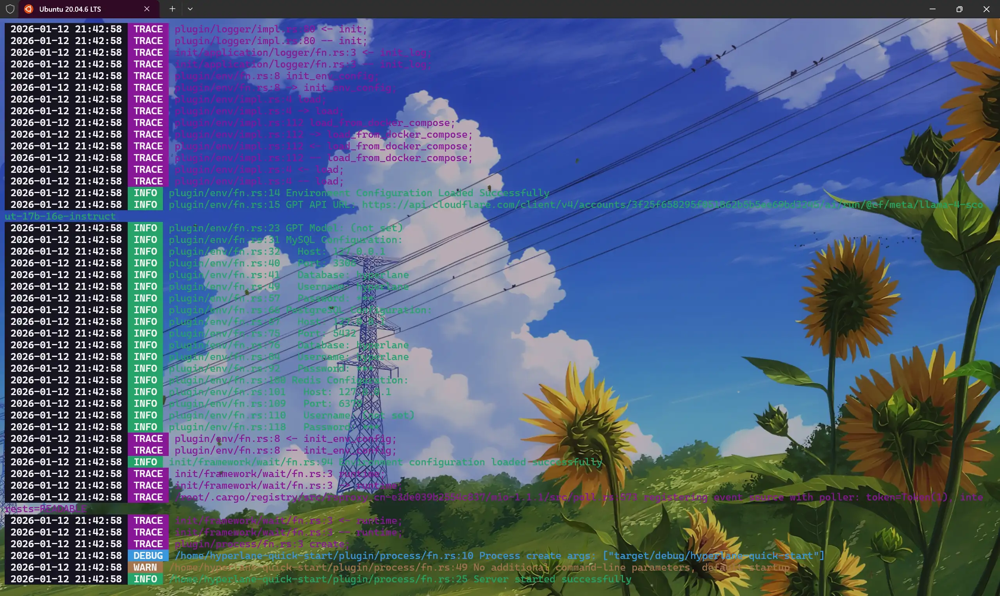
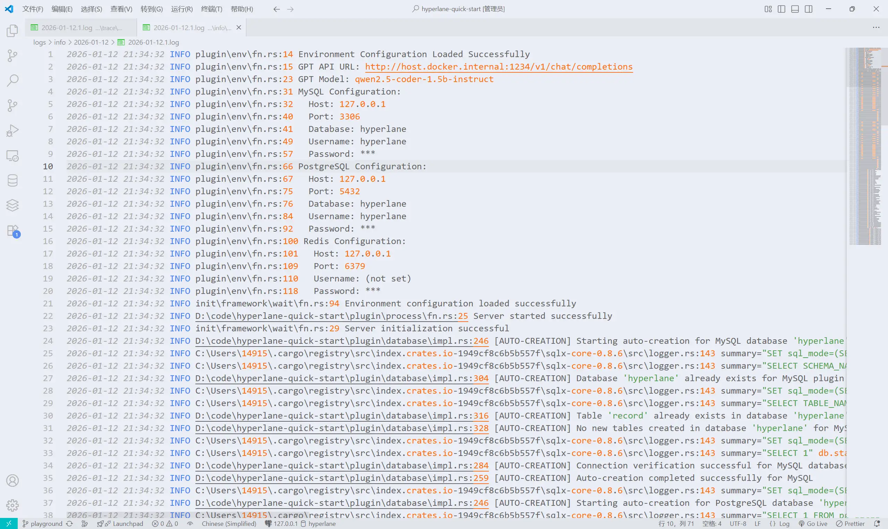
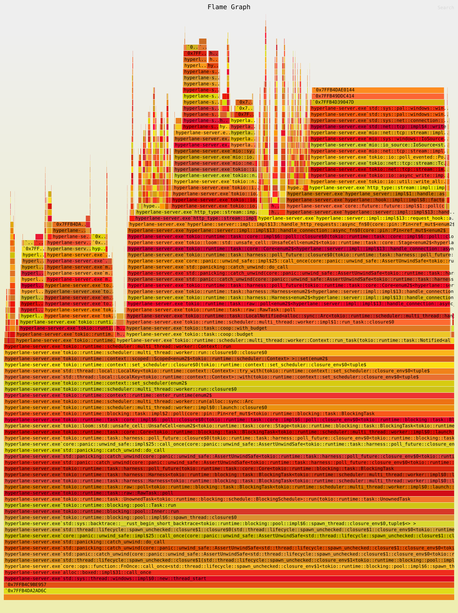

# Eastspire Dataset

> Auto-generated by build script.
> Generated at: 2026/8/29 5:15:15
> File count: 103

---
## euv/quick-start/README.md

<Share colorful />

## 快速开始

> [!tip]
>
> 这是基于 `euv` 框架的快速入门指南，帮助你快速搭建一个 WebAssembly UI 应用。

### 1. 创建项目

```sh
cargo new my-euv-app
cd my-euv-app
```

### 2. 添加依赖

在 `Cargo.toml` 中添加：

```toml
[package]
edition = "2024"

[dependencies]
euv = "*"

[lib]
crate-type = ["cdylib", "rlib"]
```

> [!tip]
>
> euv 项目需要使用 `wasm-pack` 进行构建。如果尚未安装，请先运行 `cargo install wasm-pack` 或 `npm install -g wasm-pack`。
>
> 如果使用 `euv-ui` 的 `EuvAlertProps`、`EuvButtonProps` 等带 `#[derive(CustomDebug)]` 字段的 Props 结构体，需要在 `Cargo.toml` 中添加 `lombok-macros` 依赖（`euv-ui` 内部依赖会自动带入）。仅使用 `euv` 核心时无需手动添加。`wasm-bindgen` 的 `#[wasm_bindgen]` 宏和 `console_error_panic_hook::set_once()` 也可直接使用，因为 `euv` 已重新导出。

### 3. 编写应用

在 `src/lib.rs` 中编写你的 euv 应用：

```rust
use euv::*;
use wasm_bindgen::prelude::*;

#[wasm_bindgen]
pub fn main() {
    console_error_panic_hook::set_once();
    App::mount("#app", app);
}

fn app() -> VirtualNode {
    let count: Signal<i32> = App::use_signal(|| 0);
    html! {
        div {
            style: {text_align: "center"; margin_top: "50px";}
            h1 { "Hello, euv!" }
            p {
                "Count: "
                span {
                    style: {font_weight: "700"; color: "#4f46e5"; font_size: "24px";}
                    count
                }
            }
            button {
                style: {padding: "10px 22px"; border_radius: "8px"; background: "#4f46e5"; color: "white"; border: "none"; cursor: "pointer"; font_size: "14px";}
                onclick: move |_event: Event| {
                    let current: i32 = count.get();
                    count.set(current + 1);
                }
                "Increment"
            }
        }
    }
}
```

> [!tip]
>
> `console_error_panic_hook::set_once()` 用于在浏览器控制台显示 panic 信息，开发时必须调用。`App::mount` 的第二个参数 `app` 是函数名，`App::mount` 内部会调用该函数获取初始虚拟 DOM 树。

> [!tip]
>
> `euv` 重新导出了 `js-sys`、`web-sys`、`wasm-bindgen`、`wasm-bindgen-futures`、`console_error_panic_hook`，无需在 `Cargo.toml` 中单独添加这些依赖。通过 `use euv::*` 即可访问所有 API。

> [!tip]
>
> 如需注入全局样式重置和预定义动画 `@keyframes`，可在 `main` 函数中 `App::mount` 之前调用 `euv_ui::inject_app_global_css()`。该函数由 `euv-ui` crate 导出，会注入全局样式重置和 `euv-spin`、`euv-fade-in`、`euv-pulse` 等 `@keyframes` 动画。也可以手动调用 `Css::inject_css()` 注入自定义全局样式。参见 [CSS 注入机制](../macros/class.md#css-注入机制)。

### 4. 创建 HTML 入口

在项目根目录创建 `www/index.html`：

```html
<!DOCTYPE html>
<html>
  <head>
    <meta charset="utf-8" />
    <title>My euv App</title>
  </head>
  <body>
    <div id="app"></div>
    <script type="module">
      import init, { main } from './pkg/my_euv_app.js';
      await init();
      main();
    </script>
  </body>
</html>
```

### 5. 构建与运行

#### 使用 wasm-pack 构建

```sh
wasm-pack build --target web --out-dir www/pkg
```

#### 使用 euv 开发服务器

```sh
cargo install euv-cli
euv run --crate-path . --www-dir ./www --port 80 -- --target web
```

> [!tip]
>
> `euv` 提供热重载功能，文件修改后自动重新编译和刷新浏览器。

### 6. 在浏览器中查看

打开浏览器访问 `http://127.0.0.1:80/www/index.html`

<Bottom />

---
## hyperlane/quick-start/README.md

<Share colorful />

## 快速开始

> [!tip]
>
> 这是基于 `hyperlane` 封装的项目（[hyperlane-quick-start](https://github.com/hyperlane-dev/hyperlane-quick-start)），旨在简化使用和规范项目代码结构。

### 克隆项目

```sh
git clone https://github.com/hyperlane-dev/hyperlane-quick-start.git
```

### 进入项目

```sh
cd hyperlane-quick-start
```

### 运行

> [!tip]
>
> 此项目使用 `server-manager` 进行服务管理。
> 使用参考 [官方文档](../../server-manager/README.md)。

#### 运行

```sh
cargo run
```

#### 在后台运行

```sh
cargo run -d
```

#### 停止

```sh
cargo run stop
```

#### 重启

```sh
cargo run restart
```

#### 重启在后台运行

```sh
cargo run restart -d
```

#### Docker运行

##### 开发模式

###### 启动完整服务

```sh
docker compose -f ./resources/docker/dev/server_docker_compose.yml up -d
```

###### 仅启动数据库服务

```sh
[ -s /etc/hosts ] && [ "$(tail -c 1 /etc/hosts | wc -l)" -eq 0 ] && sudo sh -c 'echo "" >> /etc/hosts'; sudo sh -c 'cat << EOF >> /etc/hosts
127.0.0.1 dev_hyperlane_quick_start_mysql
127.0.0.1 dev_hyperlane_quick_start_postgresql
127.0.0.1 dev_hyperlane_quick_start_redis
EOF'; tail -5 /etc/hosts
```

```sh
docker network create dev_hyperlane_quick_start_network --driver bridge
docker compose -f ./resources/docker/dev/server_docker_compose.yml up -d mysql postgresql redis
```

###### 停止并删除构建缓存

```sh
docker compose -f ./resources/docker/dev/server_docker_compose.yml down --rmi local
```

##### 生产模式

###### 启动完整服务

```sh
docker compose -f ./resources/docker/release/server_docker_compose.yml up -d
```

###### 仅启动数据库服务

```sh
docker network create release_hyperlane_quick_start_network --driver bridge
docker compose -f ./resources/docker/release/server_docker_compose.yml up -d mysql postgresql redis
```

###### 停止并删除构建缓存

```sh
docker compose -f ./resources/docker/release/server_docker_compose.yml down --rmi local
```

## 命令行工具

```sh
cargo install hyperlane-cli
```

### 帮助

```sh
hyperlane -h
```

### 运行效果





<Bottom />

---
## ltpp/LTPP-WEB/README.md

<Share colorful />

[WEB 系统地址](http://ltppx.cn)

## 简介

> [!tip]
> WEB 基于 Vue2.js + VueX + EventBus + WebWorker + Echarts + ElementUI + Animate.css 完成开发

<Bottom />

---
## hyperlane/speed/README.md

[GITHUB 地址](https://github.com/eastspire/web-server-pressure-measurement)

### 环境信息

- 系统: `Ubuntu20.04.6 LTS`
- CPU: `i9-14900KF`
- 内存: `192GB 6400MT/S（实际运行 4000MT/S）`
- 硬盘: `SKC3000D2048G * 2`
- GPU: `AMD Radeon RX 6750 GRE 10GB`

### 调优

#### Linux 内核调优

> 打开文件 `/etc/sysctl.conf`，增加以下设置。

```sh
#该参数设置系统的TIME_WAIT的数量，如果超过默认值则会被立即清除
net.ipv4.tcp_max_tw_buckets = 20000
#定义了系统中每一个端口最大的监听队列的长度，这是个全局的参数
net.core.somaxconn = 65535
#对于还未获得对方确认的连接请求，可保存在队列中的最大数目
net.ipv4.tcp_max_syn_backlog = 262144
#在每个网络接口接收数据包的速率比内核处理这些包的速率快时，允许送到队列的数据包的最大数目
net.core.netdev_max_backlog = 30000
#此选项会导致处于NAT网络的客户端超时，建议为0。Linux从4.12内核开始移除了 tcp_tw_recycle 配置，如果报错"No such file or directory"请忽略
net.ipv4.tcp_tw_recycle = 0
#系统所有进程一共可以打开的文件数量
fs.file-max = 6815744
#防火墙跟踪表的大小。注意：如果防火墙没开则会提示error: "net.netfilter.nf_conntrack_max" is an unknown key，忽略即可
net.netfilter.nf_conntrack_max = 2621440
net.ipv4.ip_local_port_range = 10240 65000
```

#### 控制台执行 `ulimit`

```sh
ulimit -n 1024000
```

#### 打开文件数

> 修改 `open files` 的数值重启后永久生效，修改配置文件：`/etc/security/limits.conf`。在这个文件后加上

```sh
* soft nofile 1024000
* hard nofile 1024000
root soft nofile 1024000
root hard nofile 1024000
```

#### 运行命令

```sh
RUSTFLAGS="-C target-cpu=native -C link-arg=-fuse-ld=lld" cargo run --release
```

<Bottom />

---
## ltpp/LTPP-EXE/README.md

<Share colorful />

## 简介

> [!tip]
> 客户端使用 Electron 和 Tauri 框架完成开发
>
> 后续将不在维护 Tauri 版本 和 Electron 版本
> [安装包下载地址](https://www.alipan.com/s/vQTYUkyCCbC)

### Electron


### Tauri


## 安装

双击运行安装

### 安装界面


### 隐私协议


### 安装


### 安装完成


安装完成后在桌面可以看到安装后的启动图标


### 系统托盘


### 日志

> [!tip]
> 日志在安装目录根目录的 `/LTPP/logs` 文件夹下
>
> - `logs` 目录为运行信息目录
>
> - `error` 目录为错误日志目录


<Bottom />

---
## ltpp/README.md

<Share colorful />

[GITHUB 地址](https://github.com/eastspire/LTPP)

[WEB 系统地址](http://ltppx.cn)

## 简介

> [!tip]
> LTPP `WEB` 基于 `Vue2.js` + `VueX` + `EventBus` + `WebWorker` + `Echarts` + `ElementUI` + `Animate.css` 开发
>
> LTPP `后端` 基于 `Webman` + `GatewayWorker` 框架开发
>
> LTPP 运行在 `Docker` 环境
>
> LTPP `APP` 基于`Flutter`框架开发
>
> LTPP `客户端` 基于`Electron` 和 `Tauri` 框架开发

## 部署

> [!tip]
> 服务于 `2025/2/1` 停止，现状部署在`cloudflare`（速率相比之前大大降低且稍微大点的文件上传会超时），如需私有部署，请在首页点击“联系作者”

## 注意事项

### 端口（请勿修改）

- 1236（内网|即时通讯系统注册）
- 3000（公网|音乐|开启 SSL）
- 4466（内网|Mysql）
- 6379（内网|Redis）
- 40025（公网|邮箱系统）
- 40080（公网|直播推流前端访问地址）
- 40080（内网|PHPMYADMIN 访问地址）
- 41935（公网|直播推流）
- 47272（内网|后端|即时通讯|开启 SSL）
- 48787（内网|后端|开启 SSL）
- 49999（内网|SSH 服务）

### MYSQL

#### 用户


#### 数据表


### PHP 插件

> 如果使用机器人接口需要卸载 `swoole` 插件

### Docker 使用

> [!tip]
> 在 `windows` 使用 `docker` 容器访问宿主主机 `ip/域名` 使用 `host.docker.internal` > `linux` 则使用 `172.17.0.1`

### Redis 数据库

| Redis 数据库编号 | 功能                                |
| ---------------- | ----------------------------------- |
| 0                | 黑名单                              |
| 1                | 请求限速                            |
| 2                | 验证码限速                          |
| 3                | 短句限速                            |
| 4                | 竞赛相关                            |
| 5                | 设置                                |
| 6                | 判题机                              |
| 7                | 发布问题限速                        |
| 8                | 用户信息                            |
| 9                | 登录限速                            |
| 10               | 发布文章限速                        |
| 11               | 保存浏览器信息                      |
| 12               | 在线课堂                            |
| 13               | 注册验证码                          |
| 14               | 单点登录                            |
| 15               | 用户更新锁                          |
| 16               | 私聊的未读消息数目                  |
| 17               | 群聊的未读消息数目                  |
| 18               | 缓存的 css 以及 js                  |
| 19               | 消息队列                            |
| 20               | 群信息缓存                          |
| 21               | 竞赛信息缓存                        |
| 22               | 题单信息缓存                        |
| 23               | 404 页面缓存                        |
| 24               | 竞赛排名计算缓冲区                  |
| 25               | 文章信息                            |
| 26               | 题库信息                            |
| 27               | 机器人已参赛并已经提交代码的竞赛 ID |
| 28               | 竞赛代码缓存                        |
| 29               | 代码结果缓存                        |
| 30               | 文件系统缓存                        |
| 31               | 题库测试用例缓存                    |
| 32               | 竞赛查重锁                          |
| 33               | 代码缓存                            |
| 34               | 题单题目列表缓存                    |
| 35               | MD5 缓存                            |
| 36               | 应用缓存                            |
| 37               | OJ 样例更新时间缓存                 |
| 38               | 代码分享                            |

### 判题系统

- 1. 使用 `C 语言` 编写判题机，自建沙箱环境，主进进程监控资源使用
- 2. 用户提交代码会先保存数据库和缓存，消息队列消费运行用户代码，异步更新代码结果，前端使用轮询查询代码状态


### 竞赛系统

- 1. 使用排名读取和排名写入分离的策略，用户仅能从缓存读取排名，消息队列负责通知排名计算和排名更新
- 2. 使用定时器作为缓冲，定期通知消息队列更新排名
- 3. 排名实时更新
- 4. 排名支持外链分享


- 5. 支持竞赛代码查重


- 6. 支持题目一键下载
- 7. 支持题解自动生成和一键下载
- 8. 支持 `ACM/OI/IOI` 等多种赛制
- 9. 支持赛题重判


### 限速系统

- 1. 使用缓存和中间件完成请求限速

### 文件系统

- 1. 使用中间件完成文件访问的拦截
- 2. 对于特定文件例如 `markdown` 和代码文件，系统自动添加样式进行展示
- 3. 静态资源永久有效
- 4. 配合缓存和 `gzip` 优化体验

### 即时通讯系统

- 1. 支持私聊


- 2. 支持群聊


- 3. 支持全局通知


- 4. 支持机器人对话


- 5. 支持云文件上传


- 6. 支持云文件双击下载


### 背景系统

- 1. 支持用户自定义背景
- 2. 背景支持图片和视频背景
- 3. 支持图片和视频背景共存


### 文章系统

- 1. 支持文章搜索
- 2. 支持文章查看
- 3. 支持文章评论
- 4. 支持文章收藏
- 5. 支持文章取消收藏
- 6. 支持文章点赞
- 7. 支持文章下载
- 8. 支持文章外链分享
- 9. 支持个人文章管理
- 10. 支持题解跳转到详情页
- 11. 支持文章权限设置


### 问答系统

- 1. 支持问答搜索
- 2. 支持问答查看
- 3. 支持回复问题
- 4. 支持问题下载
- 5. 支持个人问答管理


### 消息通知系统

- 1. 支持站内通知
- 2. 支持删除通知
- 3. 支持一键清空通知


### 商店系统

- 1. 支持商品的购买


- 2. 支持商品的下载


- 3. root 用户支持商品上传


### 题单系统

- 1. 支持用户创建管理题单


- 2. 支持加入题单


- 3. 支持查看我加入的题单


### 应用系统

- 1. 支持创建和管理应用


- 2. 支持打开应用


### 云盘系统

- 1. 支持文件上传，分享，下载和删除


- 2. 支持云盘代码文件在线运行


- 3. 支持静态资源在线预览


- 4. root 用户支持设置普通用户默认云盘空间大小

### 云服务器系统

- 1. 支持购买云服务器
- 2. 支持用户使用 `SSH` 登录
- 3. 支持用户访问在线版本 `VSCODE`
- 4. 支持用户重启，开启，关闭云服务器
- 5. 支持用户创建快照，回滚，重置云服务器


### 在线课堂系统

- 1. 支持推流
- 2. 支持在线观看直播
- 3. 支持课堂实时评论


### 短视频系统

- 1. 支持视频在线播放，收藏，点赞，取消收藏，取消点赞和评论


- 2. 支持视频分享


- 3. 支持视频搜索


### 题库系统

- 1. 支持题目搜索


- 2. 支持题目提交记录查看


- 3. 支持题目题解查看


- 4. 题解支持一键跳转到题目详情页


- 5. 支持每日一题


### 音乐系统

- 1. 支持网易云音乐扫码登陆


- 2. 支持歌单拉取


- 3. 支持在线播放音乐


- 4. 支持修改歌单


### 机器人系统

- 1. 支持调用 `GPT` 接口
- 2. 支持机器人问答


### 首页系统

- 1. 支持首页公告
- 2. 支持首页短语
- 3. 支持首页轮播图


### 监控系统

- 1. 支持用户监控
- 2. 支持时间检索


### 录屏系统

- 1. 网页端支持录制窗口选择
- 2. 客户端支持全屏录制
- 3. 支持录屏保存

#### 客户端


#### 网页端


<Bottom />

---
## ltpp-gitlab/README.md

<Share colorful />

## 功能

GITLAB 仓库基于 GITLAB 部署支持以下功能

- 代码仓库
- CI/CD
- PAGES
- 镜像库
- 邮件
- 监控

## 界面

### 首页


### 全局搜索


### 新建项目


### 用户主页


### 项目主页


### 项目分析


### CI/CD


### PAGES


### 个人设置


### 邮件通知


<Bottom />

---
## ltpp/LTPP-APP/README.md

<Share colorful />

[LTPP-APP GITHUB 地址](https://github.com/crates-dev/LTPP-APP-Flutter)

## 简介

> [!tip]
> 基于 Flutter 框架完成开发

## 打包

> [!tip]
> build:flutter build apk

### 文章系统


### 题库系统


### 用户系统


### 竞赛系统


### 工具系统


### 视频系统


### 评论系统


### 聊天系统


### 后台系统


<Bottom />

---
## ltpp-web-ide/README.md

<Share colorful />

## 功能

LTPP 在线 WEB 编辑器支持以下功能

- 多种编程语言（C、C++、JS、TS、Go、Rust、PHP、JAVA、Ruby、Python3、C#、Ruby）
- 根据系统主题自动切换主题
- 支持编译错误和运行错误等详情信息的显示
- 支持输出显示

## 使用

- 标准输入快捷键：F1-F12 中（除去 F1，F5）
- 运行快捷键：F5

[LTPP-WEB-IDE C 语言地址](https://ide.ltpp.vip/?language=c)


[LTPP-WEB-IDE C++语言地址](https://ide.ltpp.vip/?language=cpp)


[LTPP-WEB-IDE JavaScript 语言地址](https://ide.ltpp.vip/?language=javascript)


[LTPP-WEB-IDE TypeScript 语言地址](https://ide.ltpp.vip/?language=typescript)


[LTPP-WEB-IDE Rust 语言地址](https://ide.ltpp.vip/?language=rust)


[LTPP-WEB-IDE Golang 语言地址](https://ide.ltpp.vip/?language=golang)


[LTPP-WEB-IDE PHP](https://ide.ltpp.vip/?language=php)


[LTPP-WEB-IDE Ruby 语言地址](https://ide.ltpp.vip/?language=ruby)


[LTPP-WEB-IDE Python3](https://ide.ltpp.vip/?language=python3)


[LTPP-WEB-IDE Java 语言地址](https://ide.ltpp.vip/?language=java)


[LTPP-WEB-IDE C#语言地址](https://ide.ltpp.vip/?language=csharp)


## 在线运行（编译/运行错误）


## 标准输入


## 正常运行


## 暗色主题


<Bottom />

---
## ltpp-qrcode/README.md

<Share colorful />

[系统地址](https://qrcode.ltpp.vip)

## 功能

- 支持文件解析和保存
- 支持历史记录单个和全部导入导出
- 支持域名前缀自动添加
- 支持 `URL` 点击打开页面
- 二维码自动隐藏（聚焦输入框或者鼠标进入二维码所在区域即可显示），防止设备误扫码
- 一键返回顶部


<Bottom />

---
## hyperlane/utils/README.md


---
## ltpp-html-pdf/README.md

<Share colorful />

[GITHUB 地址](https://github.com/eastspire/HTML-PDF)

## 功能

> [!tip]
> 工具 `LTPP` 批量 `HTML` 转 `PDF` 支持将当前目录下所有 `HTML` 文件转成 `PDF` 文件，并且在新目录中保存文件结构与原目录结构一致

## 说明

> 一共两个独立版本，`html-pdf` 目录下是基于 `html-pdf` 模块开发的应用，`puppeteer` 目录下是基于 `puppeteer` 模块开发的应用

## 安装

> [!tip]
> npm i

## 运行

> [!tip]
>
> - 1.对于 `html-pdf`，双击 `exe` 文件运行（仅适用于 `win-x64`）
> - 2.对于 `puppeteer`，由于打包后 `exe` 过大无法上传 `git` 仓库，请用户自行根据下面的打包方法进行打包
> - 2.如果系统有 `node` 环境并且安装了 `npm`，可以使用命令 `npm run start` 直接运行

### 针对 puppeteer 进行打包（对于 html-pdf 开发的应用，由于 pkg 对于可执行文件的限制策略暂时不可用，puppeteer 可以使用下面的命令打包）

> [!tip]
> 打包时间可能很久请耐心等待，因为需要打包的资源很大并且进行压缩处理，时间消耗较多

> - 1.首次打包需要运行以下命令 `npm run install-pkg`
> - 2.解压 `chrome.7z`
> - 3.运行打包命令，会在项目根目录生成 `exe` 可执行文件 `npm run pkg`

## 使用说明

> [!tip]
>
> - 使用多进程将 `HTML` 转成 `PDF`
> - 递归自动扫描项目下的所有目录获取所有 `HTML` 文件
> - `PDF` 目录（系统会自动创建）存储转换后的 `PDF` 文件（`PDF` 存储位置根据获取的 `HTML` 目录相对位置递归创建文件夹存储 `PDF` 文件，保证和原来目录结构相同）
> - 如果 `PDF` 重复会覆盖旧的内容
> - 对于基于 `puppeteer` 开发的应用，添加环境自动检测和修复功能

### 批量转换


### 转换结果


<Bottom />

---
## ltpp-leetcode-and-acwing-rank/README.md

<Share colorful />

[GITHUB 地址](https://github.com/eastspire/LeetcodeAndAcwingRank)

## 功能

`LTPP` `力扣`/`ACWING` 周赛排名爬取工具支持以下功能

- 爬取`力扣` 和 `ACWING` 最新已完成的周赛
- 支持用户列表查找，可查看用户列表成绩，用户未参加会有文字提示

### 排名爬取


### 力扣表格排名


### ACWING 表格排名


<Bottom />

---
## ltpp-oj-judge-testdata-creat/README.md

<Share colorful />

[GITHUB 地址](https://github.com/eastspire/OjJudgeTestdataCreat)

## 功能

LTPP-OJ 测试用例生成器支持以下功能

- 支持样例生成

<Bottom />

---
## ltpp-ssh/README.md

<Share colorful />

[GITHUB 地址](https://github.com/eastspire/LTPP-SSH)

## 说明

- 服务端口：`49999`

## 功能

- 支持远程调用
- 支持服务器创建
- 支持服务器创建镜像
- 支持服务器回滚
- 支持服务器开机
- 支持服务器关机
- 支持服务器重启
- 支持服务器销毁

<Bottom />

---
## ltpp-code-run/README.md

<Share colorful />

[GITHUB 地址](https://github.com/eastspire/LTPP-CODE-RUN)

## 功能

> [!tip]
> 支持在线运行代码

## 接口

### https://code.ltpp.vip/

#### 请求参数

```json
{
  "language": "c|cpp|rust|javascript|typescript|php|python|ruby|java|go|csharp",
  "code": "需要运行的代码",
  "testin": "标准输入"
}
```

#### 响应参数

##### 运行成功

```json
{
  "code": 1,
  "data": "代码标准输出",
  "time": 代码用时（MS）,
  "memory": 代码内存消耗（KB）
}
```

##### 运行错误/失败

```json
{
  "code": -1,
  "data": "代码错误输出/失败信息",
  "time": 代码用时（MS）,
  "memory": 代码内存消耗（KB）
}
```

<Bottom />

---
## ltpp-post-blog-user-crawler/README.md

<Share colorful />

[GITHUB 地址](https://github.com/eastspire/RUST-WEB-SERVE)

## 功能

LTPP 爬虫工具支持以下功能

- 爬取`知乎`，`简书`，`CSDN` 文章
- 支持 `HTML` 文件本地保存
- 支持数据库保存
- 支持选择爬取站点
- 支持爬取进程数目设置
- 支持 `Node` 和 `PHP` 两种语言版本

## 说明

- 数据库确保创建
- 未创建指定数据库运行时根据提示输入【不保存到数据库】和【保存到本地文件】对应序号即可
- `JS` 版本不在提供维护，只维护 `PHP` 版本
- `PHP` 需要安装和启用 `Swoole` 插件


<Bottom />

---
## color-output/README.md

<Share colorful />

[GITHUB 地址](https://github.com/crates-dev/color-output)

<center>

[](https://crates.io/crates/color-output)
[](https://img.shields.io/crates/d/color-output.svg)
[](https://docs.rs/color-output)
[](https://github.com/crates-dev/color-output/actions?query=workflow:Rust)
[](./LICENSE)

</center>

## 说明

> 一个基于 Rust 的原子输出库，支持通过函数、构建器和其他方法实现输出功能。它允许自定义文本和背景颜色。

## 功能

- 支持输出格式化后时间
- 支持自定义文字颜色，背景颜色，文字粗细等配置
- 支持结构体定义，输出信息
- 支持构造器定义，输出信息
- 支持单行多任务输出
- 支持多行多任务输出
- 输出原子化

## 安装

```shell
cargo add color-output
```

## 许可

本项目根据 MIT 许可证发布。详细信息请参见 [license](LICENSE) 文件。

## 贡献

欢迎贡献！请提出问题或提交拉取请求。

## 联系

如有任何疑问，请联系作者 [root@ltpp.vip](mailto:root@ltpp.vip)。

<Bottom />

---
## std-macro-extensions/README.md

<Share colorful />

[GITHUB 地址](https://github.com/crates-dev/std-macro-extensions)

<center>

[](https://crates.io/crates/std-macro-extensions)
[](https://img.shields.io/crates/d/std-macro-extensions.svg)
[](https://docs.rs/std-macro-extensions)
[](https://github.com/crates-dev/std-macro-extensions/actions?query=workflow:Rust)
[](./LICENSE)

</center>

## 说明

> 一个为 Rust 标准库数据结构提供的宏扩展集合，简化了如 HashMap、Vec 等常用集合的创建和操作。

## 特性

- **简化初始化**：使用宏轻松创建常见数据结构的实例。
- **支持多种数据结构**：包括 `Vec`、`HashMap`、`Arc` 等的宏。
- **易于使用**：直观的语法使数据结构的创建更加迅速。

## 安装

要安装 `std-macro-extensions`，请运行以下命令：

```sh
cargo add std-macro-extensions
```

## 可用的宏

- `arc!`：创建一个 `Arc<T>`。
- `vector!`：创建一个 `Vec<T>`。
- `map!`：创建一个 `HashMap<K, V>`。
- `set!`：创建一个 `HashSet<T>`。
- `b_tree_map!`：创建一个 `BTreeMap<K, V>`。
- `b_tree_set!`：创建一个 `BTreeSet<T>`。
- `list!`：创建一个 `LinkedList<T>`。
- `heap!`：创建一个 `BinaryHeap<T>`。
- `string!`：创建一个 `String`。
- `boxed!`：创建一个 `Box<T>`。
- `rc!`：创建一个 `Rc<T>`。
- `arc!`：创建一个 `Arc<T>`。
- `mutex!`：创建一个 `Mutex<T>`。
- `rw_lock!`：创建一个 `RwLock<T>`。
- `cell!`：创建一个 `Cell<T>`。
- `ref_cell!`：创建一个 `RefCell<T>`。
- `vector_deque!`: Creates a `VecDeque<T>`。
- `join_paths!`: 将多个路径组合成一个有效的路径，并处理重叠的斜杠。
- `cin!`: 从标准输入读取一行字符串输入。
- `cin_parse!`: 将输入解析为指定的类型或类型数组。
- `cout!`: 将格式化输出打印到标准输出（不换行）。
- `endl!`: 打印一个换行符到标准输出。
- `cout_endl!`: 打印格式化输出并追加一个换行符到标准输出，同时刷新缓冲区。
- `execute!`: 使用提供的参数调用并执行指定函数。
- `execute_async!`: 使用提供的参数调用并异步执行指定函数。

## 许可证

本项目根据 MIT 许可证授权。有关详细信息，请参见 [license](LICENSE) 文件。

## 贡献

欢迎贡献！请打开一个问题或提交拉取请求。

## 联系方式

如有任何询问，请联系作者 [root@ltpp.vip](mailto:root@ltpp.vip)。

<Bottom />

---
## china-identification-card/README.md

<Share colorful />

[GITHUB 地址](https://github.com/crates-dev/china_identification_card)

<center>

[](https://crates.io/crates/china_identification_card)
[](https://img.shields.io/crates/d/china_identification_card.svg)
[](https://docs.rs/china_identification_card)
[](https://github.com/crates-dev/china_identification_card/actions?query=workflow:Rust)
[](./LICENSE)

</center>

> 一个根据官方规则和校验和验证中国身份证号码的 Rust 库。

## 功能

- 校验中国身份证号码的长度和格式
- 根据官方的权重因子计算并校验校验位
- 轻量且易于集成

## 安装

使用此库，可以运行以下命令：

```shell
cargo add china_identification_card
```

## 许可证

此项目基于 MIT 许可证发布。更多详情见 [license](LICENSE) 文件。

## 贡献

欢迎贡献！请提交 issue 或拉取请求（pull request）。

## 联系方式

如有任何疑问，请联系作者：[root@ltpp.vip](mailto:root@ltpp.vip)。

<Bottom />

---
## compare-version/README.md

<Share colorful />

[GITHUB 地址](https://github.com/crates-dev/compare-version)

<center>

[](https://crates.io/crates/compare_version)
[](https://img.shields.io/crates/d/compare_version.svg)
[](https://docs.rs/compare_version)
[](https://github.com/crates-dev/compare_version/actions?query=workflow:Rust)
[](./LICENSE)

</center>

## 说明

> 这是一个用于比较语义版本字符串和检查版本兼容性的 Rust 库。

## 特性

- **版本比较**：比较两个语义版本字符串，以确定它们的顺序（大于、小于、等于）。
- **版本范围匹配**：检查特定版本是否匹配指定范围，支持 `^` 和 `~` 语法。
- **预发布支持**：正确处理预发布版本的比较逻辑。
- **错误处理**：提供全面的错误类型，以优雅地处理版本解析和范围问题。

## 安装

要使用此库，可以运行以下命令：

```shell
cargo add COMPARE_VERSION
```

## 许可

本项目根据 MIT 许可证发布。详细信息请参见 [license](LICENSE) 文件。

## 贡献

欢迎贡献！请提出问题或提交拉取请求。

## 联系

如有任何疑问，请联系作者 [root@ltpp.vip](mailto:root@ltpp.vip)。

<Bottom />

---
## http-request/README.md

<Share colorful />

[GITHUB 地址](https://github.com/crates-dev/http-request)

<center>

[](https://crates.io/crates/http-request)
[](https://img.shields.io/crates/d/http-request.svg)
[](https://docs.rs/http-request)
[](https://github.com/crates-dev/http-request/actions?query=workflow:Rust)
[](./LICENSE)

</center>

[API 文档](https://docs.rs/http-request/latest/)

> 一个轻量、高效的库，用于在 Rust 应用程序中构建、发送和处理 HTTP/HTTPS 请求。它提供了一个简单直观的 API，让开发者可以轻松地与 Web 服务进行交互，无论他们使用的是 “HTTP” 还是 “HTTPS” 协议。该库支持各种 HTTP 方法、自定义请求头、请求体、超时、自动处理重定向（包括检测重定向循环）以及增强的响应体解码（自动和手动），从而实现快速、安全的通信。无论是处理安全的 “HTTPS” 连接还是标准的 “HTTP” 请求，该库都经过优化，以实现高性能、最小的资源占用和轻松集成到 Rust 项目中。

## 特性

- **支持 HTTP/HTTPS**：支持 HTTP 和 HTTPS 协议。
- **WebSocket 支持**：完整的 WebSocket 支持，提供同步和异步 API 用于实时通信。
- **轻量级设计**：`http_request` crate 提供简单高效的 API 来构建、发送和处理 HTTP 请求，同时最小化资源消耗。
- **支持常见 HTTP 方法**：支持常见的 HTTP 方法，如 GET 和 POST。
- **灵活的请求构建**：通过 `RequestBuilder` 提供丰富的配置选项来设置请求头、请求体和 URL。
- **简单的错误处理**：利用 `Result` 类型处理请求和响应中的错误，使错误处理变得简单直接。
- **自定义头部和请求体**：轻松添加自定义头部和请求体。
- **响应处理**：提供 HTTP 响应的简单包装器，便于访问和处理响应数据。
- **优化的内存管理**：实现高效的内存管理，最小化不必要的内存分配并提高性能。
- **重定向处理**：支持重定向处理，允许设置最大重定向次数，并包含重定向循环检测。
- **超时**：支持超时。
- **自动和手动响应体解码**：支持响应体的自动和手动解码，允许与不同内容类型（如 JSON、XML 等）无缝交互。
- **代理支持**：全面的代理支持，包括 HTTP、HTTPS 和 SOCKS5 代理，支持 HTTP 请求和 WebSocket 连接的身份验证。

## 安装

要使用此 crate，您可以运行命令：

```shell
cargo add http-request
```

## 帮助

确保系统上已安装 CMake。

## 许可证

该项目采用 MIT 许可证。有关详情，请查看 [license](LICENSE) 文件。

## 贡献

欢迎贡献代码！请提交 Issue 或发起 Pull Request。

## 联系方式

如有任何疑问，请联系作者：[root@ltpp.vip](mailto:root@ltpp.vip)。

<Bottom />

---
## bin-encode-decode/README.md

<Share colorful />

[GITHUB 地址](https://github.com/crates-dev/bin-encode-decode)

<center>

[](https://crates.io/crates/bin-encode-decode)
[](https://img.shields.io/crates/d/bin-encode-decode.svg)
[](https://docs.rs/bin-encode-decode)
[](https://github.com/crates-dev/bin-encode-decode/actions?query=workflow:Rust)
[](./LICENSE)

</center>

> 一个高性能的二进制编码和解码库，支持超越 Base64 的可自定义字符集。

#### 特性

- **自定义字符集**：可定义自己的字符集用于编码和解码，从而实现灵活的数据表示。
- **高性能**：经过速度优化，适用于需要高效加密操作的应用程序。
- **简单的 API**：编码和解码过程都有直观且易于使用的接口。
- **强大的错误处理**：提供清晰且具描述性的错误消息，便于调试。
- **丰富的文档**：有全面的指南和示例，帮助你快速上手。

#### 安装

要安装 `bin-encode-decode`，请运行以下命令：

```sh
cargo add bin-encode-decode
```

## 许可协议

此项目基于 MIT 许可证开源。有关详细信息，请参阅 [license](LICENSE) 文件。

## 贡献

欢迎贡献代码！请提交 issue 或 pull request。

## 联系方式

如有任何疑问，请联系作者 [root@ltpp.vip](mailto:root@ltpp.vip)。

<Bottom />

---
## http-compress/README.md

<Share colorful />

[GITHUB 地址](https://github.com/crates-dev/http-compress)

<center>

[](https://crates.io/crates/http-compress)
[](https://img.shields.io/crates/d/http-compress.svg)
[](https://docs.rs/http-compress)
[](https://github.com/crates-dev/http-compress/actions?query=workflow:Rust)
[](./LICENSE)

</center>

[API 文档](https://docs.rs/http-compress/latest/)

> 一个用于 HTTP 压缩/解压缩的高性能异步库，支持 Brotli、Deflate 和 Gzip 算法。提供压缩和解压缩功能，并优化了内存使用，非常适合 HTTP 客户端/服务器和网络编程。

## 安装

要使用此 crate，可以运行以下命令：

```shell
cargo add http-compress
```

## 许可证

此项目基于 MIT 许可证授权。详细信息请查看 [license](LICENSE) 文件。

## 贡献

欢迎贡献！请提交 issue 或创建 pull request。

## 联系方式

如有任何疑问，请联系作者：[root@ltpp.vip](mailto:root@ltpp.vip)。

<Bottom />

---
## http-constant/README.md

<Share colorful />

[GITHUB 地址](https://github.com/crates-dev/http-constant)

<center>

[](https://crates.io/crates/http-constant)
[](https://img.shields.io/crates/d/http-constant.svg)
[](https://docs.rs/http-constant)
[](https://github.com/crates-dev/http-constant/actions?query=workflow:Rust)
[](./LICENSE)

</center>

[API 文档](https://docs.rs/http-constant/latest/)

> 一个提供常见 HTTP 常量的全面库，包括头部名称、版本、MIME 类型和协议标识符。

## 安装

要使用此 crate，可以运行以下命令：

```shell
cargo add http-constant
```

## 许可证

此项目基于 MIT 许可证授权。详细信息请查看 [license](LICENSE) 文件。

## 贡献

欢迎贡献！请提交 issue 或创建 pull request。

## 联系方式

如有任何疑问，请联系作者：[root@ltpp.vip](mailto:root@ltpp.vip)。

<Bottom />

---
## http-type/README.md

<Share colorful />

[GITHUB 地址](https://github.com/crates-dev/http-type)

<center>

[](https://crates.io/crates/http-type)
[](https://img.shields.io/crates/d/http-type.svg)
[](https://docs.rs/http-type)
[](https://github.com/crates-dev/http-type/actions?query=workflow:Rust)
[](./LICENSE)

</center>

[API 文档](https://docs.rs/http-type/latest/)

> 一个全面的 Rust 库，为 HTTP 操作提供必要的类型。包括核心 HTTP 抽象（请求/响应、方法、状态码、版本）、内容类型、Cookie、WebSocket 支持以及线程安全的并发类型（ArcMutex、ArcRwLock）。还提供了方便的 Option 包装的原始类型，以实现灵活的 HTTP 处理。

## 安装

要使用此 crate，可以运行以下命令：

```shell
cargo add http-type
```

## 许可证

此项目基于 MIT 许可证授权。详细信息请查看 [license](LICENSE) 文件。

## 贡献

欢迎贡献！请提交 issue 或创建 pull request。

## 联系方式

如有任何疑问，请联系作者：[root@ltpp.vip](mailto:root@ltpp.vip)。

<Bottom />

---
## hyperlane/README.md

<Share colorful />

[GITHUB 地址](https://github.com/hyperlane-dev/hyperlane)

<center>


[](https://crates.io/crates/hyperlane)
[](https://img.shields.io/crates/d/hyperlane.svg)
[](https://docs.rs/hyperlane)
[](https://github.com/hyperlane-dev/hyperlane/actions?query=workflow:Rust)
[](./LICENSE)

</center>

[API 文档](https://docs.rs/hyperlane/latest/)

> 一个轻量级、高性能、跨平台的 Rust HTTP 服务器库，构建于 Tokio 之上，旨在简化现代 Web 服务开发。它内建对中间件、WebSocket、服务器发送事件（SSE）以及原始 TCP 通信的支持，同时在 Windows、Linux 和 macOS 平台上提供统一且符合人体工学的 API，使开发者能够以最小的开销和最大的灵活性构建健壮、可扩展、事件驱动的网络应用程序。

## 安装

要使用此 crate，可以运行以下命令：

```shell
cargo add hyperlane
```

## 快速开始

- [hyperlane-quick-start git](https://github.com/hyperlane-dev/hyperlane-quick-start)

```sh
git clone https://github.com/hyperlane-dev/hyperlane-quick-start.git
```

## 许可证

此项目基于 MIT 许可证授权。详细信息请查看 [license](LICENSE) 文件。

## 贡献

欢迎贡献！请提交 issue 或创建 pull request。

## 联系方式

如有任何疑问，请联系作者：[root@ltpp.vip](mailto:root@ltpp.vip)。

<Bottom />

---
## lombok-macros/README.md

<Share colorful />

[GITHUB 地址](https://github.com/crates-dev/lombok-macros)

<center>

[](https://crates.io/crates/lombok-macros)
[](https://img.shields.io/crates/d/lombok-macros.svg)
[](https://docs.rs/lombok-macros)
[](https://github.com/crates-dev/lombok-macros/actions?query=workflow:Rust)
[](./LICENSE)

</center>

[API 文档](https://docs.rs/lombok-macros/latest/)

> 一个提供类似 Lombok 功能的 Rust 过程宏集合。可自动生成带有字段级可见性控制的 getter/setter、可跳过字段的自定义 Debug 实现以及 Display trait 的实现。支持结构体、枚举、泛型和生命周期。

## 安装

要使用此 crate，可以运行以下命令：

```shell
cargo add lombok-macros
```

## 许可

本项目采用 MIT 许可证，详细内容请参见 [license](LICENSE) 文件。

## 贡献

欢迎贡献！请提交问题或拉取请求。

## 联系

如有任何问题，请通过邮件联系作者 [root@ltpp.vip](mailto:root@ltpp.vip)。

<Bottom />

---
## hyperlane-log/README.md

<Share colorful />

[GITHUB 地址](https://github.com/hyperlane-dev/hyperlane-log)

<center>

[](https://crates.io/crates/hyperlane-log)
[](https://img.shields.io/crates/d/hyperlane-log.svg)
[](https://docs.rs/hyperlane-log)
[](https://github.com/hyperlane-dev/hyperlane-log/actions?query=workflow:Rust)
[](./LICENSE)

</center>

[API 文档](https://docs.rs/hyperlane-log/latest/)

> 一个支持异步和同步日志记录的 Rust 日志库。它提供多个日志级别，如错误、信息和调试。用户可以定义自定义的日志处理方法并配置日志文件路径。该库支持日志轮换，当当前文件达到指定的大小限制时，会自动创建一个新的日志文件。它允许灵活的日志配置，使其既适用于高性能的异步应用程序，也适用于传统的同步日志记录场景。异步模式利用 Tokio 的异步通道进行高效的日志缓冲，而同步模式则直接将日志写入文件系统。

## 安装

要使用此库，您可以运行以下命令：

```shell
cargo add hyperlane-log
```

## 日志存储位置说明

> 会在用户指定的目录下生成三个目录，分别对应错误日志目录，信息日志目录，调试日志目录，这三个目录下还有一级目录使用日期命名，此目录下的日志文件命名是时间.下标.log

## 许可证

该项目采用 MIT 许可证。详细信息请参阅 [LICENSE](LICENSE) 文件。

## 贡献

欢迎贡献！请提交问题或拉取请求。

## 联系方式

如有任何问题，请通过 [root@ltpp.vip](mailto:root@ltpp.vip) 联系作者。

<Bottom />

---
## hyperlane-time/README.md

<Share colorful />

[GITHUB 地址](https://github.com/hyperlane-dev/hyperlane-time)

<center>

[](https://crates.io/crates/hyperlane-time)
[](https://img.shields.io/crates/d/hyperlane-time.svg)
[](https://docs.rs/hyperlane-time)  
[](https://github.com/hyperlane-dev/hyperlane-time/actions?query=workflow:Rust)
[](./LICENSE)

</center>

[API 文档](https://docs.rs/hyperlane-time/latest/)

> 一个根据系统区域设置获取当前时间的库。

## 安装

要使用这个库，你可以运行以下命令：

```shell
cargo add hyperlane-time
```

## 许可证

本项目使用 MIT 许可证。详情请见 [LICENSE](LICENSE) 文件。

## 贡献

欢迎贡献！请提交问题或拉取请求。

## 联系

如有任何问题，请通过邮件联系作者 [root@ltpp.vip](mailto:root@ltpp.vip)。

<Bottom />

---
## tcplane/README.md

<Share colorful />

[GITHUB 地址](https://github.com/crates-dev/tcplane)

<center>

[](https://crates.io/crates/tcplane)
[](https://img.shields.io/crates/d/tcplane.svg)
[](https://docs.rs/tcplane)
[](https://github.com/crates-dev/tcplane/actions?query=workflow:Rust)
[](./LICENSE)

</center>

[API 文档](https://docs.rs/tcplane/latest/)

> **tcplane** 是一个轻量级且高性能的 Rust TCP 服务器库，旨在简化网络服务开发。它支持 TCP 通信、数据流管理和连接处理，专注于提供高效的底层网络连接和数据传输能力，非常适合构建现代网络服务。

## 安装

可以通过以下命令安装该库：

```shell
cargo add tcplane
```

## 许可协议

本项目基于 MIT 许可协议进行授权。详情请参阅 [LICENSE](LICENSE) 文件。

## 贡献

欢迎贡献！请提交 Issue 或 Pull Request。

## 联系方式

如有任何问题，请联系作者：[root@ltpp.vip](mailto:root@ltpp.vip)。

<Bottom />

---
## tcp-request/README.md

<Share colorful />

[GITHUB 地址](https://github.com/crates-dev/tcp-request)

<center>

[](https://crates.io/crates/tcp-request)
[](https://img.shields.io/crates/d/tcp-request.svg)
[](https://docs.rs/tcp-request)
[](https://github.com/crates-dev/tcp-request/actions?query=workflow:Rust)
[](./LICENSE)

</center>

[API 文档](https://docs.rs/tcp-request/latest/)

> 一个 Rust 库，用于发送原始 TCP 请求，支持处理响应、管理重定向以及在 TCP 连接中处理压缩数据。

### 安装

通过以下命令安装该 crate：

```shell
cargo add tcp-request
```

### 注意事项

确保系统中已安装 CMake。

### 开源协议

此项目基于 MIT 协议开源，详细内容请参阅 [LICENSE](LICENSE)。

### 贡献

欢迎贡献！请提交 Issue 或 Pull Request。

### 联系方式

如有任何问题，请通过以下邮箱联系作者：[root@ltpp.vip](mailto:root@ltpp.vip)。

<Bottom />

---
## file-operation/README.md

<Share colorful />

[GITHUB 地址](https://github.com/crates-dev/file-operation)

## 文件操作

<center>

[](https://crates.io/crates/file-operation)
[](https://img.shields.io/crates/d/file-operation.svg)
[](https://docs.rs/file-operation)
[](https://github.com/crates-dev/file-operation/actions?query=workflow:Rust)
[](./LICENSE)

</center>

[API 文档](https://docs.rs/file-operation/latest/)

> 一个 Rust 库，提供了一组常见的文件操作工具，如读取、写入和查询文件元数据（例如大小）。它旨在简化 Rust 项目中的文件处理，提供安全且高效的文件操作方法。

## 安装

要使用此库，可以运行以下命令：

```shell
cargo add file-operation
```

## 许可

该项目遵循 MIT 许可协议。有关详细信息，请参阅 [LICENSE](LICENSE) 文件。

## 贡献

欢迎贡献！请提交问题或拉取请求。

## 联系

如有任何问题，请联系作者：[root@ltpp.vip](mailto:root@ltpp.vip)。

<Bottom />

---
## recoverable-spawn/README.md

<Share colorful />

[GITHUB 地址](https://github.com/crates-dev/recoverable-spawn)

<center>

[](https://crates.io/crates/recoverable-spawn)
[](https://img.shields.io/crates/d/recoverable-spawn.svg)
[](https://docs.rs/recoverable-spawn)
[](https://github.com/crates-dev/recoverable-spawn/actions?query=workflow:Rust)
[](./LICENSE)

</center>

[API 文档](https://docs.rs/recoverable-spawn/latest/)

> 一个支持从 panic 中自动恢复的线程，允许线程在发生 panic 后重新启动。这对于在网络和 Web 编程中实现弹性和容错的并发非常有用。

## 安装

要使用此库，可以运行以下命令：

```shell
cargo add recoverable-spawn
```

## 许可证

此项目使用 MIT 许可证。详细信息请参见 [LICENSE](LICENSE) 文件。

## 贡献

欢迎贡献！请提交问题或拉取请求。

## 联系

如有任何疑问，请联系作者：[root@ltpp.vip](mailto:root@ltpp.vip)。

<Bottom />

---
## recoverable-thread-pool/README.md

<Share colorful />

[GITHUB 地址](https://github.com/crates-dev/recoverable-thread-pool)

<center>

[](https://crates.io/crates/recoverable-thread-pool)
[](https://img.shields.io/crates/d/recoverable-thread-pool.svg)
[](https://docs.rs/recoverable-thread-pool)
[](https://github.com/crates-dev/recoverable-thread-pool/actions?query=workflow:Rust)
[](./LICENSE)

</center>

[API 文档](https://docs.rs/recoverable-thread-pool/latest/)

> 一个支持从 panic 中自动恢复的线程池，允许线程在发生 panic 后重新启动。这对于在网络和 Web 编程中实现弹性和容错的并发非常有用。

## 安装

要使用此 crate，可以运行以下命令：

```shell
cargo add recoverable-thread-pool
```

## 许可证

此项目基于 MIT 许可证。有关详细信息，请参阅 [LICENSE](LICENSE) 文件。

## 贡献

欢迎贡献！请提交 issue 或 pull request。

## 联系方式

如有任何问题，请通过以下邮箱联系作者：[root@ltpp.vip](mailto:root@ltpp.vip)。

<Bottom />

---
## clonelicious/README.md

<Share colorful />

[GITHUB 地址](https://github.com/crates-dev/clonelicious)

<center>

[](https://crates.io/crates/clonelicious)
[](https://img.shields.io/crates/d/clonelicious.svg)
[](https://docs.rs/clonelicious)
[](https://github.com/crates-dev/clonelicious/actions?query=workflow:Rust)
[](./LICENSE)

</center>

[API 文档](https://docs.rs/clonelicious/latest/)

> 一个 Rust 宏库，它简化了克隆和闭包的执行。`clone!` 宏会自动克隆变量，并立即使用克隆的值执行闭包，从而简化了 Rust 编程中的常见模式。

## 安装

要安装 `clonelicious`，运行以下命令：

```sh
cargo add clonelicious
```

## 许可证

本项目使用 MIT 许可证。详情请参见 [LICENSE](LICENSE) 文件。

## 贡献

欢迎贡献！请提交问题或拉取请求。

## 联系

如有任何疑问，请通过电子邮件联系作者：[root@ltpp.vip](mailto:root@ltpp.vip)。

<Bottom />

---
## future-fn/README.md

<Share colorful />

[GITHUB 地址](https://github.com/crates-dev/future-fn)

<center>

[](https://crates.io/crates/future-fn)
[](https://img.shields.io/crates/d/future-fn.svg)
[](https://docs.rs/future-fn)
[](https://github.com/crates-dev/future-fn/actions?query=workflow:Rust)
[](./LICENSE)

</center>

[API 文档](https://docs.rs/future-fn/latest/)

> 一个 Rust 库，提供宏来简化异步闭包的创建，这些闭包通过移动（move）捕获外部状态。这对于轻松、清晰地构建异步代码非常有用。

## 安装

要安装 `future-fn`，请运行以下命令：

```sh
cargo add future-fn
```

## 许可证

本项目遵循 MIT 许可证。有关详细信息，请参阅 [LICENSE](LICENSE) 文件。

## 贡献

欢迎贡献！请提交问题或拉取请求。

## 联系方式

如有任何疑问，请通过 [root@ltpp.vip](mailto:root@ltpp.vip) 与作者联系。

<Bottom />

---
## server-manager/README.md

<Share colorful />

[GITHUB 地址](https://github.com/crates-dev/server-manager)

<center>

[](https://crates.io/crates/server-manager)
[](https://img.shields.io/crates/d/server-manager.svg)
[](https://docs.rs/server-manager)
[](https://github.com/crates-dev/server-manager/actions?query=workflow:Rust)
[](./LICENSE)

</center>

[Api 文档](https://docs.rs/server-manager/latest/)

> server-manager 是一个用于管理服务器进程的 Rust 库。它封装了服务的启动、关闭和后台守护进程模式。用户可以通过自定义设置指定 PID 文件、日志文件路径和其他配置，同时也可以传入自己的异步服务器函数来执行。该库支持同步和异步操作。在 Unix 和 Windows 平台上，它支持后台守护进程。

## 安装

在项目目录下执行下面的命令，将 server-manager 添加为依赖项：

```shell
cargo add server-manager
```

## 许可证

本项目遵循 MIT 许可证。有关详细信息，请参阅 [LICENSE](LICENSE) 文件。

## 贡献

欢迎贡献！请提交问题或拉取请求。

## 联系方式

如有任何疑问，请通过 [root@ltpp.vip](mailto:root@ltpp.vip) 与作者联系。

<Bottom />

---
## udp/README.md

<Share colorful />

[GITHUB 地址](https://github.com/crates-dev/udp)

<center>

[](https://crates.io/crates/udp)
[](https://img.shields.io/crates/d/udp.svg)
[](https://docs.rs/udp)
[](https://github.com/crates-dev/udp/actions?query=workflow:Rust)
[](./LICENSE)

</center>

[API 文档](https://docs.rs/udp/latest/)

> 一个轻量高效的 Rust 库，用于构建支持请求-响应处理的 UDP 服务器

## 安装

要使用此 crate，你可以运行以下命令：

```shell
cargo add udp
```

## 许可协议

本项目基于 MIT 许可协议进行授权。详情请参阅 [LICENSE](LICENSE) 文件。

## 贡献

欢迎贡献！请提交 Issue 或 Pull Request。

## 联系方式

如有任何问题，请联系作者：[root@ltpp.vip](mailto:root@ltpp.vip)。

<Bottom />

---
## udp-request/README.md

<Share colorful />

[GITHUB 地址](https://github.com/crates-dev/udp-request)

<center>

[](https://crates.io/crates/udp-request)
[](https://img.shields.io/crates/d/udp-request.svg)
[](https://docs.rs/udp-request)
[](https://github.com/crates-dev/udp-request/actions?query=workflow:Rust)
[](./LICENSE)

</center>

[API 文档](https://docs.rs/udp-request/latest/)

> 一个简单的 UDP 请求库，用于在 Rust 应用程序中发送和接收 UDP 数据包，设计用于处理网络通信。

## 安装

要使用这个库，你可以运行以下命令：

```shell
cargo add udp-request
```

## 许可证

本项目基于 MIT 许可证授权。详情请查看 [LICENSE](LICENSE) 文件。

## 贡献指南

欢迎贡献代码！请提交 Issue 或 Pull Request。

## 联系方式

如有任何疑问，请联系作者：[root@ltpp.vip](mailto:root@ltpp.vip)。

<Bottom />

---
## gtl/README.md

<Share colorful />

[GITHUB 地址](https://github.com/crates-dev/gtl)

<center>

[](https://crates.io/crates/gtl)
[](https://img.shields.io/crates/d/gtl.svg)
[](./LICENSE)

</center>

> `gtl` 是一个基于 Git 的工具，旨在简化多远程仓库的管理。它扩展了 Git 的功能，提供了一键初始化和推送到多个远程仓库的功能，特别适合需要同时维护多个远程仓库的开发者。

## 特性

- **多远程仓库管理**：支持为一个本地仓库配置多个远程仓库。
- **一键初始化远程仓库**：通过简单的命令，一次性初始化并配置多个远程仓库。
- **一键推送到多个远程仓库**：可以通过一条命令将代码推送到所有已配置的远程仓库，节省时间和精力。
- **Git 命令扩展**：为 Git 提供了更多便捷的操作，提升工作效率。

## 安装

通过 `cargo` 安装 `gtl`：

```bash
cargo install gtl
```

## 许可证

此项目基于 MIT 许可证授权。详细信息请查看 [license](LICENSE) 文件。

## 贡献

欢迎贡献！请提交 issue 或创建 pull request。

## 联系方式

如有任何疑问，请联系作者：[root@ltpp.vip](mailto:root@ltpp.vip)。

<Bottom />

---
## chunkify/README.md

<Share colorful />

[GITHUB 地址](https://github.com/crates-dev/chunkify)

<center>

[](https://crates.io/crates/chunkify)
[](https://img.shields.io/crates/d/chunkify.svg)
[](https://docs.rs/chunkify)
[](https://github.com/crates-dev/chunkify/actions?query=workflow:Rust)
[](./LICENSE)

</center>

[API 文档](https://docs.rs/chunkify/latest/)

> 一个简单高效的 Rust 分块处理库。

## 安装

使用该 crate，你可以运行以下命令：

```shell
cargo add chunkify
```

## 许可证

本项目采用 MIT 许可证，详情请参阅 [LICENSE](LICENSE) 文件。

## 贡献指南

欢迎贡献代码！你可以提交 issue 或 pull request。

## 联系方式

如有任何问题，请联系作者：[root@ltpp.vip](mailto:root@ltpp.vip)。

<Bottom />

---
## hyperlane-broadcast/README.md

<Share colorful />

[GITHUB 地址](https://github.com/hyperlane-dev/hyperlane-broadcast)

<center>

[](https://crates.io/crates/hyperlane-broadcast)
[](https://img.shields.io/crates/d/hyperlane-broadcast.svg)
[](https://docs.rs/hyperlane-broadcast)
[](https://github.com/hyperlane-dev/hyperlane-broadcast/actions?query=workflow:Rust)
[](./LICENSE)

</center>

[API 文档](https://docs.rs/hyperlane-broadcast/latest/)

> hyperlane-broadcast 是对 Tokio 广播通道的一个轻量级且符合人体工程学的封装，旨在为异步 Rust 应用程序提供易于使用的发布-订阅消息传递。它通过提供一个直接的接口，以最少的样板代码向多个订阅者广播消息，

## 安装方式

你可以使用如下命令添加依赖：

```shell
cargo add hyperlane-broadcast
```

## 开源协议

本项目采用 [MIT 许可证](LICENSE)。

## 贡献指南

我们欢迎任何形式的贡献！如有建议或想法，请通过 issue 或 pull request 提交。

## 联系方式

如有任何问题，欢迎联系作者：[root@ltpp.vip](mailto:root@ltpp.vip)。

<Bottom />

---
## hyperlane-utils/README.md

<Share colorful />

[GITHUB 地址](https://github.com/hyperlane-dev/hyperlane-utils)

<center>

[](https://crates.io/crates/hyperlane-utils)
[](https://img.shields.io/crates/d/hyperlane-utils.svg)
[](https://docs.rs/hyperlane-utils)
[](https://github.com/hyperlane-dev/hyperlane-utils/actions?query=workflow:Rust)
[](./LICENSE)

</center>

[API 文档](https://docs.rs/hyperlane-utils/latest/)

> 一个为 hyperlane 提供工具的库。

## 安装

您可以使用以下命令安装该 crate：

```shell
cargo add hyperlane-utils
```

## 许可证

本项目采用 MIT 许可证进行授权。详情请参阅 [LICENSE](LICENSE) 文件。

## 贡献指南

欢迎贡献！如有问题请提交 Issue 或发起 Pull Request。

## 联系方式

如有任何疑问，请通过邮箱 [root@ltpp.vip](mailto:root@ltpp.vip) 联系作者。

<Bottom />

---
## hyperlane-plugin-websocket/README.md

<Share colorful />

[GITHUB 地址](https://github.com/hyperlane-dev/hyperlane-plugin-websocket)

<center>

[](https://crates.io/crates/hyperlane-plugin-websocket)
[](https://img.shields.io/crates/d/hyperlane-plugin-websocket.svg)
[](https://docs.rs/hyperlane-plugin-websocket)
[](https://github.com/hyperlane-dev/hyperlane-plugin-websocket/actions?query=workflow:Rust)
[](./LICENSE)

</center>

[API 文档](https://docs.rs/hyperlane-plugin-websocket/latest/)

> hyperlane 框架的 websocket 插件，提供强大的 websocket 通信功能，并与 hyperlane-broadcast 集成以实现高效的消息传播。

## 安装

使用以下命令添加此依赖：

```shell
cargo add hyperlane-plugin-websocket
```

## 许可证

本项目使用 MIT 协议，详情请参见 [LICENSE](LICENSE) 文件。

## 贡献

欢迎贡献代码！请提交 issue 或 pull request。

## 联系方式

如有任何问题，请联系作者 [root@ltpp.vip](mailto:root@ltpp.vip)。

<Bottom />

---
## hot-restart/README.md

<Share colorful />

[GITHUB 地址](https://github.com/crates-dev/hot-restart)

<center>

[](https://crates.io/crates/hot-restart)
[](https://img.shields.io/crates/d/hot-restart.svg)
[](https://docs.rs/hot-restart)
[](https://github.com/crates-dev/hot-restart/actions?query=workflow:Rust)
[](./LICENSE)

</center>

[API 文档](https://docs.rs/hot-restart/latest/)

> 一个用于热重启应用程序而无需停机的 Rust 库。为服务器和长时间运行的服务提供无缝的进程替换，从而实现零停机更新和配置重载。

## 安装

使用以下命令添加此依赖：

```shell
cargo add hot-restart
```

## 许可证

本项目使用 MIT 协议，详情请参见 [LICENSE](LICENSE) 文件。

## 贡献

欢迎贡献代码！请提交 issue 或 pull request。

## 联系方式

如有任何问题，请联系作者 [root@ltpp.vip](mailto:root@ltpp.vip)。

<Bottom />

---
## hyperlane-macros/README.md

<Share colorful />

[GITHUB 地址](https://github.com/hyperlane-dev/hyperlane-macros)

<center>

[](https://crates.io/crates/hyperlane-macros)
[](https://img.shields.io/crates/d/hyperlane-macros.svg)
[](https://docs.rs/hyperlane-macros)
[](https://github.com/hyperlane-dev/hyperlane-macros/actions?query=workflow:Rust)
[](./LICENSE)

</center>

[API 文档](https://docs.rs/hyperlane-macros/latest/)

> 一个用于构建增强功能 HTTP 服务器的过程宏综合集合。该 crate 提供属性宏，简化 HTTP 请求处理、协议验证、响应管理和请求数据提取。

## 安装

要使用此 crate，可以运行以下命令：

```shell
cargo add hyperlane-macros
```

## 可用宏

### Hyperlane 宏

- `#[hyperlane(server: Server)]` - 创建一个指定变量名和类型的 `Server` 实例，并自动注册 crate 中定义的其他钩子和路由。
- `#[hyperlane(config: ServerConfig)]` - 创建一个指定变量名和类型的 `ServerConfig` 实例。
- `#[hyperlane(var1: Type1, var2: Type2, ...)]` - 支持在单次调用中初始化多个实例。

### HTTP 方法宏

- `#[methods(method1, method2, ...)]` - 接受多个 HTTP 方法。
- `#[get]` - GET 方法处理器。
- `#[post]` - POST 方法处理器。
- `#[put]` - PUT 方法处理器。
- `#[delete]` - DELETE 方法处理器。
- `#[patch]` - PATCH 方法处理器。
- `#[head]` - HEAD 方法处理器。
- `#[options]` - OPTIONS 方法处理器。
- `#[connect]` - CONNECT 方法处理器。
- `#[trace]` - TRACE 方法处理器。

### 协议检查宏

- `#[ws]` - WebSocket 检查，确保函数仅在 WebSocket 升级请求时执行。
- `#[http]` - HTTP 检查，确保函数仅在标准 HTTP 请求时执行。
- `#[h2c]` - HTTP/2 明文检查，确保函数仅在 HTTP/2 明文请求时执行。
- `#[http0_9]` - HTTP/0.9 检查，确保函数仅在 HTTP/0.9 协议请求时执行。
- `#[http1_0]` - HTTP/1.0 检查，确保函数仅在 HTTP/1.0 协议请求时执行。
- `#[http1_1]` - HTTP/1.1 检查，确保函数仅在 HTTP/1.1 协议请求时执行。
- `#[http1_1_or_higher]` - HTTP/1.1 或更高版本检查，确保函数仅在 HTTP/1.1 或更新协议版本请求时执行。
- `#[http2]` - HTTP/2 检查，确保函数仅在 HTTP/2 协议请求时执行。
- `#[http3]` - HTTP/3 检查，确保函数仅在 HTTP/3 协议请求时执行。
- `#[tls]` - TLS 检查，确保函数仅在 TLS 加密连接时执行。

### 响应设置宏

- `#[response_status_code(code)]` - 设置响应状态码（支持字面量和全局常量）。
- `#[response_reason_phrase("phrase")]` - 设置响应原因短语（支持字面量和全局常量）。
- `#[response_header("key", "value")]` - 添加响应头（支持字面量和全局常量）。
- `#[response_header("key" => "value")]` - 设置响应头（支持字面量和全局常量）。
- `#[response_body("data")]` - 设置响应体（支持字面量和全局常量）。
- `#[response_version(version)]` - 设置响应 HTTP 版本（支持字面量和全局常量）。
- `#[clear_response_headers]` - 清除所有响应头。

### 发送操作宏

- `#[try_send]` - 尝试在函数执行后发送完整响应（头部和正文）（返回 Result）。
- `#[send]` - 在函数执行后发送完整响应（头部和正文）（**失败时 panic**）。
- `#[try_send_body]` - 尝试在函数执行后仅发送响应正文（返回 Result）。
- `#[send_body]` - 在函数执行后仅发送响应正文（**失败时 panic**）。
- `#[try_send_body_with_data("data")]` - 尝试在函数执行后使用指定数据仅发送响应正文（返回 Result）。
- `#[send_body_with_data("data")]` - 在函数执行后使用指定数据仅发送响应正文（**失败时 panic**）。

### 刷新宏

- `#[try_flush]` - 尝试在函数执行后刷新响应流以确保立即传输数据（返回 Result）。
- `#[flush]` - 在函数执行后刷新响应流以确保立即传输数据（**失败时 panic**）。

### 中断宏

- `#[aborted]` - 处理被中断的请求，为提前终止的连接提供清理逻辑。

### 关闭操作宏

- `#[closed]` - 处理已关闭的流，为已完成的连接提供清理逻辑。

### 条件宏

- `#[filter(condition)]` - 仅当 `condition`（返回布尔值的代码块）为 `true` 时继续执行。
- `#[reject(condition)]` - 仅当 `condition`（返回布尔值的代码块）为 `false` 时继续执行。

### 请求体宏

- `#[request_body(variable_name)]` - 将原始请求体提取到指定变量中，类型为 RequestBody。
- `#[request_body(var1, var2, ...)]` - 支持多个请求体变量。
- `#[request_body_json(variable_name: type)]` - 将请求体解析为 JSON 并存入指定变量和类型。
- `#[request_body_json(var1: Type1, var2: Type2, ...)]` - 支持多个 JSON 体解析。

### 属性宏

- `#[attribute_option(key => variable_name: type)]` - 按键提取特定属性到带类型的变量中（Option 包装）。
- `#[attribute_option("key1" => var1: Type1, "key2" => var2: Type2, ...)]` - 支持多个属性提取。
- `#[attribute(key => variable_name: type)]` - 按键提取特定属性到带类型的变量中（缺失时 panic）。
- `#[attribute("key1" => var1: Type1, "key2" => var2: Type2, ...)]` - 支持多个属性提取。

### 属性集合宏

- `#[attributes(variable_name)]` - 获取所有属性作为 HashMap，用于全面访问属性。
- `#[attributes(var1, var2, ...)]` - 支持多个属性集合。

### Panic 数据宏

- `#[task_panic_data_option(variable_name)]` - 将 panic 数据提取到 Option 包装的变量中。
- `#[task_panic_data_option(var1, var2, ...)]` - 支持多个 panic 数据变量。
- `#[task_panic_data(variable_name)]` - 将 panic 数据提取到变量中（缺失时 panic）。
- `#[task_panic_data(var1, var2, ...)]` - 支持多个 panic 数据变量。

### 请求错误数据宏

- `#[request_error_data_option(variable_name)]` - 将请求错误数据提取到 Option 包装的变量中。
- `#[request_error_data_option(var1, var2, ...)]` - 支持多个请求错误数据变量。
- `#[request_error_data(variable_name)]` - 将请求错误数据提取到变量中（缺失时 panic）。
- `#[request_error_data(var1, var2, ...)]` - 支持多个请求错误数据变量。

### 路由参数宏

- `#[route_param_option(key => variable_name)]` - 按键提取特定路由参数到变量中（Option 包装）。
- `#[route_param_option("key1" => var1, "key2" => var2, ...)]` - 支持多个路由参数提取。
- `#[route_param(key => variable_name)]` - 按键提取特定路由参数到变量中（缺失时 panic）。
- `#[route_param("key1" => var1, "key2" => var2, ...)]` - 支持多个路由参数提取。

### 路由参数集合宏

- `#[route_params(variable_name)]` - 获取所有路由参数作为集合。
- `#[route_params(var1, var2, ...)]` - 支持多个路由参数集合。

### 请求查询宏

- `#[request_query_option(key => variable_name)]` - 从 URL 查询字符串按键提取特定查询参数。
- `#[request_query_option("key1" => var1, "key2" => var2, ...)]` - 支持多个查询参数提取。
- `#[request_query(key => variable_name)]` - 从 URL 查询字符串按键提取特定查询参数（缺失时 panic）。
- `#[request_query("key1" => var1, "key2" => var2, ...)]` - 支持多个查询参数提取。

### 请求查询集合宏

- `#[request_querys(variable_name)]` - 获取所有查询参数作为集合。
- `#[request_querys(var1, var2, ...)]` - 支持多个查询参数集合。

### 请求头宏

- `#[request_header_option(key => variable_name)]` - 从请求中按键提取特定 HTTP 头（Option 包装）。
- `#[request_header_option(KEY1 => var1, KEY2 => var2, ...)]` - 支持多个头提取。
- `#[request_header(key => variable_name)]` - 从请求中按键提取特定 HTTP 头（缺失时 panic）。
- `#[request_header(KEY1 => var1, KEY2 => var2, ...)]` - 支持多个头提取。

### 请求头集合宏

- `#[request_headers(variable_name)]` - 获取所有 HTTP 头作为集合。
- `#[request_headers(var1, var2, ...)]` - 支持多个头集合。

### 请求 Cookie 宏

- `#[request_cookie_option(key => variable_name)]` - 从请求 Cookie 头按键提取特定 Cookie 值（Option 包装）。
- `#[request_cookie_option("key1" => var1, "key2" => var2, ...)]` - 支持多个 Cookie 提取。
- `#[request_cookie(key => variable_name)]` - 从请求 Cookie 头按键提取特定 Cookie 值（缺失时 panic）。
- `#[request_cookie("key1" => var1, "key2" => var2, ...)]` - 支持多个 Cookie 提取。

### 请求 Cookie 集合宏

- `#[request_cookies(variable_name)]` - 从 Cookie 头获取所有 Cookie 作为原始字符串。
- `#[request_cookies(var1, var2, ...)]` - 支持多个 Cookie 集合。

### 请求版本宏

- `#[request_version(variable_name)]` - 将 HTTP 请求版本提取到变量中。
- `#[request_version(var1, var2, ...)]` - 支持多个请求版本变量。

### 请求路径宏

- `#[request_path(variable_name)]` - 将 HTTP 请求路径提取到变量中。
- `#[request_path(var1, var2, ...)]` - 支持多个请求路径变量。

### 主机宏

- `#[host("hostname")]` - 限制函数仅在具有特定 Host 头值的请求时执行。
- `#[host("host1", "host2", ...)]` - 支持多个主机检查。
- `#[reject_host("hostname")]` - 拒绝匹配特定 Host 头值的请求。
- `#[reject_host("host1", "host2", ...)]` - 支持多个主机拒绝。

### Referer 宏

- `#[referer("url")]` - 限制函数仅在具有特定 Referer 头值的请求时执行。
- `#[referer("url1", "url2", ...)]` - 支持多个 Referer 检查。
- `#[reject_referer("url")]` - 拒绝匹配特定 Referer 头值的请求。
- `#[reject_referer("url1", "url2", ...)]` - 支持多个 Referer 拒绝。

### 钩子宏

- `#[prologue_hooks(function_name)]` - 在主处理函数前执行指定函数。
- `#[epilogue_hooks(function_name)]` - 在主处理函数后执行指定函数。
- `#[prologue_hooks(method::expression, another::method)]` - 支持方法表达式用于高级钩子配置。
- `#[epilogue_hooks(method::expression, another::method)]` - 支持方法表达式用于高级钩子配置。
- `#[task_panic]` - 在服务器内发生 panic 时执行函数。
- `#[request_error]` - 在服务器内发生请求错误时执行函数。
- `#[prologue_macros(macro1, macro2, ...)]` - 在装饰函数前注入一系列宏。
- `#[epilogue_macros(macro1, macro2, ...)]` - 在装饰函数后注入一系列宏。

### 中间件宏

- `#[request_middleware]` - 将函数注册为请求中间件。
- `#[request_middleware(order)]` - 将函数注册为指定顺序的请求中间件。
- `#[response_middleware]` - 将函数注册为响应中间件。
- `#[response_middleware(order)]` - 将函数注册为指定顺序的响应中间件。
- `#[task_panic]` - 将函数注册为 panic 钩子。
- `#[task_panic(order)]` - 将函数注册为指定顺序的 panic 钩子。
- `#[request_error]` - 将函数注册为请求错误钩子。
- `#[request_error(order)]` - 将函数注册为指定顺序的请求错误钩子。

### 流处理宏

- `#[http_from_stream]` - 使用默认请求配置包装函数体进行 HTTP 流处理。仅当成功从 HTTP 流读取数据时才执行函数体。
- `#[http_from_stream(request_config)]` - 使用指定请求配置进行 HTTP 流处理。
- `#[http_from_stream(variable_name)]` - 进行 HTTP 流处理并将数据存储在指定变量名中。
- `#[http_from_stream(request_config, variable_name)]` - 使用指定请求配置和变量名进行 HTTP 流处理。
- `#[http_from_stream(variable_name, request_config)]` - 使用指定变量名和请求配置进行 HTTP 流处理（顺序可交换）。
- `#[ws_from_stream]` - 使用默认请求配置包装函数体进行 WebSocket 流处理。仅当成功从 WebSocket 流读取数据时才执行函数体。
- `#[ws_from_stream(request_config)]` - 使用指定请求配置进行 WebSocket 流处理。
- `#[ws_from_stream(variable_name)]` - 进行 WebSocket 流处理并将数据存储在指定变量名中。
- `#[ws_from_stream(request_config, variable_name)]` - 使用指定请求配置和变量名进行 WebSocket 流处理。
- `#[ws_from_stream(variable_name, request_config)]` - 使用指定变量名和请求配置进行 WebSocket 流处理（顺序可交换）。

### 路由宏

- `#[route("path")]` - 为给定路径注册路由处理器，使用默认服务器（前提：需使用 `#[hyperlane(server: Server)]` 宏）。

### 使用提示

- **请求相关宏**（数据提取）使用 **`get`** 操作——从请求中检索/查询数据。
- **响应相关宏**（数据设置）使用 **`set`** 操作——分配/配置响应数据。
- **钩子宏** 对于支持 `order` 参数的钩子宏，若未指定 `order`，则该钩子优先级高于指定了 `order` 的钩子（仅适用于如 `#[request_middleware]`、`#[response_middleware]`、`#[task_panic]`、`#[request_error]` 等宏）。
- **多参数支持** 大多数数据提取宏支持在单次调用中指定多个参数（例如 `#[request_body(var1, var2)]`、`#[request_query("k1" => v1, "k2" => v2)]`），以减少宏重复并提高代码可读性。

## 许可证

该项目使用 MIT 许可证。详情请参阅 [LICENSE](LICENSE) 文件。

## 贡献

欢迎贡献！请提交问题或拉取请求。

## 联系方式

如有任何问题，请联系作者 [root@ltpp.vip](mailto:root@ltpp.vip)。

<Bottom />

---
## hyperlane-ai/README.md

<Share colorful />

[GITHUB 地址](https://github.com/hyperlane-dev/hyperlane-ai)

本项目提供了一个完整的流水线，用于微调语言模型并将其转换为 GGUF 格式以实现高效推理。

## 项目概述

该流水线包括以下步骤：

1. 使用 Python 虚拟环境进行环境设置
2. 安装依赖项
3. 数据集生成
4. 使用 LoRA 适配器进行模型微调
5. 将 LoRA 适配器与基础模型合并
6. 将合并后的模型转换为 GGUF 格式
7. 分析训练参数

## 先决条件

- Python 3.8 或更高版本
- pip (Python 包安装器)
- Git

## 设置和使用

### 1. 克隆仓库

```bash
git clone <repository-url>
cd hyperlane-ai-training
```

### 2. 运行训练流水线

执行主脚本来运行完整的流水线：

```bash
./run.sh
```

这将：

- 创建并激活 Python 虚拟环境
- 安装所有必需的依赖项
- 生成数据集
- 微调模型
- 将 LoRA 适配器与基础模型合并
- 将合并后的模型转换为 GGUF 格式
- 分析训练参数

### 3. 开发模式

为了在开发过程中更快地迭代，您可以运行开发模式的流水线，该模式限制训练步数：

```bash
./run.sh dev
```

## 配置

项目可以使用根目录中的 `.env` 文件进行配置。以下环境变量可用：

- `MERGED_MODEL_DIR`: 合并模型的目录 (默认: "merged_model")
- `OUTPUT_DIR`: 输出文件的目录 (默认: "output")

示例 `.env` 文件：

```
MERGED_MODEL_DIR=my_merged_model
OUTPUT_DIR=my_output
```

## 项目结构

- `run.sh`: 主执行脚本
- `generate_markdown.py`: 生成训练数据集的脚本
- `finetune.py`: 模型微调脚本
- `merge_model.py`: 将 LoRA 适配器与基础模型合并的脚本
- `convert_hf_to_gguf.py`: 将模型转换为 GGUF 格式的脚本
- `analyze_training_args.py`: 分析和记录训练参数的脚本
- `dataset/`: 包含训练数据集的目录

## 依赖项

项目需要以下 Python 包：

- torch (>=2.3.0)
- transformers
- datasets
- trl
- peft
- accelerate
- hf_xet
- gguf
- mistral_common
- dotenv

## 输出

成功执行后，最终的 GGUF 模型将位于: `$OUTPUT_DIR/$OUTPUT_DIR.gguf`

## 许可证

本项目采用 MIT 许可证进行授权。详情请参阅 [LICENSE](LICENSE) 文件。

## 贡献指南

欢迎贡献！如有问题请提交 Issue 或发起 Pull Request。

## 联系方式

如有任何疑问，请通过邮箱 [root@ltpp.vip](mailto:root@ltpp.vip) 联系作者。

<Bottom />

---
## instrument-level/README.md

<Share colorful />

[GITHUB 地址](https://github.com/crates-dev/instrument-level)

<center>

[](https://crates.io/crates/instrument-level)
[](https://img.shields.io/crates/d/instrument-level.svg)
[](https://docs.rs/instrument-level)
[](https://github.com/crates-dev/instrument-level/actions?query=workflow:Rust)
[](./LICENSE)

</center>

[API 文档](https://docs.rs/instrument-level/latest/)

> 一个 Rust 过程宏集合，为不同日志级别（trace、debug、info、warn、error）提供便捷的跟踪检测宏。该库简化了向函数添加预配置日志级别的跟踪跨度的过程。

## 安装

要使用此库，您可以运行命令：

```shell
cargo add instrument-level
```

## 使用方法

该库为不同的跟踪日志级别提供了五个属性宏：

- `#[instrument_trace]` - 跟踪级别检测 - 使用此宏为函数添加跟踪级别的日志检测。这是最详细的日志级别，会自动使用 `skip_all` 排除所有函数参数。

- `#[instrument_debug]` - 调试级别检测 - 使用此宏为函数添加调试级别的日志检测。适用于开发和调试目的。

- `#[instrument_info]` - 信息级别检测 - 使用此宏为函数添加信息级别的日志检测。适用于一般信息性消息。

- `#[instrument_warn]` - 警告级别检测 - 使用此宏为函数添加警告级别的日志检测。用于潜在有害的情况。

- `#[instrument_error]` - 错误级别检测 - 使用此宏为函数添加错误级别的日志检测。用于不一定停止程序执行的错误情况。每个宏都接受可选的跟踪参数，如 `target`、`name`、`skip`、`fields` 等，可用于根据您的需求自定义跨度行为。

## 许可证

本项目采用 MIT 许可证进行授权。详情请参阅 [LICENSE](LICENSE) 文件。

## 贡献指南

欢迎贡献！如有问题请提交 Issue 或发起 Pull Request。

## 联系方式

如有任何疑问，请通过邮箱 [root@ltpp.vip](mailto:root@ltpp.vip) 联系作者。

<Bottom />

---
## jwt-service/README.md

<Share colorful />

[GITHUB 地址](https://github.com/crates-dev/jwt-service)

<center>

[](https://crates.io/crates/jwt-service)
[](https://img.shields.io/crates/d/jwt-service.svg)
[](https://docs.rs/jwt-service)
[](https://github.com/crates-dev/jwt-service/actions?query=workflow:Rust)
[](./LICENSE)

</center>

[API 文档](https://docs.rs/jwt-service/latest/)

> 一个**高性能的异步 JWT（JSON Web Token）认证与授权库**。支持令牌生成、校验以及自定义声明，具备经过优化的内存使用，适用于 HTTP 客户端/服务器以及 Web 应用场景。

## 功能特性

- 支持包含标准声明和自定义声明的令牌生成
- 支持令牌校验与合法性验证
- 通过 `HashMap` 支持自定义扩展声明（extra claims）
- 可配置的过期时间（expiration）和签发者（issuer）设置
- 基于 Serde 的完整序列化 / 反序列化支持
- 提供包含详细校验信息的错误处理机制

## 安装

你可以通过以下命令使用该 crate：

```shell
cargo add jwt-service
```

## 许可证

本项目采用 MIT 许可证进行授权。详情请参阅 [LICENSE](LICENSE) 文件。

## 贡献指南

欢迎贡献！如有问题请提交 Issue 或发起 Pull Request。

## 联系方式

如有任何疑问，请通过邮箱 [root@ltpp.vip](mailto:root@ltpp.vip) 联系作者。

<Bottom />

---
## hyperlane-cli/README.md

<Share colorful />

[GITHUB 地址](https://github.com/hyperlane-dev/hyperlane-cli)

<center>

[](https://crates.io/crates/hyperlane-cli)
[](https://img.shields.io/crates/d/hyperlane-cli.svg)
[](https://github.com/hyperlane-dev/hyperlane-cli/actions?query=workflow:Rust)
[](./LICENSE)

</center>

[API 文档](https://docs.rs/hyperlane-cli /latest/)

> 一个用于Hyperlane框架的命令行工具

## 安装

你可以通过以下命令使用该 crate：

```shell
cargo add hyperlane-cli
```

## 许可证

本项目采用 MIT 许可证进行授权。详情请参阅 [LICENSE](LICENSE) 文件。

## 贡献指南

欢迎贡献！如有问题请提交 Issue 或发起 Pull Request。

## 联系方式

如有任何疑问，请通过邮箱 [root@ltpp.vip](mailto:root@ltpp.vip) 联系作者。

<Bottom />

---
## euv/README.md

<Share colorful />

[GITHUB 地址](https://github.com/euv-dev/euv)

<center>


[](https://crates.io/crates/euv)
[](https://img.shields.io/crates/d/euv.svg)
[](https://docs.rs/euv)
[](https://github.com/euv-dev/euv/actions?query=workflow:Rust)
[](./LICENSE)

</center>

[API 文档](https://docs.rs/euv/latest/)

> 一个声明式、跨平台的 Rust UI 框架，基于虚拟 DOM、响应式信号和 HTML 宏，面向 WebAssembly 构建。

## 安装

要使用此 crate，可以运行以下命令：

```shell
cargo add euv
```

## 许可证

此项目基于 MIT 许可证授权。详细信息请查看 [license](LICENSE) 文件。

## 贡献

欢迎贡献！请提交 issue 或创建 pull request。

## 联系方式

如有任何疑问，请联系作者：[root@ltpp.vip](mailto:root@ltpp.vip)。

<Bottom />

---
## euv/example/build.md

<Share colorful />

## 安装 wasm-pack

euv 项目需要使用 `wasm-pack` 构建 WASM 输出。如果尚未安装：

```shell
# 通过 cargo 安装
cargo install wasm-pack

# 或通过 npm 安装
npm install -g wasm-pack
```

## wasm-pack 构建

```shell
wasm-pack build --target web --out-dir www/pkg
```

## euv 开发服务器

```shell
cargo install euv-cli
euv run --crate-path ./example --www-dir ./www --port 80
```

## 浏览器访问

```
http://127.0.0.1:80/www/index.html
```

## 依赖配置

```toml
[package]
edition = "2024"

[dependencies]
euv = "*"
lombok-macros = "*"

[lib]
crate-type = ["cdylib"]
```

## 应用入口

```rust
use euv::*;
use wasm_bindgen::prelude::*;

#[wasm_bindgen]
pub fn main() {
    console_error_panic_hook::set_once();
    App::mount("#app", app);
}
```

> [!tip]
>
> `console_error_panic_hook::set_once()` 用于在浏览器控制台显示 panic 信息，开发时必须调用。`App::mount` 的第二个参数是函数名，`App::mount` 内部会调用该函数获取初始虚拟 DOM 树。

> [!tip]
>
> 示例项目中的 `inject_app_global_css()` 由 `euv-ui` crate 提供，会注入全局样式重置和预定义的 `@keyframes` 动画。你可以在自己的项目中通过 `Css::inject_css("your css")` 注入额外的自定义全局样式。

<Bottom />

---
## euv/example/component.md

<Share colorful />

## Button 组件

示例项目包含两种按钮组件：`primary_button`（全宽按钮，移动端自动拉伸）和 `modal_primary_button`（模态框内按钮，移动端不全宽）。

```rust
#[derive(Clone, Default)]
struct PrimaryButtonProps {
    label: &'static str,
    onclick: Option<Rc<dyn Fn(Event)>>,
    disabled: Signal<bool>,
}

#[component]
pub(crate) fn primary_button(node: VirtualNode<PrimaryButtonProps>) -> VirtualNode {
    let PrimaryButtonProps { label, onclick, disabled }: PrimaryButtonProps = node.try_get_props().unwrap_or_default();
    let children: VirtualNode = node.get_child_node();
    let content: VirtualNode = match children {
        VirtualNode::Empty => VirtualNode::Text(TextNode::new(label.to_string(), None)),
        other => other,
    };
    html! {
        button {
            class: c_euv_button_primary_md()
            onclick: onclick
            content
        }
    }
}

#[component]
pub(crate) fn modal_primary_button(node: VirtualNode<PrimaryButtonProps>) -> VirtualNode {
    // 与 primary_button 相同的 Props，但使用不同的 CSS 类
    // 移动端不全宽，适用于模态框场景
}
```

使用：

```rust
html! {
    primary_button {
        label: "Click me"
        onclick: move |_event: Event| { /* 处理点击 */ }
        "Click me"
    }
    primary_button {
        label: "Disabled"
        disabled: my_disabled_signal
        "Disabled Button"
    }
}
```

## Badge 组件

```rust
#[derive(Clone, Default)]
struct MyBadgeProps {
    color: &'static str,
    text: &'static str,
    outline: bool,
    on_click: Option<Rc<dyn Fn(Event)>>,
}

#[component]
pub fn my_badge(node: VirtualNode<MyBadgeProps>) -> VirtualNode {
    let MyBadgeProps { color, text, outline, on_click } = node.try_get_props().unwrap_or_default();
    if outline {
        html! {
            span {
                class: c_badge_outline()
                style: { color: {color}; border-color: {color}; }
                onclick: on_click
                text
            }
        }
    } else {
        html! {
            span {
                class: c_badge()
                style: { background: {color}; }
                onclick: on_click
                text
            }
        }
    }
}
```

使用：

```rust
html! {
    my_badge {
        color: "#059669"
        text: "Success"
        on_click: move |_event: Event| { /* 点击处理 */ }
    }
}
```

## Card 组件

```rust
#[derive(Clone, Default)]
struct MyCardProps {
    title: &'static str,
}

#[component]
pub fn my_card(node: VirtualNode<MyCardProps>) -> VirtualNode {
    let MyCardProps { title }: MyCardProps = node.try_get_props().unwrap_or_default();
    let children: VirtualNode = node.get_child_node();
    html! {
        div {
            class: c_card()
            h3 {
                class: c_card_title()
                title
            }
            children
        }
    }
}
```

使用：

```rust
html! {
    my_card {
        title: "Card Title"
        p { "Card content" }
    }
}
```

## FormInput 组件

```rust
#[derive(Clone, Default)]
struct FormInputProps {
    id: &'static str,
    label: &'static str,
    placeholder: &'static str,
    value: &'static str,
    autocomplete: &'static str,
}

#[component]
pub fn form_input(node: VirtualNode<FormInputProps>) -> VirtualNode {
    let FormInputProps { id, label: label_string, placeholder, value, autocomplete } = node.try_get_props().unwrap_or_default();
    html! {
        div {
            class: c_euv_input_wrapper()
            label {
                r#for: id
                class: c_form_label()
                label_string
            }
            input {
                id: id
                name: id
                r#type: "text"
                placeholder: placeholder
                value: value
                autocomplete: autocomplete
                class: c_euv_input()
            }
        }
    }
}
```

使用：

```rust
html! {
    form_input {
        label: "Username"
        placeholder: "Enter your username"
        value: ""
    }
}
```

## Modal 组件

模态框组件支持弹出/关闭、遮罩层点击关闭和自定义内容：

```rust
#[derive(Clone, Default)]
struct MyModalProps {
    title: &'static str,
    onclick: Option<Rc<dyn Fn(Event)>>,
}

#[component]
pub fn my_modal(node: VirtualNode<MyModalProps>) -> VirtualNode {
    let MyModalProps { title, onclick }: MyModalProps = node.try_get_props().unwrap_or_default();
    let children: VirtualNode = node.get_child_node();
    html! {
        div {
            class: c_modal_overlay()
            onclick: onclick.clone()
            div {
                class: c_modal_content()
                onclick: move |_event: Event| {}
                div {
                    class: c_modal_header()
                    h3 { class: c_modal_title() title }
                    button {
                        onclick: onclick
                        "×"
                    }
                }
                div {
                    class: c_modal_body()
                    children
                }
            }
        }
    }
}
```

使用：

```rust
html! {
    my_modal {
        title: "Confirm"
        onclick: move |_event: Event| { show_modal.set(false); }
        p { "Are you sure?" }
    }
}
```

## VConsole 组件

虚拟控制台组件，在页面底部提供半屏抽屉式调试面板，支持日志级别过滤和清除：

- **vconsole_panel** — 顶级面板组件，协调浮动按钮和抽屉面板
- **vconsole_fab** — 浮动操作按钮（带未读日志数徽标），点击展开面板
- **vconsole_drawer** — 半屏抽屉面板，包含日志条目列表、级别过滤栏和清除/关闭按钮

```rust
#[derive(Clone, Default)]
pub(crate) struct VconsolePanelProps {
    panel_open: Signal<bool>,
}

#[component]
pub(crate) fn vconsole_panel(node: VirtualNode<VconsolePanelProps>) -> VirtualNode {
    let VconsolePanelProps { panel_open } = node.try_get_props().unwrap_or_default();
    // 渲染浮动按钮 + 抽屉面板
}
```

使用：

```rust
html! {
    vconsole_panel {
        panel_open: show_console_signal
    }
}
```

VConsole 提供日志 API（`Console::log`、`Console::warn`、`Console::error`、`Console::clear`），需要在应用入口调用 `init_console()` 初始化：

```rust
pub(crate) fn app() -> VirtualNode {
    init_console();
    // ...
}
```

## PageHeader 组件

页面头部组件，为每个演示页面提供统一的标题和副标题结构。与 `#[component]` 组件不同，`page_header` 是普通函数组件，直接接收参数而非 Props 结构体：

```rust
pub(crate) fn page_header(title: &str, subtitle: &str) -> VirtualNode {
    html! {
        div {
            class: c_page_content()
            h1 {
                class: c_page_title()
                title
            }
            p {
                class: c_page_subtitle()
                subtitle
            }
        }
    }
}
```

使用：

```rust
html! {
    page_header("Signals", "Explore reactive signals")
}
```

## LogoButton 组件

品牌 Logo 按钮组件，渲染带渐变背景的 "E" 字母标识。根据是否提供点击处理器，渲染为 `<button>` 或 `<span>` 元素。用于导航侧边栏 Logo 和调试控制台浮动按钮。

```rust
#[derive(Clone, Default)]
pub(crate) struct LogoButtonProps {
    variant: LogoButtonVariant,
    on_click: Option<Rc<dyn Fn(Event)>>,
}

/// 显示变体
pub(crate) enum LogoButtonVariant {
    Nav,  // 导航侧边栏内联 32×32 按钮
    Fab,  // 固定位置 48×48 浮动操作按钮
}

#[component]
pub(crate) fn logo_button(node: VirtualNode<LogoButtonProps>) -> VirtualNode {
    let LogoButtonProps { variant, on_click } = node.try_get_props().unwrap_or_default();
    let children: VirtualNode = node.get_child_node();
    // 根据 variant 和 on_click 渲染不同样式和元素类型
}
```

使用：

```rust
html! {
    // 可点击的导航 Logo
    logo_button {
        variant: LogoButtonVariant::Nav
        on_click: move |_event: Event| { /* 导航处理 */ }
    }

    // 不可点击的标识（如锚点内）
    logo_button {
        variant: LogoButtonVariant::Fab
    }
}
```

## VirtualList 组件

虚拟列表组件，实现高性能的窗口化列表渲染。仅渲染可见区域内的 DOM 节点加上少量 overscan 缓冲项，无论列表总大小如何，DOM 节点数量保持恒定。

```rust
/// 虚拟列表状态
#[derive(Clone, Copy, Data, New)]
pub(crate) struct UseVirtualList {
    scroll_offset: Signal<i32>,
    viewport_height: Signal<i32>,
}

/// 创建虚拟列表状态
pub(crate) fn use_virtual_list() -> UseVirtualList

/// 计算可见项范围
pub(crate) fn compute_visible_range(
    scroll_offset: i32,
    viewport_height: i32,
    total_count: usize,
    item_height: i32,
    overscan_count: usize,
) -> (usize, usize)

/// 创建滚动事件处理器
pub(crate) fn virtual_list_on_scroll(state: UseVirtualList) -> Option<Rc<dyn Fn(Event)>>
```

使用：

```rust
#[component]
pub(crate) fn page_virtual_list(node: VirtualNode<PageVirtualListProps>) -> VirtualNode {
    let state: UseVirtualList = use_virtual_list();
    let (start_index, end_index): (usize, usize) = compute_visible_range(
        state.get_scroll_offset().get(),
        state.get_viewport_height().get(),
        total_count,
        item_height,
        overscan_count,
    );
    html! {
        div {
            onscroll: virtual_list_on_scroll(state)
            div {
                style: format!("position: relative; height: {total_height}px;")
                div {
                    style: format!("position: absolute; top: {top_padding}px;")
                    for index in { start_index..end_index } {
                        div {
                            key: index.to_string()
                            { format!("Item #{index}") }
                        }
                    }
                }
            }
        }
    }
}
```

> [!tip]
>
> 组件嵌套直接在标签内嵌套即可：`primary_button { my_badge { text: "Nested" } }`

<Bottom />

---
## euv/example/page.md

<Share colorful />

## Signals 页面

展示信号的 `get`/`set`/`subscribe` 操作和 `batch` 批量更新。

## Event 页面

展示各类事件的完整使用：鼠标事件（坐标、按键）、键盘事件、焦点事件、拖拽事件、触摸事件、滚轮事件、剪贴板事件、媒体事件、表单提交事件。

## List 页面

展示动态列表的添加、删除和 `for` 循环语法使用。

## Observer 页面

展示 `IntersectionObserver` API 的使用：监测容器元素进入/离开视口，日志输出交叉比例和可见子项数量估算。

## Conditional 页面

展示 `if/else` 切换显示、`else if` 链和 `match` 角色渲染、Tab 切换。

## Modal 页面

展示模态框组件：弹出、关闭、遮罩层点击关闭、自定义内容。

## Select 页面

展示下拉选择框（`<select>`）和文本域（`<textarea>`）的使用与数据绑定。

## Async 页面

展示 `wasm-bindgen-futures` 异步请求、加载状态和错误处理。

## Form 页面

展示文本输入双向绑定、复选框绑定、表单验证和提交。

## File Upload 页面

展示文件上传：`<input type="file">` 文件选择、拖拽上传区域、多文件和文件类型过滤。

## Timer 页面

展示定时器功能：倒计时、开始/暂停/重置控制、完成提示。

## Animation 页面

展示 CSS 动画控制：淡入（`euv-fade-in`）、旋转（`euv-spin`）、脉冲（`euv-pulse`）、缩放进入（`euv-scale-in`）、进度条、颜色渐变。

## Browser 页面

展示浏览器 API 调用：LocalStorage 读写、Clipboard API、Navigator 信息获取、Window 属性。

## Lifecycle 页面

展示渲染计数器和事件日志更新。

## Keep-Alive 页面

展示状态保持：通过 CSS `display: none/block` 切换 Tab 内容，而非销毁/重建组件，使信号值、表单输入、定时器等在 Tab 切换后得以保留。

## Component Binding 页面

展示组件间数据绑定：

- Props Down / Callback Up — 父组件通过 props 传递数据，子组件通过回调通知父组件
- 强类型 Props — 传递 `bool`、`i32` 等非 String 类型 props
- 自定义回调 — 传递 `on_change`、`on_submit`、`on_reset` 等回调函数
- 双向绑定 — 父子组件共享同一个 Signal，任一方修改即同步
- 跨组件响应式绑定 — 使用 `watch!` 连接不同信号（如摄氏度/华氏度转换、RGB 颜色混合器）

## Custom Attrs 页面

展示自定义 HTML 属性（`data_*`、`aria_*`）的使用和提取。

## Dynamic Component 页面

展示动态标签切换：使用 `{tag_expr} { content }` 语法在运行时切换标签类型。支持原生 HTML 元素（`div`、`span`）和用户组件（`my_card`、`badge`），信号变化时动态标签自动重新渲染。

## Virtual List 页面

展示高性能虚拟滚动列表：10,000 条数据的窗口化渲染，仅创建可见区域内的 DOM 节点加上少量 overscan 缓冲项，无论列表总大小如何，DOM 节点数量保持恒定。实时显示总数、可见数量和索引范围。

## Camera 页面

展示浏览器摄像头 API 的使用：通过 `navigator.mediaDevices.getUserMedia()` 获取视频流，将摄像头画面实时显示在 `<video>` 元素中，支持开启/关闭摄像头控制。

## Home 页面

应用首页，展示框架概览和导航入口。

## SSE 页面

展示 Server-Sent Events 的使用：通过 `EventSource` API 接收服务器推送的实时消息，自动重连和错误处理。

## WebSocket 页面

展示 WebSocket 通信的使用：建立 WebSocket 连接、发送和接收消息、处理连接状态变化（打开、关闭、错误），实现实时双向通信。

## Canvas 页面

展示 Canvas 画板的使用：自由手绘绘图板，支持鼠标和触摸绘制、颜色选择、线条粗细调节、全屏绘制模式、画布清除和绘制预览。

## Tags 页面

展示所有标准 HTML5 元素的使用：按语义分类展示文档元数据、分区、标题、流内容、短语内容、嵌入内容、交互元素、表格、表单等各类 HTML 标签。

## Sticky & CSS 页面

展示 CSS 高级效果：`position: sticky` 粘性定位、毛玻璃（glassmorphism）效果、`backdrop-filter` 模糊控制、圆锥渐变（conic-gradient）、文字阴影（text-shadow）、`clip-path` 裁剪路径、滚动阴影指示器。

> [!tip]
>
> 所有页面源码位于 `example/src/page/` 目录下，可直接参考。

<Bottom />

---
## euv/example/router.md

<Share colorful />

## 获取当前路由

路由功能由 `euv-ui` 的 `Router` 提供：

```rust
use euv_ui::Router;

let route: String = Router::current_route();
```

## 导航

```rust
Router::navigate("/about");
```

## 创建导航链接

`Router::link_handler` 会自动调用 `event.prevent_default()`，避免 `<a href>` 的默认行为与 `navigate()` 同时触发产生重复历史记录：

```rust
let handler: NativeEventHandler = Router::link_handler("/about");
```

使用：

```rust
html! {
    a {
        onclick: link_handler("/about".to_string())
        "Go to About"
    }
}
```

## 检测移动端

```rust
let mobile: bool = Router::is_mobile();
```

> [!tip]
>
> `Router::is_mobile()` 通过 `window.inner_width()` 获取视口宽度，使用 `MOBILE_BREAKPOINT`（默认 768px）作为阈值判断是否为移动设备，可用于响应式布局条件渲染。

## 路由匹配

```rust
let route_signal: Signal<String> = App::use_signal(Router::current_route);

App::use_window_event("hashchange", move || {
    let new_route: String = Router::current_route();
    route_signal.set(new_route);
});

html! {
    main {
        match { route_signal.get().as_str() } {
            "/" => { page_home() }
            "/list" => { page_list() }
            _ => { page_not_found() }
        }
    }
}
```

> [!tip]
>
> euv 示例使用 hash 路由（`#/path`），调用 `Router::navigate(route)` 即可切换页面。可使用 `Router::use_hash_change(route_signal)` Hook 自动监听 `hashchange` 事件并更新信号，Hook 上下文清除时自动移除监听器，无需手动清理。也可以手动使用 `App::use_window_event("hashchange", ...)` 监听。

<Bottom />

---
## euv/macros/class.md

<Share colorful />

## 定义 CSS 类

```rust
use euv::*;

class! {
    pub container {
        max_width: "800px";
        margin: "0 auto";
    }
    pub(crate) header {
        font_size: "28px";
    }
    hidden {
        display: "none";
    }
}
```

## 可见性修饰

|              | 修饰符                      | 说明 |
| ------------ | --------------------------- | ---- |
| `pub`        | 公开，生成公开的 CSS 类函数 |
| `pub(crate)` | crate 内可见                |
| `pub(super)` | 父模块内可见                |
| 无修饰       | 私有                        |

## 参数化 CSS 类

`class!` 宏支持定义带参数的 CSS 类，样式值可动态计算：

```rust
class! {
    pub dynamic_color(color: &str) {
        color: {color};
        padding: "8px 16px";
        border_radius: "4px";
    }
    pub size_box(width: &str, height: &str) {
        width: {width};
        height: {height};
        border: "1px solid #ccc";
    }
}
```

使用：

```rust
html! {
    div {
        class: dynamic_color("#4f46e5")
        "Colored text"
    }
    div {
        class: size_box("200px", "100px")
        "Sized box"
    }
}
```

> [!tip]
>
> 参数化 CSS 类的样式值使用花括号 `{param}` 包裹动态表达式，静态值仍使用字符串字面量。框架会根据参数值生成唯一的类名（如 `dynamic_color-4f46e5`），避免样式冲突。

> [!warning]
>
> 参数化类返回 `Css` 实例（每次调用创建新实例），非参数化类返回 `&'static Css`（通过 `OnceLock` 单例缓存）。对于频繁使用的静态样式，优先使用非参数化形式以获得更好的性能。

## 继承（extends）

`class!` 宏支持类继承语法，一个类可以继承一个或多个父类的样式属性、伪类规则和媒体查询规则：

```rust
class! {
    pub c_base {
        padding: "8px 16px";
        border_radius: "4px";
        font_size: "14px";
    }
    pub c_primary {
        background: "#4f46e5";
        color: "white";
    }
    pub c_primary_button {
        c_base();
        c_primary();
        cursor: "pointer";
        hover {
            background: "#4338ca";
        }
    }
}
```

使用：

```rust
html! {
    button {
        class: c_euv_button_primary_md()
        "Primary Button"
    }
}
```

继承支持参数化类：

```rust
class! {
    pub c_size(size: &str) {
        padding: {size};
    }
    pub c_large_button {
        c_size("12px 24px");
        background: "#4f46e5";
        color: "white";
    }
}
```

> [!tip]
>
> 继承语法 `c_base();` 会将父类的所有样式属性合并到子类中，生成完整的 CSS 字符串。父类的样式放在子类样式之前，子类可以覆盖继承的属性。父类的**伪类/伪元素规则**和**媒体查询规则**也会一并继承，子类可通过重定义同名伪类或媒体查询来覆盖父类的规则。

## 在 HTML 宏中使用

```rust
html! {
    div {
        class: c_card()
        h3 { "Card Title" }
        p { "Card content" }
    }
}
```

> [!tip]
>
> `class!` 宏会生成与类名同名的函数，返回 `Css` 实例，调用时需要加 `()`。

## 配合 vars! 使用

`class!` 宏的样式值支持使用 `var!` 宏引用 CSS 自定义属性，实现主题化样式：

```rust
vars! {
    pub c_theme_light {
        bg-primary: "#f8f9fb";
        text-primary: "#1a1a2e";
    }
    pub c_theme_dark {
        bg-primary: "#1a1a2e";
        text-primary: "#f1f5f9";
    }
}

class! {
    pub c_container {
        background: var!(bg-primary);
        color: var!(text-primary);
        max_width: "800px";
        margin: "0 auto";
    }
}
```

### 在 format! 中拼接 var!

`var!` 宏可以在 `format!` 宏中使用，用于将 CSS 变量引用与其他字符串动态拼接：

```rust
class! {
    pub c_nav {
        width: var!(nav-width);
        border-right: format!("1px solid {}", var!(glass-border));
        scrollbar-color: format!("{} {}", var!(scrollbar-thumb), var!(scrollbar-track));
    }
}
```

```rust
class! {
    pub c_nav_header {
        padding: format!("{} {}", var!(space-xl), var!(space-xl));
        border-bottom: format!("1px solid {}", var!(border-subtle));
        gap: format!("{}", var!(space-md));
    }
}
```

> [!tip]
>
> `class!` 宏会自动展开嵌套在 `format!` 中的 `var!(name)` 调用为 `"var(--name)"` 字符串字面量，因此 `format!("1px solid {}", var!(glass-border))` 在编译期等价于 `format!("1px solid {}", "var(--glass-border)")`。

> [!tip]
>
> `var!` 宏在 `class!` 内部会展开为 CSS `var(--variable-name)` 字符串，支持 kebab-case 标识符或字符串字面量。详细用法参见 [vars! 和 var! 宏](../macros/css-vars.md)。

## 样式属性名

样式属性名使用 snake_case，自动转换为 kebab-case：

```rust
class! {
    pub c_flex_row {
        display: "flex";
        flex_direction: "row";      // → flex-direction
        align_items: "center";      // → align-items
        justify_content: "center";  // → justify-content
        gap: "10px";
    }
}
```

## 伪类/伪元素规则

`class!` 宏支持在类定义中嵌套伪类和伪元素规则块，使用关键字 + 花括号语法：

```rust
class! {
    pub c_button {
        padding: "10px 20px";
        border_radius: "6px";
        cursor: "pointer";
        background: "#4f46e5";
        color: "white";
        hover {
            background: "#4338ca";
            box_shadow: "0 4px 12px rgba(67, 56, 202, 0.4)";
        }
        focus {
            outline: "2px solid #818cf8";
            outline_offset: "2px";
        }
        active {
            background: "#3730a3";
            transform: "scale(0.98)";
        }
        disabled {
            opacity: "0.5";
            cursor: "not-allowed";
        }
        before {
            content: "\"→\"";
            margin_right: "8px";
        }
    }
}
```

### 支持的伪类关键字

| 关键字              | CSS 选择器           |
| ------------------- | -------------------- |
| `hover`             | `:hover`             |
| `focus`             | `:focus`             |
| `focus_within`      | `:focus-within`      |
| `focus_visible`     | `:focus-visible`     |
| `active`            | `:active`            |
| `visited`           | `:visited`           |
| `disabled`          | `:disabled`          |
| `enabled`           | `:enabled`           |
| `checked`           | `:checked`           |
| `readonly`          | `:read-only`         |
| `readwrite`         | `:read-write`        |
| `required`          | `:required`          |
| `optional`          | `:optional`          |
| `valid`             | `:valid`             |
| `invalid`           | `:invalid`           |
| `in_range`          | `:in-range`          |
| `out_of_range`      | `:out-of-range`      |
| `placeholder_shown` | `:placeholder-shown` |
| `first_child`       | `:first-child`       |
| `last_child`        | `:last-child`        |
| `only_child`        | `:only-child`        |
| `first_of_type`     | `:first-of-type`     |
| `last_of_type`      | `:last-of-type`      |
| `only_of_type`      | `:only-of-type`      |
| `root`              | `:root`              |
| `empty`             | `:empty`             |
| `target`            | `:target`            |
| `link`              | `:link`              |
| `any_link`          | `:any-link`          |

### 支持的伪元素关键字

| 关键字           | CSS 选择器         |
| ---------------- | ------------------ |
| `before`         | `::before`         |
| `after`          | `::after`          |
| `first_line`     | `::first-line`     |
| `first_letter`   | `::first-letter`   |
| `selection`      | `::selection`      |
| `placeholder`    | `::placeholder`    |
| `backdrop`       | `::backdrop`       |
| `marker`         | `::marker`         |
| `spelling_error` | `::spelling-error` |
| `grammar_error`  | `::grammar-error`  |

### nth-child 参数化伪类

`nth_child` 和 `nth_last_child` 支持参数化，括号内传入参数：

```rust
class! {
    pub c_stripe_row {
        padding: "8px 12px";
        nth_child(2n+1) {
            background: "rgba(0, 0, 0, 0.05)";
        }
        nth_last_child(1) {
            border_bottom: "none";
        }
    }
}
```

> [!tip]
>
> `nth_child` 和 `nth_last_child` 的下划线会自动转换为 CSS 的 `nth-child` 和 `nth-last-child`。

## 媒体查询规则

`class!` 宏支持 `media(...)` 块，在类定义中定义响应式样式：

```rust
class! {
    pub c_responsive_container {
        max_width: "800px";
        padding: "20px";
        media("(max-width: 768px)") {
            padding: "12px";
            font_size: "14px";
        }
        media("(min-width: 1200px)") {
            max_width: "1200px";
            font_size: "18px";
        }
    }
}
```

### 媒体查询内嵌套伪元素规则

`media(...)` 块内可以嵌套伪元素规则，生成的 CSS 为 `@media (条件) { .class-name::pseudo { ... } }`：

```rust
class! {
    pub c_scrollable {
        overflow_y: "auto";
        media("(max-width: 767px)") {
            font_size: "14px";
            scrollbar {
                width: "0px";
            }
        }
    }
}
```

> [!tip]
>
> 媒体查询条件以字符串形式写在 `media(...)` 的括号内，生成的 CSS 为 `@media (条件) { .class-name { ... } }`。

## @keyframes 关键帧动画

`class!` 块内可使用 `keyframes(名称) { ... }` 定义关键帧动画，关键帧内可用 `from / to / <百分比> { ... }` 形式：

```rust
class! {
    pub c_fade_in {
        keyframes(fade-in) {
            from { opacity: 0; }
            to   { opacity: 1; }
        }
        animation: "fade-in 0.3s ease-out";
    }
}
```

> [!tip]
>
> 宏内部支持的 22 种 at-rule（`media / keyframes / supports / layer / container / property / scope / font-face / charset / import / namespace / page / color-profile / counter-style / font-feature-values / font-palette-values / document / starting-style / view-transition / position-try / custom-media / function`）按相同语法书写。详细规则参考 [`class/fn.rs:544-568`](https://github.com/euv-dev/euv)。

## CSS 注入机制

CSS 类首次使用时，框架会自动将样式注入 DOM 的 `<style id="euv-css-injected">` 元素。注入规则如下：

1. 基础样式：`.class-name { style }`
2. 伪类/伪元素规则：`.class-name:selector { style }`
3. 媒体查询规则：`@media (query) { .class-name { style } }`

同时注入以下全局样式：

| 全局样式                                                       | 说明         |
| -------------------------------------------------------------- | ------------ |
| `html, body, #app { height: 100%; margin: 0; ... }`            | 全局重置     |
| `* { scrollbar-width: thin; }` + `::-webkit-scrollbar { ... }` | 全局滚动条   |
| `@media (prefers-reduced-motion: reduce) { ... }`              | 减弱动效     |
| `@media (hover: none) and (pointer: coarse) { ... }`           | 触屏适配     |
| `@keyframes euv-spin`                                          | 旋转动画     |
| `@keyframes euv-fade-in`                                       | 淡入动画     |
| `@keyframes euv-pulse`                                         | 脉冲动画     |
| `@keyframes euv-progress`                                      | 进度条动画   |
| `@keyframes euv-scale-in-modal`                                | 模态缩放动画 |

> [!tip]
>
> CSS 类首次使用时自动注入样式到 DOM，无需手动引入 CSS 文件。相同类名的样式只会注入一次。样式注入采用追加模式（`appendChild`），不会读取和重写整个 `<style>` 元素的内容，避免性能开销。

## 动态属性名

样式属性名也可以使用花括号 `{expr}` 包裹动态表达式，在运行时计算属性名：

```rust
class! {
    pub c_dynamic_style(prop_key: &str, prop_value: &str) {
        {prop_key}: {prop_value};
        padding: "8px 16px";
    }
}
```

使用：

```rust
html! {
    div {
        class: c_dynamic_style("background", "#4f46e5")
        "Dynamic style"
    }
}
```

> [!warning]
>
> 使用动态属性名时，由于属性名在编译期不可知，该类无法被静态优化，会退化为运行时拼接模式。优先使用静态属性名（snake_case 标识符）以获得更好的性能。

<Bottom />

---
## euv/macros/component.md

<Share colorful />

## 使用方式

使用 `#[component]` 属性宏标记函数组件，`html!` 宏在编译时扫描项目源码查找所有 `#[component]` 标记的函数，将其识别为自定义组件：

```rust
use euv::*;

#[derive(Clone, Default)]
struct MyCardProps {
    title: &'static str,
}

#[component]
pub fn my_card(node: VirtualNode<MyCardProps>) -> VirtualNode {
    let MyCardProps { title, .. }: MyCardProps = node.try_get_props().unwrap_or_default();
    let children: VirtualNode = node.get_child_node();
    html! {
        div {
            h3 { title }
            children
        }
    }
}
```

使用：

```rust
html! {
    my_card {
        title: "Hello"
        p { "Card content" }
    }
}
```

> [!tip]
>
> `#[component]` 属性宏本身是透传的（不会修改函数体），但它是 `html!` 宏识别组件的必要标记。只有被 `#[component]` 标记的函数才会在 `html!` 宏中作为组件标签使用，未标记的标识符一律被视为原生 HTML 元素。

## 获取 Props 和 Children

组件函数接收 `VirtualNode<T>` 参数，通过以下方法获取数据：

|                             | 方法                  | 返回类型                                                                   | 说明 |
| --------------------------- | --------------------- | -------------------------------------------------------------------------- | ---- |
| `node.try_get_props()`      | `Option<T>`           | 获取 Props 结构体（需 `T: Clone`）                                         |
| `node.try_get_child_node()` | `Option<VirtualNode>` | 获取子节点（无子节点返回 `None`，多个子节点返回 `Some(Fragment)`）         |
| `node.get_child_node()`     | `VirtualNode`         | 获取子节点（无子节点返回 `VirtualNode::Empty`，多个子节点返回 `Fragment`） |

> [!warning]
>
> Props 结构体必须派生 `Clone` 和 `Default`。`Default` 用于未传递属性时的默认值填充。Children 不应作为 Props 字段，而是通过 `node.get_child_node()` 获取。

## 组件属性映射

当 `html!` 宏识别到标签为组件时，属性名直接映射到 Props 结构体的字段名：

```rust
#[derive(Clone, Default)]
struct MyInputProps {
    on_change: Option<Rc<dyn Fn(Event)>>,
    on_submit: Option<Rc<dyn Fn(Event)>>,
    data_id: &'static str,
}

#[component]
pub fn my_input(node: VirtualNode<MyInputProps>) -> VirtualNode {
    let MyInputProps { on_change, on_submit, data_id, .. } = node.try_get_props().unwrap_or_default();
    html! {
        input {
            oninput: on_change
            data_id: data_id
        }
    }
}
```

使用：

```rust
html! {
    my_input {
        on_change: my_handler
        on_submit: my_submit_handler
        data_id: "123"
    }
}
```

> [!tip]
>
> 组件属性名直接对应 Props 结构体字段名。`html!` 宏自动将属性值映射到结构体字段，未传递的字段使用 `Default::default()` 填充。回调属性类型为 `Option<Rc<dyn Fn(Event)>>`，字段名使用 `on` 前缀格式（如 `onclick`、`on_change`）。

<Bottom />

---
## euv/macros/computed.md

<Share colorful />

## 基本用法

`computed!` 宏用于创建响应式计算信号，监听一个或多个输入信号并自动派生新的信号值。闭包的返回值即为计算信号的值，必须在 `->` 后显式标注返回类型。

```rust
use euv::*;

let first_name: Signal<String> = App::use_signal(|| String::from("John"));
let last_name: Signal<String> = App::use_signal(|| String::from("Doe"));

let full_name: Signal<String> = computed!(first_name, last_name, |first: String, last: String| -> String {
    format!("{} {}", first, last)
});
```

> [!tip]
>
> `computed!` 返回 `Signal<T>`，可以在 `html!` 宏中直接使用，与其他信号用法一致。

## 单个信号的计算

```rust
let price: Signal<f64> = App::use_signal(|| 100.0);

let total: Signal<String> = computed!(price, |price_value: f64| -> String {
    format!("{:.2}", price_value * 1.08)
});
```

> [!tip]
>
> 计算闭包内可以访问外部作用域的信号（如 `tax_rate`），但只有列在 `computed!` 参数中的信号变化时才会触发重新计算。

## 闭包参数

信号表达式的数量必须与闭包参数的数量一致。每个闭包参数接收对应信号的当前值（通过 `.get()` 获取）。参数类型标注是可选的，但建议显式标注以提高可读性：

```rust
// 带类型标注
computed!(red, green, blue, |r: i32, g: i32, b: i32| -> String {
    format!("#{:02x}{:02x}{:02x}", r.clamp(0, 255), g.clamp(0, 255), b.clamp(0, 255))
});

// 不带类型标注（类型自动推导）
computed!(red, green, blue, |r, g, b| -> String {
    format!("#{:02x}{:02x}{:02x}", r.clamp(0, 255), g.clamp(0, 255), b.clamp(0, 255))
});
```

### 匿名参数

不需要使用的信号参数可以用 `_` 忽略，支持带类型标注的忽略：

```rust
computed!(counter, timer, |count: i32, _: f64| -> String {
    format!("Count: {}", count)  // timer 值不参与计算
});

computed!(counter, timer, |count: i32, _| -> String {
    format!("Count: {}", count)
});
```

> [!warning]
>
> 返回类型必须在 `->` 后显式标注，不可省略。

## 与 watch! 的区别

|              | `watch!`                                            | `computed!`                                                     |
| ------------ | --------------------------------------------------- | --------------------------------------------------------------- |
| 返回值       | 无（执行副作用）                                    | `Signal<T>`（派生信号）                                         |
| 用途         | 日志、网络请求、手动同步等副作用                    | 从输入信号派生新的响应式值                                      |
| 闭包返回值   | 无                                                  | 必须返回计算值（类型与 `->` 标注一致）                          |
| DOM 更新调度 | 初始执行在 `batch` 内，`.set()` 不触发即时 DOM 调度 | 更新在 `batch` 内通过 `set()` 更新结果信号，不触发即时 DOM 调度 |

> [!tip]
>
> 需要执行副作用（如日志、网络请求、手动同步其他信号）时使用 `watch!`，需要派生新的响应式值时使用 `computed!`。

## 在 HTML 宏中使用

```rust
let width: Signal<i32> = App::use_signal(|| 100);
let height: Signal<i32> = App::use_signal(|| 200);

let area: Signal<String> = computed!(width, height, |w: i32, h: i32| -> String {
    (w * h).to_string()
});

html! {
    div {
        "Area: "
        area
    }
}
```

> [!tip]
>
> `computed!` 必须在动态节点 的渲染函数内部（即 `html!` 的 `{expr}` 花括号表达式内）使用，以确保其内部状态在重新渲染时持久化。`computed!` 内部通过 `App::use_signal` 创建结果信号并使用 `set` 更新值，更新操作在 `batch` 闭包内执行，确保不会触发过早的 DOM 调度。

<Bottom />

---
## euv/macros/css-vars.md

<Share colorful />

## vars! 宏

`vars!` 宏用于定义 CSS 自定义属性（CSS Variables），生成 `Css` 函数。调用时自动将自定义属性注入 DOM。

变量名自动添加 `--` 前缀，支持 kebab-case 标识符或字符串字面量。

### 定义 CSS 变量

```rust
use euv::*;

vars! {
    pub c_theme_light {
        bg-primary: "#f8f9fb";
        text-primary: "#1a1a2e";
        border-color: "#e2e8f0";
    }
    pub c_theme_dark {
        bg-primary: "#1a1a2e";
        text-primary: "#f1f5f9";
        border-color: "#334155";
    }
}
```

### 可见性修饰

与 `class!` 宏一致：

|              |              | 说明 |
| ------------ | ------------ | ---- |
| `pub`        | 公开         |
| `pub(crate)` | crate 内可见 |
| `pub(super)` | 父模块内可见 |
| 无修饰       | 私有         |

### 参数化 CSS 变量

`vars!` 支持定义带参数的 CSS 变量块，值可以动态计算：

```rust
vars! {
    pub c_theme_dynamic(bg: &str, text: &str) {
        bg-primary: {bg};
        text-primary: {text};
    }
}
```

使用：

```rust
html! {
    div {
        class: c_theme_dynamic("#f8f9fb", "#1a1a2e")
        "Dynamic themed content"
    }
}
```

> [!tip]
>
> 参数化 CSS 变量块的样式值使用花括号 `{param}` 包裹动态表达式，静态值使用字符串字面量。框架根据参数值生成唯一类名，避免样式冲突。

### 在 HTML 宏中使用

```rust
html! {
    div {
        class: c_theme_light()
        "Themed content"
    }
}
```

> [!tip]
>
> `vars!` 宏生成的函数与 `class!` 宏一样返回 `Css` 实例（非参数化返回 `&'static Css`），因此可以直接用于 `class:` 属性。

<Bottom />

---
## euv/macros/html.md

<Share colorful />

## 基本用法

```rust
use euv::{web_sys::*, *};

html! {
    div {
        class: c_container()
        h1 { "Hello, euv!" }
        button {
            onclick: move |_| { /* handle click */ },
            "Click me"
        }
    }
}
```

## 字符串属性

```rust
html! {
    input {
        r#type: "text"
        placeholder: "Enter your name"
        value: "default value"
    }
}
```

> [!tip]
>
> Rust 关键字（如 `type`）需使用 `r#` 前缀：`r#type: "text"`

## 信号属性

```rust
let count: Signal<i32> = App::use_signal(|| 0);

html! {
    span { count }
}
```

## 事件属性

事件闭包签名为 `FnMut(Event)`，其中 `Event` 是 `web_sys::Event`：

```rust
html! {
    button {
        onclick: move |event: Event| {
            // 处理点击
        }
        "Click me"
    }
}
```

## CSS 类属性

```rust
html! {
    div {
        class: c_container()
        "Content"
    }
}
```

### 多 class 合并

同一元素上可以声明多个 `class:` 属性，框架会自动将它们合并为一个空格分隔的类名字符串：

```rust
html! {
    div {
        class: c_flex_row()
        class: c_padding()
        class: c_card()
        "Multiple classes"
    }
}
```

> [!tip]
>
> 多个 `class:` 属性在编译时自动合并，效果等同于将所有类名拼接。如果其中任何一个 class 值是响应式 `Signal`，合并后的结果也会自动成为响应式属性。

## 多 style 合并

同一元素上可以声明多个 `style:` 属性，框架会自动将它们合并为完整的 CSS 样式字符串：

```rust
html! {
    div {
        style: {display: "flex"; gap: "10px";}
        style: {padding: "20px"; background: "white";}
        "Merged styles"
    }
}
```

> [!tip]
>
> 多个 `style:` 属性在编译时自动合并。如果其中任何一个 style 包含响应式 `if` 条件，合并后的结果也会自动成为响应式属性。

## 内联样式属性

支持两种语法——对象语法和表达式语法：

### 对象语法

```rust
html! {
    div {
        style: {display: "flex"; padding: "10px"; font_size: "14px";}
        "Content"
    }
}
```

### 动态样式值

样式属性值支持花括号包裹的动态表达式：

```rust
html! {
    div {
        style: {background: {color};}
        "Dynamic background"
    }
}
```

### 样式中的条件渲染

样式属性值同样支持 `if` 条件渲染，实现响应式的样式切换：

```rust
let is_active: Signal<bool> = App::use_signal(|| false);

html! {
    div {
        style: {
            color: if { is_active.get() } { "#4f46e5".to_string() } else { "inherit".to_string() };
            font_weight: if { is_active.get() } { "700".to_string() } else { "400".to_string() };
        }
        "Conditional styles"
    }
}
```

> [!tip]
>
> 样式属性值中的 `if` 条件会自动包装为响应式 `Signal<String>`，信号变化时样式自动更新。

> [!tip]
>
> 内联样式使用 snake_case，自动转换为 kebab-case（如 `font_size` → `font-size`）。

## 布尔属性

```rust
let agree: Signal<bool> = App::use_signal(|| true);

html! {
    input {
        r#type: "checkbox"
        checked: agree
    }
}
```

## 自定义属性

```rust
html! {
    div {
        data_role: "container"
        data_id: "12345"
        aria_label: "Demo section"
        "Custom attributes"
    }
}
```

> [!tip]
>
> `data_*` 和 `aria_*` 属性自动转换为 `data-*` 和 `aria-*` 格式。使用 `r#` 前缀处理 Rust 保留字。

## 条件渲染

`html!` 宏支持 `if` 条件渲染，有**响应式**和**内联**两种模式。

### 响应式 if（花括号条件）

条件表达式用 `{}` 包裹，自动包装为动态节点（响应式）。信号变化时条件会重新求值并切换渲染分支：

```rust
let show: Signal<bool> = App::use_signal(|| true);

html! {
    if { show.get() } {
        div { "Visible" }
    } else {
        ""
    }
}
```

### 内联 if（裸条件）

条件直接写（无花括号），在父级渲染时一次性求值，不产生动态节点。适合在 `for` 循环中根据循环变量做条件判断：

```rust
html! {
    ul {
        for item in items.get() {
            if item.len() > 5 {
                li { "Long: " item.clone() }
            } else {
                li { "Short: " item.clone() }
            }
        }
    }
}
```

### else if 链（响应式）

```rust
html! {
    if { score.get() >= 90 } {
        div { "Excellent" }
    } else if { score.get() >= 60 } {
        div { "Pass" }
    } else {
        div { "Fail" }
    }
}
```

### match 表达式

`match` 也支持响应式和内联两种模式。响应式 `match { expr }` 自动包装为动态节点；内联 `match expr` 在父级渲染时一次性求值：

```rust
// 响应式 match——信号变化时重新匹配
html! {
    match { route.get().as_str() } {
        "/" => { page_home() }
        "/about" => { page_about() }
        _ => { page_not_found() }
    }
}

// 内联 match——在父级渲染时一次性求值，适合 for 循环内
html! {
    ul {
        for (index, item) in items.iter().enumerate() {
            li {
                match index % 2 {
                    0 => { "Even" }
                    _ => { "Odd" }
                }
            }
        }
    }
}
```

> [!warning]
>
> 响应式 `if` 的 `else` 分支不能省略，`match` 必须包含 `_` 通配分支。

### 属性值条件渲染

`if` 条件渲染不仅可用于子节点位置，还可在属性值中使用，实现响应式的属性切换：

```rust
let is_active: Signal<bool> = App::use_signal(|| false);

html! {
    div {
        class: if { is_active.get() } { c_active() } else { c_inactive() }
        "Content"
    }
}
```

样式中同样支持条件渲染：

```rust
html! {
    div {
        style: {
            color: if { is_active.get() } { "#4f46e5".to_string() } else { "inherit".to_string() };
            border_bottom: if { is_active.get() } { "2px solid #4f46e5".to_string() } else { "2px solid transparent".to_string() };
        }
        "Tab item"
    }
}
```

> [!tip]
>
> 属性值中的 `if` 条件会自动包装为响应式 `Signal<String>`，信号变化时属性值自动更新，无需手动订阅。

## 列表渲染（for 循环）

`html!` 宏支持 `for` 循环语法来渲染列表。迭代表达式支持带花括号和不带花括号两种写法。`for` 本身**不是响应式结构**（不同于 `if { expr }` 会生成动态节点），它是一个普通的 Rust `for` 循环，在父级渲染时运行。

### 带花括号形式

花括号作为表达式边界，宏解析时剥掉外层 `{}` 提取内部表达式作为迭代源：

```rust
let items: Signal<Vec<String>> = App::use_signal(|| vec!["Rust".to_string(), "euv".to_string()]);

html! {
    ul {
        for item in { items.get() } {
            li { item }
        }
    }
}
```

带索引的循环：

```rust
html! {
    ul {
        for (index, item) in { items.get().iter().enumerate() } {
            li { item }
        }
    }
}
```

### 不带花括号形式

宏直接解析表达式，以循环体 `{` 作为表达式结束边界：

```rust
html! {
    ul {
        for item in items.get() {
            li { item }
        }
        for index in 0..100 {
            li { format!("Item {}", index + 1) }
        }
    }
}
```

带索引的循环：

```rust
html! {
    ul {
        for (index, item) in items.get().iter().enumerate() {
            li { item }
        }
    }
}
```

> [!tip]
>
> `for` 循环的迭代表达式有**两种写法**：
>
> - **带花括号** `{ expr }`：花括号明确标出表达式边界，宏解析时会剥掉外层 `{}` 提取内部的表达式。
> - **不带花括号** `expr`：宏直接解析表达式，遇到循环体 `{` 时自动停止。
>
> 两种写法**功能完全等价**，生成完全相同的 Rust 代码，区别仅在于语法风格。

### 带 key 的列表渲染

为列表项添加 `key` 属性可以启用 Keyed Diffing，优化列表重排序时的 DOM 操作：

```rust
struct Item {
    id: String,
    name: String,
}

html! {
    ul {
        for item in { items.get() } {
            li {
                key: item.id
                item.name
            }
        }
    }
}
```

> [!tip]
>
> `key` 属性帮助框架识别哪些节点可以复用。当列表项的顺序变化时，Keyed Diffing 通过 `key` 匹配已有 DOM 节点，仅移动节点而不重建，提升性能。如果列表项没有 `key`，框架按位置逐一对比。

## 字符串字面量标签（Web Components）

`html!` 宏支持使用字符串字面量作为标签名，用于渲染自定义 HTML5 元素（如 Web Components）。字符串字面量标签始终生成 `Tag::Element`，不会被识别为组件：

```rust
html! {
    "my-custom-element" {
        class: c_container()
        "Web Component content"
    }
    "paper-button" {
        raised: true
        "Material button"
    }
}
```

> [!tip]
>
> 字符串字面量标签适用于渲染 Web Components 或自定义 HTML5 元素。标识符标签（如 `div`、`my_card`）如果对应 `#[component]` 标记的函数，会被识别为组件；否则作为原生 HTML 元素处理。字符串字面量标签则始终作为原生 HTML 元素，即使存在同名组件函数。

## 动态标签

`html!` 宏支持动态标签语法 `{tag_expr} { content }`，标签名在运行时根据信号值决定。标签可以是原生 HTML 元素，也可以是用户组件：

```rust
let tag_name: Signal<String> = App::use_signal(|| "div".to_string());

html! {
    div {
        { tag_name.get() } {
            "Hello, dynamic tag!"
        }
    }
}
```

动态标签支持传入属性：

```rust
html! {
    { tag_name.get() } {
        title: "Dynamic my_card"
        onclick: move |_event: Event| { /* handle */ }
        { content.get() }
    }
}
```

> [!tip]
>
> 动态标签通过 `{expr}` 语法将标签名变为响应式，信号变化时自动重新渲染。如果动态标签名对应 `#[component]` 标记的函数，会被识别为组件；否则作为原生 HTML 元素处理。

> [!warning]
>
> 动态标签切换时，整个标签及其子树会被替换，不会进行增量 Diff。

## 动态属性键

`html!` 宏支持动态属性键语法 `{key}: value`，属性名在运行时根据变量值决定：

```rust
let dynamic_key: Signal<String> = App::use_signal(|| "data-custom".to_string());
let dynamic_value: Signal<String> = App::use_signal(String::new);

html! {
    div {
        { dynamic_key.get() }: dynamic_value
        class: c_demo()
        "Dynamic attribute"
    }
}
```

静态属性键也支持表达式形式：

```rust
let static_key: String = "data-role".to_string();
let static_value: String = "container".to_string();

html! {
    div {
        { static_key }: static_value
        "Static key, static value"
    }
}
```

`class!` 宏同样支持动态 CSS 属性键：

```rust
let class_prop_key: Signal<String> = App::use_signal(|| "background".to_string());
let class_prop_value: Signal<String> = App::use_signal(|| "#4f46e5".to_string());

class! {
    pub c_dynamic_demo(key: &str, value: &str) {
        {key}: {value};
    }
}

html! {
    div {
        class: c_dynamic_demo(&class_prop_key.get(), &class_prop_value.get())
        "Dynamic CSS property"
    }
}
```

> [!tip]
>
> 动态属性键通过 `{expr}` 语法将属性名变为响应式，常用于 `data-*` 自定义属性或动态 CSS 属性等场景。属性键和属性值都可以是动态表达式。

## 嵌入表达式

### 动态表达式（响应式）

使用花括号 `{expr}` 包裹的表达式会自动包装为动态节点，信号变化时自动重新渲染：

```rust
html! {
    div {
        {format!("Count: {}", count.get())}
    }
}
```

### 静态表达式

裸标识符（无花括号）通过 `From` trait 进行静态一次性转换，不会响应信号变化：

```rust
html! {
    div {
        count
    }
}
```

## 组件标签

使用 `#[component]` 属性宏标记的函数会被 `html!` 宏识别为自定义组件。在 `html!` 宏中使用同名标签即可调用该组件，框架自动将属性映射到 Props 结构体字段：

```rust
html! {
    my_card {
        title: "Card Title"
        p { "Card content" }
    }
}
```

等价于调用 `my_card(MyCardProps { title: "Card Title", ..Default::default() })`，子节点通过 `node.get_child_node()` 获取。

```rust
#[derive(Clone, Default)]
struct MyCardProps {
    title: &'static str,
}

#[component]
pub fn my_card(node: VirtualNode<MyCardProps>) -> VirtualNode {
    let MyCardProps { title, .. }: MyCardProps = node.try_get_props().unwrap_or_default();
    let children: VirtualNode = node.get_child_node();
    html! {
        div {
            h3 { title }
            children
        }
    }
}
```

> [!tip]
>
> 组件函数必须使用 `#[component]` 属性宏标记，`html!` 宏在编译时扫描项目源码查找所有 `#[component]` 标记的函数。未标记的标识符一律被视为原生 HTML 元素。组件的属性通过类型化 Props 结构体接收，未传递的字段使用 `Default::default()` 填充。推荐使用 `node.get_child_node()` 获取子节点，Props 结构体中无需定义 `children` 字段。

<Bottom />

---
## euv/macros/var.md

<Share colorful />

## 基本用法

`var!` 宏用于引用 `vars!` 定义的 CSS 自定义属性，展开为 CSS `var()` 字符串：

```rust
use euv::*;

// 两种写法等价
var!(bg-primary)        // → "var(--bg-primary)"
var!("bg-primary")      // → "var(--bg-primary)"
```

> [!tip]
>
> 变量名支持 kebab-case 标识符（如 `bg-primary`）或字符串字面量（如 `"bg-primary"`）。kebab-case 标识符会自动转换为 `--bg-primary` 格式。

## 配合 vars! 实现主题切换

`var!` 宏与 `vars!` 配合，通过切换 CSS 变量类实现主题切换：

```rust
vars! {
    pub c_theme_light {
        bg-primary: "#f8f9fb";
        text-primary: "#1a1a2e";
        border-color: "#e2e8f0";
    }
    pub c_theme_dark {
        bg-primary: "#1a1a2e";
        text-primary: "#f1f5f9";
        border-color: "#334155";
    }
}

class! {
    pub c_container {
        background: var!(bg-primary);
        color: var!(text-primary);
        border: format!("1px solid {}", var!(border-color));
        max_width: "800px";
        margin: "0 auto";
    }
}

// 切换主题：将 c_theme_light() 替换为 c_theme_dark() 即可
html! {
    div {
        class: c_theme_light()
        class: c_container()
        "Themed content"
    }
}
```

> [!tip]
>
> `var!` 宏在 `class!`、内联样式和 `format!` 宏中都可以使用。它仅生成 CSS `var(--variable-name)` 字符串，实际变量值由 `vars!` 生成的 `Css` 在注入 DOM 时定义。以数字开头的变量名必须使用字符串字面量形式（如 `var!("font-2xl")`）。更多 `vars!` 用法参见 [vars! 和 var! 宏](../macros/css-vars.md)。

<Bottom />

---
## euv/macros/watch.md

<Share colorful />

## 单个信号监听

```rust
use euv::*;

let count: Signal<i32> = App::use_signal(|| 0);

watch!(count, |count_val: i32| {
    web_sys::console::log_1(&format!("Count: {}", count_val).into());
});
```

## 多个信号监听

```rust
let count: Signal<i32> = App::use_signal(|| 0);
let name: Signal<String> = App::use_signal(|| String::from("euv"));

watch!(count, name, |count_val: i32, name_val: String| {
    web_sys::console::log_1(&format!("count={}, name={}", count_val, name_val).into());
});
```

> [!tip]
>
> 闭包参数的类型标注是可选的，但建议显式标注以提高可读性。每个闭包参数接收对应信号的当前值（通过 `.get()` 获取）。

> [!tip]
>
> 闭包会在创建时立即执行一次（初始执行在 `batch` 内进行，闭包内的 `.set()` 调用不会触发即时 DOM 更新），之后在任意信号变化时再次执行（同样在 `batch` 内）。初始执行后不会重复订阅。

> [!warning]
>
> 信号表达式的数量必须与闭包参数的数量一致。

## 匿名参数

不需要使用的信号参数可以用 `_` 忽略，支持带类型标注的忽略：

```rust
let timer: Signal<f64> = App::use_signal(|| 0.0);
let count: Signal<i32> = App::use_signal(|| 0);

// timer 变化也会触发回调，但其值被忽略
watch!(timer, count, |_, count_val: i32| {
    web_sys::console::log_1(&format!("Count: {}", count_val).into());
});

// 带类型标注的匿名参数
watch!(timer, |_: f64| {
    web_sys::console::log_1(&"Timer triggered".into());
});
```

> [!tip]
>
> `watch!` 必须在动态节点 的渲染函数内部（即 `html!` 的 `{expr}` 花括号表达式内）使用，以确保其内部状态在重新渲染时持久化。`watch!` 内部确保订阅和初始执行只发生一次，不会在每次 动态节点 重新渲染时重复执行。

## 打破循环依赖

当两个信号互相监听时，在 `watch!` 闭包内使用 `batch` 包裹 `set` 调用，延迟 DOM 调度以避免在同一帧内触发级联更新：

```rust
let celsius: Signal<f64> = App::use_signal(|| 0.0);
let fahrenheit: Signal<f64> = App::use_signal(|| 32.0);

// 摄氏度变化 → 更新华氏度
watch!(celsius, |celsius_value: f64| {
    fahrenheit.set(celsius_value * 9.0 / 5.0 + 32.0);
});

// 华氏度变化 → 更新摄氏度
watch!(fahrenheit, |fahrenheit_value: f64| {
    celsius.set((fahrenheit_value - 32.0) * 5.0 / 9.0);
});
```

> [!tip]
>
> `watch!` 的订阅回调和初始执行均在 `batch` 内运行，闭包内的 `set` 调用会标记依赖的动态节点 为脏，但不会立即触发 DOM 更新，而是在 `batch` 结束后统一调度。当两个信号互相监听时，同一帧内的级联 `set` 调用会被合并为一次 DOM 更新，避免中间状态闪烁。

<Bottom />

---
## euv/quick-start/directory.md

<Share colorful />

> [!tip]
>
> 基于 `euv` 框架设计的项目目录结构，核心逻辑、宏定义和示例分离，便于开发和维护。

```txt
├── cli                     # 命令行开发服务器
│   ├── build               # 构建逻辑
│   ├── fmt                 # 格式化逻辑
│   ├── logger              # 日志
│   ├── server              # 开发服务器
│   ├── mode                # 模式调度
│   ├── error               # 错误类型
├── core                    # 核心库
│   ├── app                 # App 结构体
│   ├── event               # 事件系统
│   │   ├── handler         # 事件处理器
│   ├── reactive            # 响应式信号系统
│   │   ├── cast            # 类型转换
│   │   ├── hook            # Hook 系统
│   │   ├── schedule        # 更新调度
│   │   ├── signal          # 信号实现
│   ├── renderer            # DOM 渲染器
│   │   ├── dom             # DOM 操作
│   │   ├── registry        # 事件处理器注册表
│   │   ├── render          # 渲染逻辑
│   ├── vdom                # 虚拟 DOM
│   │   ├── attribute       # 属性系统
│   │   ├── cast            # 属性值类型转换
│   │   ├── node            # 节点系统
│   ├── tests               # 测试
├── example                 # 示例应用
│   ├── component           # 组件定义
│   ├── page                # 页面组件
│   ├── style               # 示例样式
├── engine                  # 2D/3D 游戏引擎
│   ├── asset               # 资源加载
│   ├── audio               # Web Audio 集成
│   ├── cell                # 空间分区
│   ├── collider            # 碰撞检测
│   ├── config              # 配置
│   ├── easing              # 缓动函数
│   ├── entity              # ECS 实体系统
│   ├── input               # 输入管理
│   ├── math                # 数学工具
│   ├── particle            # 粒子系统
│   ├── physics             # 物理模拟
│   ├── renderer            # Canvas 渲染器
│   ├── scene               # 场景管理
│   ├── scheduler           # 固定时间步游戏循环
│   ├── spatial             # 空间哈希网格
│   ├── sprite              # 精灵动画
│   ├── timer               # 定时器
│   ├── tween               # 补间动画
├── macros                  # 过程宏
│   ├── html                # HTML 宏
│   ├── class               # CSS 类宏
│   ├── var                  # vars! / var! CSS 变量宏
│   ├── watch               # Watch 宏
│   ├── computed            # Computed 宏
│   ├── ident               # 标识符解析
├── ui                      # 内置 UI 组件库
│   ├── component           # 组件
│   ├── style               # 样式工具
├── src                     # 根入口
│   ├── lib.rs              # 重新导出 core + macros + wasm-bindgen 生态
```

<Bottom />

---
## hyperlane-macros/attributes.md

<Share colorful />

> [!tip]
>
> `hyperlane-macros` 提供了属性宏用于提取上下文属性（Attribute）、Panic 数据和请求错误数据。

## 上下文属性提取

### 不安全获取（获取不到 panic）

```rust
use hyperlane::*;
use hyperlane_macros::*;

#[route("/attr")]
struct AttrRoute;

impl ServerHook for AttrRoute {
    async fn new(_: &mut Stream, _: &mut Context) -> Self {
        Self
    }

    #[attribute("key" => value: String)]
    async fn handle(self, stream: &mut Stream, ctx: &mut Context) -> Status {
        // value 类型为 String（获取不到则 panic）
        Status::Continue
    }
}
```

支持使用全局常量作为 key：

```rust
const ATTR_KEY: &str = "user_id";

#[attribute(ATTR_KEY => user_id: String)]
async fn handle(self, stream: &mut Stream, ctx: &mut Context) -> Status {
    Status::Continue
}
```

支持多参数：

```rust
#[attribute("key1" => attr1: String, "key2" => attr2: i32)]
async fn handle(self, stream: &mut Stream, ctx: &mut Context) -> Status {
    Status::Continue
}
```

### 安全获取（返回 Option）

```rust
#[try_get_attribute("key" => value: String)]
async fn handle(self, stream: &mut Stream, ctx: &mut Context) -> Status {
    // value 类型为 Option<String>
    if let Some(v) = value {
        // 使用 v
    }
    Status::Continue
}
```

### 获取所有属性

```rust
#[attributes(all_attrs)]
async fn handle(self, stream: &mut Stream, ctx: &mut Context) -> Status {
    // all_attrs 类型为 ThreadSafeAttributeStore
    Status::Continue
}
```

支持多参数：

```rust
#[attributes(attrs1, attrs2)]
async fn handle(self, stream: &mut Stream, ctx: &mut Context) -> Status {
    Status::Continue
}
```

## Panic 数据提取

### 安全获取（返回 Option）

```rust
#[try_get_task_panic_data(panic_data)]
async fn handle(self, stream: &mut Stream, ctx: &mut Context) -> Status {
    // panic_data 类型为 Option<PanicData>
    if let Some(data) = panic_data {
        // 处理 panic 数据
    }
    Status::Continue
}
```

### 不安全获取（获取不到 panic）

```rust
#[task_panic_data(panic_data)]
async fn handle(self, stream: &mut Stream, ctx: &mut Context) -> Status {
    // panic_data 类型为 PanicData（获取不到则 panic）
    Status::Continue
}
```

## 请求错误数据提取

### 安全获取（返回 Option）

```rust
#[try_get_request_error_data(error_data)]
async fn handle(self, stream: &mut Stream, ctx: &mut Context) -> Status {
    // error_data 类型为 Option<RequestError>
    if let Some(error) = error_data {
        // 处理错误
    }
    Status::Continue
}
```

### 不安全获取（获取不到 panic）

```rust
#[request_error_data(error_data)]
async fn handle(self, stream: &mut Stream, ctx: &mut Context) -> Status {
    // error_data 类型为 RequestError（获取不到则 panic）
    Status::Continue
}
```

> [!tip]
>
> Panic 数据和请求错误数据通常在 `#[task_panic]` 和 `#[request_error]` 钩子中使用，用于获取异常信息。

<Bottom />

---
## hyperlane-macros/composition.md

<Share colorful />

> [!tip]
>
> `hyperlane-macros` 提供了四种宏组合方式：`prologue_macros` / `epilogue_macros` 用于组合属性宏，`prologue_hooks` / `epilogue_hooks` 用于组合函数调用。

## prologue_macros

在函数体之前注入代码，宏列表按头部插入顺序应用（第一个宏是最外层）。适用于组合多个属性宏：

```rust
use hyperlane::*;
use hyperlane_macros::*;

#[route("/prologue")]
struct PrologueRoute;

impl ServerHook for PrologueRoute {
    async fn new(_: &mut Stream, _: &mut Context) -> Self {
        Self
    }

    #[prologue_macros(is_post_method, response_body("prologue"), send)]
    async fn handle(self, stream: &mut Stream, ctx: &mut Context) -> Status {
        Status::Continue
    }
}
```

## epilogue_macros

在函数体之后注入代码，宏列表按尾部插入顺序应用（最后一个宏是最外层）：

```rust
#[response_middleware(1)]
struct ResponseMiddleware;

impl ServerHook for ResponseMiddleware {
    async fn new(_: &mut Stream, _: &mut Context) -> Self {
        Self
    }

    #[epilogue_macros(try_send, flush)]
    async fn handle(self, stream: &mut Stream, ctx: &mut Context) -> Status {
        Status::Continue
    }
}
```

## prologue_hooks

在函数体之前注入代码，但接受的是**函数名或方法表达式**（而非属性宏）。每个钩子函数签名为 `async fn(&mut Stream, &mut Context) -> Status`：

```rust
async fn check_auth(stream: &mut Stream, ctx: &mut Context) -> Status {
    if ctx.get_request().has_header(AUTHORIZATION) {
        Status::Continue
    } else {
        Status::Reject
    }
}

#[route("/auth")]
struct AuthRoute;

impl ServerHook for AuthRoute {
    async fn new(_: &mut Stream, _: &mut Context) -> Self {
        Self
    }

    #[prologue_hooks(check_auth)]
    #[response_body("authenticated")]
    async fn handle(self, stream: &mut Stream, ctx: &mut Context) -> Status {
        Status::Continue
    }
}
```

支持方法表达式：

```rust
impl AuthRoute {
    async fn log_request(_: &mut Stream, ctx: &mut Context) -> Status {
        println!("Request: {}", ctx.get_request().get_path());
        Status::Continue
    }
}

#[prologue_hooks(AuthRoute::log_request, check_auth)]
async fn handle(self, stream: &mut Stream, ctx: &mut Context) -> Status {
    Status::Continue
}
```

## epilogue_hooks

在函数体之后注入代码，接受函数名或方法表达式：

```rust
async fn cleanup(stream: &mut Stream, ctx: &mut Context) -> Status {
    // 清理资源
    Status::Continue
}

#[epilogue_hooks(cleanup)]
async fn handle(self, stream: &mut Stream, ctx: &mut Context) -> Status {
    Status::Continue
}
```

## 组合使用

```rust
#[prologue_macros(
    try_get_route_param("id" => id),
    response_body(&format!("id: {id:?}")),
    send
)]
async fn handle(self, stream: &mut Stream, ctx: &mut Context) -> Status {
    Status::Continue
}
```

<Bottom />

---
## hyperlane-macros/filter.md

<Share colorful />

> [!tip]
>
> `hyperlane-macros` 提供了请求过滤和拒绝的属性宏，可根据条件控制请求是否继续处理。

## filter（条件过滤）

当条件为 `true` 时继续执行，条件不满足时返回 `Status::Continue` 跳过当前处理：

```rust
use hyperlane::*;
use hyperlane_macros::*;

#[route("/filter")]
struct FilterRoute;

impl ServerHook for FilterRoute {
    async fn new(_: &mut Stream, _: &mut Context) -> Self {
        Self
    }

    #[filter(ctx.get_request().get_method().is_get())]
    async fn handle(self, stream: &mut Stream, ctx: &mut Context) -> Status {
        // 只有 GET 请求到达这里
        Status::Continue
    }
}
```

## reject（条件拒绝）

当条件为 `true` 时拒绝请求（返回 `Status::Reject`）：

```rust
#[reject(ctx.get_request().get_method().is_post())]
async fn handle(self, stream: &mut Stream, ctx: &mut Context) -> Status {
    // POST 请求会被拒绝，不会到达这里
    Status::Continue
}
```

## Host 过滤

### host — 仅匹配指定 Host

只有请求的 Host 头匹配指定值时才会执行：

```rust
#[route("/host-filter")]
struct HostFilterRoute;

impl ServerHook for HostFilterRoute {
    async fn new(_: &mut Stream, _: &mut Context) -> Self {
        Self
    }

    #[host("example.com")]
    async fn handle(self, stream: &mut Stream, ctx: &mut Context) -> Status {
        // 只有 Host: example.com 的请求到达这里
        Status::Continue
    }
}
```

### reject_host — 拒绝匹配指定 Host

当请求的 Host 头匹配指定值时拒绝请求：

```rust
#[reject_host("blocked.com")]
async fn handle(self, stream: &mut Stream, ctx: &mut Context) -> Status {
    // Host: blocked.com 的请求被拒绝
    Status::Continue
}
```

## Referer 过滤

### referer — 仅匹配指定 Referer

只有请求的 Referer 头匹配指定值时才会执行：

```rust
#[route("/referer-filter")]
struct RefererFilterRoute;

impl ServerHook for RefererFilterRoute {
    async fn new(_: &mut Stream, _: &mut Context) -> Self {
        Self
    }

    #[referer("https://trusted-site.com")]
    async fn handle(self, stream: &mut Stream, ctx: &mut Context) -> Status {
        // 只有从 trusted-site.com 来的请求到达这里
        Status::Continue
    }
}
```

### reject_referer — 拒绝匹配指定 Referer

当请求的 Referer 头匹配指定值时拒绝请求：

```rust
#[reject_referer("https://malicious.com")]
async fn handle(self, stream: &mut Stream, ctx: &mut Context) -> Status {
    // 从 malicious.com 来的请求被拒绝
    Status::Continue
}
```

## 与 prologue_macros 组合

```rust
#[prologue_macros(
    reject_host("spam.example.com"),
    filter(ctx.get_request().get_method().is_get()),
    response_body("filtered response"),
    send
)]
async fn handle(self, stream: &mut Stream, ctx: &mut Context) -> Status {
    Status::Continue
}
```

<Bottom />

---
## hyperlane-macros/hyperlane-init.md

<Share colorful />

> [!tip]
>
> `hyperlane-macros` 提供了 `#[hyperlane]` 属性宏用于简化 Server 初始化，以及 `context!` 函数宏用于在 unsafe 上下文中转换 Context 指针引用。

## #[hyperlane] 属性宏

`#[hyperlane]` 属性宏用于自动创建指定类型的实例，支持一个或多个变量类型对。当类型为 `Server` 时，自动从 inventory 注册表收集并注册所有钩子（路由、中间件等）。

### 基本用法

```rust
use hyperlane::*;
use hyperlane_macros::*;

#[hyperlane(server: Server)]
#[hyperlane(server_config: ServerConfig)]
#[tokio::main]
async fn main() {
    server_config.set_nodelay(Some(false));
    server.server_config(server_config);
    let server_control_hook: ServerControlHook = server.run().await.unwrap_or_default();
    server_control_hook.wait().await;
}
```

### 单次调用多变量

```rust
#[hyperlane(server: Server, server_config: ServerConfig)]
#[tokio::main]
async fn main() {
    server_config.set_nodelay(Some(false));
    server.server_config(server_config);
    let server_control_hook: ServerControlHook = server.run().await.unwrap_or_default();
    server_control_hook.wait().await;
}
```

### 在 impl 块中使用

```rust
struct ServerInitializer;

impl ServerInitializer {
    #[hyperlane(server: Server)]
    #[hyperlane(server_config: ServerConfig)]
    async fn initialize() -> Server {
        server
    }

    #[hyperlane(server: Server)]
    async fn initialize_default() -> Server {
        server
    }
}
```

> [!tip]
>
> 当类型为 `Server` 时，`#[hyperlane]` 会自动调用 `HookType::assert_unique_order` 检查钩子顺序唯一性，然后按顺序将所有已注册的钩子（`#[route]`、`#[request_middleware]` 等）注入到 server 实例中。

## context! 函数宏

`context!` 是一个函数式宏，用于将 Context 指针转换为 Rust 引用，主要用于在 unsafe 上下文中重新获得对 `Box` 分配的 `Context` 或 `Stream` 的控制权。

### 基本用法

```rust
use hyperlane::*;
use hyperlane_macros::*;

async fn handle(ctx: &mut Context) {
    // 转换为可变引用
    let ctx_ref: &mut Context = unsafe { context!(ctx: &mut Context) };
    let _ = ctx_ref.get_mut_response();
}
```

### 不可变引用

```rust
async fn read_only(ctx: &mut Context) {
    let ctx_ref: &Context = unsafe { context!(ctx: &Context) };
    let _ = ctx_ref.get_request();
}
```

### 省略类型标注（默认不可变）

```rust
async fn default_ref(ctx: &mut Context) {
    let ctx_ref = unsafe { context!(ctx) };
    let _ = ctx_ref.get_request();
}
```

### 实际应用场景

```rust
#[route("/context-demo")]
struct ContextDemo;

impl ServerHook for ContextDemo {
    async fn new(_: &mut Stream, _: &mut Context) -> Self {
        Self
    }

    async fn handle(self, _: &mut Stream, ctx: &mut Context) -> Status {
        let new_ctx: &mut Context = unsafe { context!(ctx: &mut Context) };
        let _ = new_ctx.get_mut_response();
        Status::Continue
    }
}
```

> [!warning]
>
> `context!` 宏生成 unsafe 代码，调用者必须确保指针在转换时是有效的。通常在框架内部的异步回调中使用，普通路由处理中无需使用。

<Bottom />

---
## hyperlane-macros/method-filter.md

<Share colorful />

> [!tip]
>
> `hyperlane-macros` 提供了多种 HTTP 方法过滤属性宏，用于限制路由处理函数仅匹配特定 HTTP 方法。不匹配时直接返回 `Status::Continue`，跳过当前处理逻辑。

## 单方法过滤

使用 `is_${method}_method` 命名格式的属性宏，限制函数仅响应特定的 HTTP 方法：

```rust
use hyperlane::*;
use hyperlane_macros::*;

#[route("/get-only")]
struct GetOnly;

impl ServerHook for GetOnly {
    async fn new(_: &mut Stream, _: &mut Context) -> Self {
        Self
    }

    #[is_get_method]
    async fn handle(self, stream: &mut Stream, ctx: &mut Context) -> Status {
        Status::Continue
    }
}
```

### 可用宏列表

| 宏名称                 | 匹配的 HTTP 方法 |
| ---------------------- | ---------------- |
| `#[is_get_method]`     | GET              |
| `#[is_post_method]`    | POST             |
| `#[is_put_method]`     | PUT              |
| `#[is_delete_method]`  | DELETE           |
| `#[is_patch_method]`   | PATCH            |
| `#[is_head_method]`    | HEAD             |
| `#[is_options_method]` | OPTIONS          |
| `#[is_connect_method]` | CONNECT          |
| `#[is_trace_method]`   | TRACE            |
| `#[is_unknown_method]` | 非标准的未知方法 |

## 多方法过滤

使用 `#[methods(method1, method2, ...)]` 同时匹配多个 HTTP 方法，方法名使用小写标识符：

```rust
use hyperlane::*;
use hyperlane_macros::*;

#[route("/get-or-post")]
struct GetOrPost;

impl ServerHook for GetOrPost {
    async fn new(_: &mut Stream, _: &mut Context) -> Self {
        Self
    }

    #[methods(get, post)]
    async fn handle(self, stream: &mut Stream, ctx: &mut Context) -> Status {
        Status::Continue
    }
}
```

> [!tip]
>
> `#[methods]` 的参数是 Rust 标识符，**不是字符串**。正确写法：`#[methods(get, post)]`，而非 `#[methods("GET", "POST")]`。

## 在 impl 块中使用

这些宏也可以用于 `impl` 块中的方法：

```rust
impl GetOrPost {
    #[is_get_method]
    async fn handle_get(&self, stream: &mut Stream, ctx: &mut Context) -> Status {
        Status::Continue
    }

    #[methods(post, put)]
    async fn handle_post_or_put(&self, stream: &mut Stream, ctx: &mut Context) -> Status {
        Status::Continue
    }
}
```

## 独立函数中使用

方法过滤宏可以用于独立函数（非 `ServerHook` 实现）：

```rust
#[is_get_method]
async fn standalone_handler(stream: &mut Stream, ctx: &mut Context) -> Status {
    Status::Continue
}
```

## 与 prologue_macros 组合

```rust
#[prologue_macros(is_post_method, response_body("created"), send)]
async fn handle(self, stream: &mut Stream, ctx: &mut Context) -> Status {
    Status::Continue
}
```

<Bottom />

---
## hyperlane-macros/request.md

<Share colorful />

> [!tip]
>
> `hyperlane-macros` 提供了多种请求数据提取属性宏，用于在路由处理函数中便捷地获取请求的各个部分，无需手动调用 `ctx.get_request()`。

## 请求体提取

### 原始请求体

```rust
use hyperlane::*;
use hyperlane_macros::*;

#[route("/body")]
struct BodyRoute;

impl ServerHook for BodyRoute {
    async fn new(_: &mut Stream, _: &mut Context) -> Self {
        Self
    }

    #[request_body(body)]
    async fn handle(self, stream: &mut Stream, ctx: &mut Context) -> Status {
        // body 可用作 RequestBody (Vec<u8>)
        Status::Continue
    }
}
```

支持多参数提取：

```rust
#[request_body(body1, body2)]
async fn handle(self, stream: &mut Stream, ctx: &mut Context) -> Status {
    Status::Continue
}
```

### JSON 请求体（解析失败 panic）

```rust
use serde::{Deserialize, Serialize};

#[derive(Clone, Debug, Deserialize, Serialize)]
struct User {
    name: String,
    age: u32,
}

#[route("/json")]
struct JsonRoute;

impl ServerHook for JsonRoute {
    async fn new(_: &mut Stream, _: &mut Context) -> Self {
        Self
    }

    #[request_body_json(user: User)]
    async fn handle(self, stream: &mut Stream, ctx: &mut Context) -> Status {
        // user 可直接使用，类型为 User
        Status::Continue
    }
}
```

支持多参数：

```rust
#[request_body_json(user: User, config: Config)]
async fn handle(self, stream: &mut Stream, ctx: &mut Context) -> Status {
    Status::Continue
}
```

### JSON 请求体（安全方式，返回 Result）

```rust
#[request_body_json_result(user: User)]
async fn handle(self, stream: &mut Stream, ctx: &mut Context) -> Status {
    // user 类型为 Result<User, serde_json::Error>
    if let Ok(user_data) = user {
        // 使用 user_data
    }
    Status::Continue
}
```

> [!warning]
>
> `#[request_body_json]` 解析失败会 panic；`#[request_body_json_result]` 返回 `Result` 类型，可由开发者自行处理错误。

## 请求头提取

### 不安全获取（获取不到 panic）

```rust
#[route("/header")]
struct HeaderRoute;

impl ServerHook for HeaderRoute {
    async fn new(_: &mut Stream, _: &mut Context) -> Self {
        Self
    }

    #[request_header(HOST => host_value)]
    async fn handle(self, stream: &mut Stream, ctx: &mut Context) -> Status {
        // host_value 类型为 RequestHeadersValueItem
        Status::Continue
    }
}
```

### 安全获取（返回 Option）

```rust
#[try_get_request_header(HOST => host_value)]
async fn handle(self, stream: &mut Stream, ctx: &mut Context) -> Status {
    // host_value 类型为 Option<RequestHeadersValueItem>
    if let Some(host) = host_value {
        // 使用 host
    }
    Status::Continue
}
```

> [!tip]
>
> 请求头 key 使用框架常量（如 `HOST`、`CONTENT_TYPE`）或字符串字面量（如 `"X-Custom-Header"`）。

### 获取所有请求头

```rust
#[request_headers(headers)]
async fn handle(self, stream: &mut Stream, ctx: &mut Context) -> Status {
    // headers 类型为 RequestHeaders
    Status::Continue
}
```

支持多参数：

```rust
#[request_headers(h1, h2)]
async fn handle(self, stream: &mut Stream, ctx: &mut Context) -> Status {
    Status::Continue
}
```

## 查询参数提取

### 不安全获取（获取不到 panic）

```rust
#[request_query("key" => query_value)]
async fn handle(self, stream: &mut Stream, ctx: &mut Context) -> Status {
    // query_value 类型为 RequestQuerysValue
    Status::Continue
}
```

### 安全获取（返回 Option）

```rust
#[try_get_request_query("key" => query_value)]
async fn handle(self, stream: &mut Stream, ctx: &mut Context) -> Status {
    // query_value 类型为 Option<RequestQuerysValue>
    Status::Continue
}
```

### 获取所有查询参数

```rust
#[request_querys(querys)]
async fn handle(self, stream: &mut Stream, ctx: &mut Context) -> Status {
    // querys 类型为 RequestQuerys
    Status::Continue
}
```

支持多参数：

```rust
#[request_querys(q1, q2)]
async fn handle(self, stream: &mut Stream, ctx: &mut Context) -> Status {
    Status::Continue
}
```

## 请求路径提取

```rust
#[request_path(path)]
async fn handle(self, stream: &mut Stream, ctx: &mut Context) -> Status {
    // path 类型为 RequestPath
    Status::Continue
}
```

## 请求版本提取

```rust
#[request_version(version)]
async fn handle(self, stream: &mut Stream, ctx: &mut Context) -> Status {
    // version 类型为 RequestVersion
    Status::Continue
}
```

## Cookie 提取

### 不安全获取（获取不到 panic）

```rust
#[request_cookie("session_id" => session)]
async fn handle(self, stream: &mut Stream, ctx: &mut Context) -> Status {
    // session 类型为 String
    Status::Continue
}
```

### 安全获取（返回 Option）

```rust
#[try_get_request_cookie("session_id" => session)]
async fn handle(self, stream: &mut Stream, ctx: &mut Context) -> Status {
    // session 类型为 Option<String>
    Status::Continue
}
```

### 获取所有 Cookie 字符串

```rust
#[request_cookies(cookie_value)]
async fn handle(self, stream: &mut Stream, ctx: &mut Context) -> Status {
    // cookie_value 类型为 String（原始 Cookie 头字符串）
    Status::Continue
}
```

支持多参数：

```rust
#[request_cookies(c1, c2)]
async fn handle(self, stream: &mut Stream, ctx: &mut Context) -> Status {
    Status::Continue
}
```

<Bottom />

---
## hyperlane-macros/response.md

<Share colorful />

> [!tip]
>
> `hyperlane-macros` 提供了多种响应设置属性宏，用于在路由处理函数中便捷地设置 HTTP 响应的各个部分，无需手动操作 `ctx.get_mut_response()`。

## 设置响应状态码

```rust
use hyperlane::*;
use hyperlane_macros::*;

#[route("/ok")]
struct OkRoute;

impl ServerHook for OkRoute {
    async fn new(_: &mut Stream, _: &mut Context) -> Self {
        Self
    }

    #[response_status_code(200)]
    async fn handle(self, stream: &mut Stream, ctx: &mut Context) -> Status {
        Status::Continue
    }
}
```

也支持使用全局常量：

```rust
const CUSTOM_STATUS: i32 = 201;

#[response_status_code(CUSTOM_STATUS)]
async fn handle(self, stream: &mut Stream, ctx: &mut Context) -> Status {
    Status::Continue
}
```

## 设置响应原因短语

```rust
#[response_reason_phrase("OK")]
async fn handle(self, stream: &mut Stream, ctx: &mut Context) -> Status {
    Status::Continue
}
```

支持使用全局常量：

```rust
const CUSTOM_REASON: &str = "Accepted";

#[response_reason_phrase(CUSTOM_REASON)]
async fn handle(self, stream: &mut Stream, ctx: &mut Context) -> Status {
    Status::Continue
}
```

## 设置响应头

`#[response_header]` 支持两种语法：

### 替换响应头（set 操作）

使用 `=>` 语法，替换同名响应头的现有值：

```rust
#[response_header(SERVER => HYPERLANE)]
async fn handle(self, stream: &mut Stream, ctx: &mut Context) -> Status {
    Status::Continue
}
```

### 添加响应头（add 操作）

使用逗号分隔的语法，保留同名响应头的现有值：

```rust
#[response_header(SET_COOKIE, "session_id=abc123")]
async fn handle(self, stream: &mut Stream, ctx: &mut Context) -> Status {
    Status::Continue
}
```

> [!tip]
>
> 参数可以是字符串字面量或全局常量：`#[response_header(CONTENT_TYPE => APPLICATION_JSON)]`

## 设置响应体

```rust
#[response_body("Hello World")]
async fn handle(self, stream: &mut Stream, ctx: &mut Context) -> Status {
    Status::Continue
}
```

支持使用全局常量：

```rust
const RESPONSE_DATA: &str = "{\"status\": \"success\"}";

#[response_body(&RESPONSE_DATA)]
async fn handle(self, stream: &mut Stream, ctx: &mut Context) -> Status {
    Status::Continue
}
```

## 设置响应版本

```rust
#[response_version(HttpVersion::Http1_1)]
async fn handle(self, stream: &mut Stream, ctx: &mut Context) -> Status {
    Status::Continue
}
```

## 清空所有响应头

```rust
#[clear_response_headers]
async fn handle(self, stream: &mut Stream, ctx: &mut Context) -> Status {
    Status::Continue
}
```

## 组合使用

```rust
#[prologue_macros(
    response_status_code(200),
    response_version(HttpVersion::Http1_1),
    response_header(CONTENT_TYPE => APPLICATION_JSON),
    response_body("{\"status\":\"ok\"}"),
    send
)]
async fn handle(self, stream: &mut Stream, ctx: &mut Context) -> Status {
    Status::Continue
}
```

<Bottom />

---
## hyperlane-macros/route-params.md

<Share colorful />

> [!tip]
>
> `hyperlane-macros` 提供了路由参数提取属性宏，用于从动态路由 URL 中提取参数值。

## 不安全获取（获取不到 panic）

```rust
use hyperlane::*;
use hyperlane_macros::*;

#[route("/user/{id}")]
struct UserRoute;

impl ServerHook for UserRoute {
    async fn new(_: &mut Stream, _: &mut Context) -> Self {
        Self
    }

    #[route_param("id" => id)]
    async fn handle(self, stream: &mut Stream, ctx: &mut Context) -> Status {
        // id 类型为 String（获取不到则 panic）
        Status::Continue
    }
}
```

支持多参数：

```rust
#[route("/user/{id}/post/{post_id}")]
struct UserPostRoute;

impl ServerHook for UserPostRoute {
    async fn new(_: &mut Stream, _: &mut Context) -> Self {
        Self
    }

    #[route_param("id" => id, "post_id" => post_id)]
    async fn handle(self, stream: &mut Stream, ctx: &mut Context) -> Status {
        Status::Continue
    }
}
```

## 安全获取（返回 Option）

```rust
#[try_get_route_param("id" => id)]
async fn handle(self, stream: &mut Stream, ctx: &mut Context) -> Status {
    // id 类型为 Option<String>
    if let Some(user_id) = id {
        // 使用 user_id
    }
    Status::Continue
}
```

## 获取所有路由参数

```rust
#[route_params(params)]
async fn handle(self, stream: &mut Stream, ctx: &mut Context) -> Status {
    // params 类型为 RouteParams (HashMap<String, String>)
    Status::Continue
}
```

支持多参数：

```rust
#[route_params(p1, p2)]
async fn handle(self, stream: &mut Stream, ctx: &mut Context) -> Status {
    Status::Continue
}
```

## 动态路由注册

路由参数在路径中使用 `{param_name}` 语法：

```rust
#[route("/user/{id}")]
struct UserRoute;

#[route("/post/{post_id}")]
struct PostRoute;

// 正则表达式动态路由：/user/{id:\d+}
#[route("/user/{id:\d+}")]
struct UserWithIdRoute;

// 尾部正则匹配：/files/{path:^.*$}
#[route("/files/{path:^.*$}")]
struct FileRoute;
```

> [!tip]
>
> - `{key}` — 朴素动态路由，匹配一个路径段
> - `{key:regex}` — 正则动态路由，在路径末尾时匹配后续所有路径段

<Bottom />

---
## hyperlane-macros/send-flush.md

<Share colorful />

> [!tip]
>
> `hyperlane-macros` 提供了发送和刷新网络数据的属性宏，用于在路由处理函数执行完毕后自动发送响应或刷新缓冲区。

## 发送宏

### try_send（安全方式）

自动在函数执行后发送响应，返回 `Result`，可由开发者自行处理错误。不传参数时默认从 `ctx` 构建响应并发送：

```rust
use hyperlane::*;
use hyperlane_macros::*;

#[route("/try-send")]
struct TrySendRoute;

impl ServerHook for TrySendRoute {
    async fn new(_: &mut Stream, _: &mut Context) -> Self {
        Self
    }

    #[response_body("Hello")]
    #[try_send]
    async fn handle(self, stream: &mut Stream, ctx: &mut Context) -> Status {
        Status::Continue
    }
}
```

带数据表达式参数：

```rust
#[try_send(ctx.get_mut_response().build())]
async fn handle(self, stream: &mut Stream, ctx: &mut Context) -> Status {
    Status::Continue
}
```

### send（失败时 panic）

与 `try_send` 功能相同，但发送失败时会 **panic**：

```rust
#[response_body("Hello")]
#[send]
async fn handle(self, stream: &mut Stream, ctx: &mut Context) -> Status {
    Status::Continue
}
```

带数据表达式参数：

```rust
#[send(ctx.get_mut_response().build())]
async fn handle(self, stream: &mut Stream, ctx: &mut Context) -> Status {
    Status::Continue
}
```

## 刷新宏

### try_flush（安全方式）

尝试刷新网络缓冲区，确保数据立即发送，返回 `Result`：

```rust
use hyperlane::*;
use hyperlane_macros::*;

#[route("/try-flush")]
struct TryFlushRoute;

impl ServerHook for TryFlushRoute {
    async fn new(_: &mut Stream, _: &mut Context) -> Self {
        Self
    }

    #[response_body("flush test")]
    #[try_send]
    #[try_flush]
    async fn handle(self, stream: &mut Stream, ctx: &mut Context) -> Status {
        Status::Continue
    }
}
```

### flush（失败时 panic）

强制刷新网络缓冲区，失败时 panic：

```rust
#[response_body("flush")]
#[send]
#[flush]
async fn handle(self, stream: &mut Stream, ctx: &mut Context) -> Status {
    Status::Continue
}
```

## 连接关闭相关宏

### closed

处理已关闭的流，为已完成的连接提供清理逻辑：

```rust
use hyperlane::*;
use hyperlane_macros::*;

#[route("/closed")]
struct ClosedRoute;

impl ServerHook for ClosedRoute {
    async fn new(_: &mut Stream, _: &mut Context) -> Self {
        Self
    }

    #[closed]
    async fn handle(self, stream: &mut Stream, ctx: &mut Context) -> Status {
        // 连接已关闭，执行清理逻辑
        Status::Continue
    }
}
```

### try_get_http_request

从 TCP 流中读取并解析下一个 HTTP 请求。仅在成功读取数据后执行函数体：

```rust
use hyperlane::*;
use hyperlane_macros::*;

#[route("/next-request")]
struct NextRequestRoute;

impl ServerHook for NextRequestRoute {
    async fn new(_: &mut Stream, _: &mut Context) -> Self {
        Self
    }

    #[try_get_http_request]
    async fn handle(self, stream: &mut Stream, ctx: &mut Context) -> Status {
        Status::Continue
    }
}
```

可选地传入变量名存储读取的请求数据：

```rust
#[try_get_http_request(request)]
async fn handle(self, stream: &mut Stream, ctx: &mut Context) -> Status {
    // request 变量包含读取到的 HTTP 请求数据
    Status::Continue
}
```

### try_get_websocket_request

从 TCP 流中读取 WebSocket 请求数据。仅在成功读取数据后执行函数体：

```rust
use hyperlane::*;
use hyperlane_macros::*;

#[route("/ws")]
struct WsRoute;

impl ServerHook for WsRoute {
    async fn new(_: &mut Stream, _: &mut Context) -> Self {
        Self
    }

    #[is_ws_upgrade_type]
    #[try_get_websocket_request(body)]
    async fn handle(self, stream: &mut Stream, ctx: &mut Context) -> Status {
        let body_list: Vec<ResponseBody> = WebSocketFrame::create_frame_list(&body);
        stream.send_list(body_list).await;
        Status::Continue
    }
}
```

> [!tip]
>
> `#[try_get_websocket_request]` 支持传变量名存储读取的数据；不传变量名时仅在成功读取后执行函数体。

<Bottom />

---
## hyperlane-macros/upgrade-filter.md

<Share colorful />

> [!tip]
>
> `hyperlane-macros` 提供了协议升级类型过滤属性宏，用于限制路由处理函数仅匹配特定类型的协议升级请求（如 WebSocket、h2c、TLS 等）。

## 可用宏列表

| 宏名称                       | 匹配的升级类型                  |
| ---------------------------- | ------------------------------- |
| `#[is_ws_upgrade_type]`      | WebSocket 升级请求              |
| `#[is_h2c_upgrade_type]`     | HTTP/2 Cleartext (h2c) 升级请求 |
| `#[is_tls_upgrade_type]`     | TLS/SSL 加密连接                |
| `#[is_unknown_upgrade_type]` | 无法识别的非标准升级类型        |

## 示例：WebSocket 升级

```rust
use hyperlane::*;
use hyperlane_macros::*;

#[route("/ws")]
struct WsHandler;

impl ServerHook for WsHandler {
    async fn new(_: &mut Stream, _: &mut Context) -> Self {
        Self
    }

    #[is_ws_upgrade_type]
    #[try_get_websocket_request(body)]
    async fn handle(self, stream: &mut Stream, ctx: &mut Context) -> Status {
        let body_list: Vec<ResponseBody> = WebSocketFrame::create_frame_list(&body);
        stream.send_list(body_list).await;
        Status::Continue
    }
}
```

## 示例：h2c 升级过滤

```rust
use hyperlane::*;
use hyperlane_macros::*;

#[route("/h2c")]
struct H2cHandler;

impl ServerHook for H2cHandler {
    async fn new(_: &mut Stream, _: &mut Context) -> Self {
        Self
    }

    #[is_h2c_upgrade_type]
    async fn handle(self, stream: &mut Stream, ctx: &mut Context) -> Status {
        Status::Continue
    }
}
```

## 示例：TLS 连接过滤

```rust
#[is_tls_upgrade_type]
async fn handle(self, stream: &mut Stream, ctx: &mut Context) -> Status {
    // 只有 TLS 加密的请求会到达这里
    Status::Continue
}
```

<Bottom />

---
## hyperlane-macros/version-filter.md

<Share colorful />

> [!tip]
>
> `hyperlane-macros` 提供了 HTTP 版本过滤属性宏，用于限制路由处理函数仅匹配特定 HTTP 协议版本。

## 版本过滤宏

```rust
use hyperlane::*;
use hyperlane_macros::*;

#[route("/http11-only")]
struct Http11Only;

impl ServerHook for Http11Only {
    async fn new(_: &mut Stream, _: &mut Context) -> Self {
        Self
    }

    #[is_http1_1_version]
    async fn handle(self, stream: &mut Stream, ctx: &mut Context) -> Status {
        Status::Continue
    }
}
```

### 可用宏列表

| 宏名称                            | 匹配的 HTTP 版本     |
| --------------------------------- | -------------------- |
| `#[is_http0_9_version]`           | HTTP/0.9             |
| `#[is_http1_0_version]`           | HTTP/1.0             |
| `#[is_http1_1_version]`           | HTTP/1.1             |
| `#[is_http2_version]`             | HTTP/2               |
| `#[is_http3_version]`             | HTTP/3               |
| `#[is_http1_1_or_higher_version]` | HTTP/1.1 及以上版本  |
| `#[is_unknown_version]`           | 无法识别的 HTTP 版本 |

## 标准 HTTP 请求过滤

`#[is_http_version]` 用于限制仅处理**标准 HTTP 请求**（排除 WebSocket、h2c、TLS 等协议升级请求）：

```rust
use hyperlane::*;
use hyperlane_macros::*;

#[route("/http-only")]
struct HttpOnly;

impl ServerHook for HttpOnly {
    async fn new(_: &mut Stream, _: &mut Context) -> Self {
        Self
    }

    #[is_http_version]
    async fn handle(self, stream: &mut Stream, ctx: &mut Context) -> Status {
        Status::Continue
    }
}
```

> [!tip]
>
> `#[is_http_version]` **不接收参数**。它的作用是排除协议升级请求（WebSocket、h2c、TLS 升级），只有标准 HTTP 请求才会通过过滤。

<Bottom />

---
## hyperlane/config/config.md

<Share colorful />

### 设置 `监听地址`

> [!tip]
>
> `hyperlane` 框架监听地址方式如下：

```rust
let mut config: ServerConfig = ServerConfig::default();
config.set_address("0.0.0.0:80");
```

> [!tip]
>
> `hyperlane` 框架内部为 `RequestConfig` 生成了 `get|get_mut|set` 等方法。`RequestConfig` 是用于请求解析的安全配置结构体，定义了各种限制和约束以防止拒绝服务攻击和其他安全漏洞。

**网络与缓冲区配置**

| 属性            | 类型  | 说明                                                         | 默认值 / 安全优先值 |
| --------------- | ----- | ------------------------------------------------------------ | ------------------- |
| buffer_size     | usize | 读取操作的缓冲区大小。较大的值可能提高性能但会消耗更多内存。 | 8KB / 4KB           |
| read_timeout_ms | u64   | 读取请求的超时时间（毫秒）。防止慢速攻击。                   | 6000ms / 3000ms     |

**HTTP 请求行配置**

| 属性          | 类型  | 说明                                                           | 默认值 / 安全优先值 |
| ------------- | ----- | -------------------------------------------------------------- | ------------------- |
| max_path_size | usize | URL 路径部分的最大长度（如 "/api/v1/users"）。不包括查询参数。 | 8KB / 4KB           |

**HTTP 头部配置**

| 属性                  | 类型  | 说明                                                       | 默认值 / 安全优先值 |
| --------------------- | ----- | ---------------------------------------------------------- | ------------------- |
| max_header_count      | usize | 允许的头部字段最大数量。防止使用数千个头部的内存耗尽攻击。 | 100 / 50            |
| max_header_key_size   | usize | 头部键名的最大长度。                                       | 8KB / 4KB           |
| max_header_value_size | usize | 头部值的最大长度。                                         | 8KB / 4KB           |

**请求体配置**

| 属性          | 类型  | 说明                                         | 默认值 / 安全优先值 |
| ------------- | ----- | -------------------------------------------- | ------------------- |
| max_body_size | usize | 请求体的最大大小（字节）。根据应用需求调整。 | 2MB / 1MB           |

**默认配置**

使用 `RequestConfig::new()` 或 `RequestConfig::default()` 获得平衡的默认值。

**高安全配置**

使用 `RequestConfig::high_security()` 获得更严格的安全限制，适用于高风险环境。

### 设置 `nodelay`

> [!tip]
>
> `hyperlane` 框架支持配置 `nodelay`，该选项基于 `Tokio` 的 `TcpStream::set_nodelay`，用于控制 `TCP_NODELAY` 选项，以减少 `Nagle` 算法的影响，提高低延迟场景下的数据传输效率。

### 启用 `nodelay`

```rust
let mut server_config: ServerConfig = ServerConfig::default();
server_config.set_nodelay(Some(true));
```

### 禁用 `nodelay`

```rust
let mut server_config: ServerConfig = ServerConfig::default();
server_config.set_nodelay(Some(false));
```

### 设置 `ttl`

> [!tip]
>
> `hyperlane` 框架支持配置 `ttl`，该选项基于 `Tokio` 的 `TcpStream::set_ttl`，用于控制 `IP_TTL` 选项，以设置传输数据包的生存时间（`Time To Live`），从而影响数据包在网络中的跳数限制。

```rust
let mut server_config: ServerConfig = ServerConfig::default();
server_config.set_ttl(Some(128));
```

### 设置 `request_config`

> [!tip]
>
> `hyperlane` 框架支持直接传入配置字符串。

```rust
let request_config_json: &'static str = r#"
{
    "buffer_size": 8192,
    "max_path_size": 8192,
    "max_header_count": 100,
    "max_header_key_size": 8192,
    "max_header_value_size": 8192,
    "max_body_size": 2097152,
    "read_timeout_ms": 6000
}
"#;
let mut server: Server = Server::default();
let request_config: RequestConfig = RequestConfig::from_json(request_config_json).unwrap();
server.request_config(request_config);
```

### 设置 `server_config`

```rust
let server_config_json: &'static str = r#"
{
    "address": "0.0.0.0:80",
    "nodelay": true,
    "ttl": 64
}
"#;
let mut server: Server = Server::default();
let mut server_config: ServerConfig = ServerConfig::from_json(server_config_json).unwrap();
server.server_config(server_config);
```

### 使用 `config_from_json`

> [!tip]
>
> `hyperlane` 框架支持通过 `config_from_json` 方法直接从 JSON 字符串设置服务配置，返回 `&mut Self` 支持链式调用。

```rust
let config_json: &'static str = r#"
{
    "address": "0.0.0.0:80",
    "nodelay": true,
    "ttl": 64
}
"#;
let mut server: Server = Server::default();
server.config_from_json(config_json);
```

### 格式化绑定地址

> [!tip]
>
> `Server::format_bind_address` 将主机和端口格式化为可绑定的地址字符串。

```rust
let address: String = Server::format_bind_address("0.0.0.0", 80);
```

### 刷新标准输出

> [!tip]
>
> `Server` 提供了刷新标准输出和标准错误流的方法，适用于日志输出后立即刷新的场景。

#### try_flush_stdout

```rust
let result: io::Result<()> = Server::try_flush_stdout();
```

#### flush_stdout

> [!warning]
>
> 刷新失败会 panic。

```rust
Server::flush_stdout();
```

#### try_flush_stderr

```rust
let result: io::Result<()> = Server::try_flush_stderr();
```

#### flush_stderr

> [!warning]
>
> 刷新失败会 panic。

```rust
Server::flush_stderr();
```

#### try_flush_stdout_and_stderr

```rust
let result: io::Result<()> = Server::try_flush_stdout_and_stderr();
```

#### flush_stdout_and_stderr

> [!warning]
>
> 刷新失败会 panic。

```rust
Server::flush_stdout_and_stderr();
```

<Bottom />

---
## hyperlane/config/middleware.md

<Share colorful />

> [!tip]
>
> `hyperlane` 框架支持请求中间件和响应中间件，
> 支持多次注册，会按照注册顺序进行执行，如果任何阶段返回了 `Status::Reject`，则后续注册的逻辑将不会执行。

### 请求中间件

#### 原生写法

```rust
struct RequestMiddleware;

impl ServerHook for RequestMiddleware {
    async fn new(stream: &mut Stream, _: &mut Context) -> Self {
        Self
    }

    async fn handle(self, stream: &mut Stream, ctx: &mut Context) -> Status {
        ctx.get_mut_response()
            .set_version(HttpVersion::Http1_1)
            .set_status_code(200)
            .set_header(SERVER, HYPERLANE)
            .set_header(CONNECTION, KEEP_ALIVE)
            .set_header(CONTENT_TYPE, TEXT_PLAIN)
            .set_header(ACCESS_CONTROL_ALLOW_ORIGIN, WILDCARD_ANY);
        Status::Continue
    }
}

let mut server: Server = Server::default();
server.request_middleware::<RequestMiddleware>().await;
```

#### 属性宏写法

```rust
use hyperlane::*;
use hyperlane_macros::*;

#[request_middleware]
struct RequestMiddleware;

impl ServerHook for RequestMiddleware {
    async fn new(stream: &mut Stream, _: &mut Context) -> Self {
        Self
    }

    #[epilogue_macros(
        response_status_code(200),
        response_version(HttpVersion::Http1_1),
        response_header(SERVER => HYPERLANE)
    )]
    async fn handle(self, stream: &mut Stream, ctx: &mut Context) -> Status {
        Status::Continue
    }
}
```

#### 指定执行顺序

> [!tip]
>
> 如果不指定 `order` 参数，钩子的优先级高于指定了 `order` 的钩子。

```rust
#[request_middleware(1)]
struct RequestMiddleware1;

#[request_middleware(2)]
struct RequestMiddleware2;
```

### 响应中间件

#### 原生写法

```rust
struct ResponseMiddleware;

impl ServerHook for ResponseMiddleware {
    async fn new(_: &mut Stream, _: &mut Context) -> Self {
        Self
    }

    async fn handle(self, stream: &mut Stream, ctx: &mut Context) -> Status {
        if ctx.get_request().is_ws_upgrade_type() {
            return Status::Continue;
        }
        let data: Vec<u8> = ctx.get_mut_response().build();
        if stream.try_send(data).await.is_err() {
            stream.set_closed(true);
            return Status::Reject;
        }
        Status::Continue
    }
}

let mut server: Server = Server::default();
server.response_middleware::<ResponseMiddleware>().await;
```

#### 属性宏写法

```rust
use hyperlane::*;
use hyperlane_macros::*;

#[response_middleware]
struct ResponseMiddleware;

impl ServerHook for ResponseMiddleware {
    async fn new(_: &mut Stream, _: &mut Context) -> Self {
        Self
    }

    async fn handle(self, stream: &mut Stream, ctx: &mut Context) -> Status {
        Status::Continue
    }
}
```

#### 指定执行顺序

> [!tip]
>
> 如果不指定 `order` 参数，钩子的优先级高于指定了 `order` 的钩子。

```rust
#[response_middleware(1)]
struct ResponseMiddleware1;

#[response_middleware(2)]
struct ResponseMiddleware2;
```

<Bottom />

---
## hyperlane/config/request_error.md

<Share colorful />

> [!tip]
>
> `hyperlane` 框架使用 `request_error` 接口进行请求错误处理。

#### 原生写法

```rust
struct RequestErrorHook {
    response_status_code: ResponseStatusCode,
    response_body: String,
}

impl ServerHook for RequestErrorHook {
    async fn new(_: &mut Stream, ctx: &mut Context) -> Self {
        let request_error: RequestError = ctx.try_get_request_error_data().unwrap_or_default();
        Self {
            response_status_code: request_error.get_http_status_code(),
            response_body: request_error.to_string(),
        }
    }

    async fn handle(self, stream: &mut Stream, ctx: &mut Context) -> Status {
        let data: Vec<u8> = ctx
            .get_mut_response()
            .set_version(HttpVersion::Http1_1)
            .set_status_code(self.response_status_code)
            .set_body(self.response_body)
            .build();
        if stream.try_send(data).await.is_err() {
            stream.set_closed(true);
            return Status::Reject;
        }
        Status::Continue
    }
}

let mut server: Server = Server::default();
server.request_error::<RequestErrorHook>().await;
```

#### 属性宏写法

```rust
use hyperlane::*;
use hyperlane_macros::*;

#[request_error]
struct RequestErrorHook;

impl ServerHook for RequestErrorHook {
    async fn new(_: &mut Stream, ctx: &mut Context) -> Self {
        Self
    }

    #[epilogue_macros(response_body("request_error"), send)]
    async fn handle(self, stream: &mut Stream, ctx: &mut Context) -> Status {
        let error: RequestError = ctx.try_get_request_error_data().unwrap_or_default();
        Status::Continue
    }
}
```

### 使用属性宏获取请求错误数据

> [!tip]
>
> 可以使用 `#[try_get_request_error_data]` 或 `#[request_error_data]` 属性宏提取请求错误数据。

#### 安全获取请求错误数据（返回 Option）

```rust
#[try_get_request_error_data(error_data)]
async fn handle(self, stream: &mut Stream, ctx: &mut Context) -> Status {
    if let Some(data) = error_data {
        // use data
    }
    Status::Continue
}
```

#### 不安全获取请求错误数据（获取失败会 Panic）

```rust
#[request_error_data(error_data)]
async fn handle(self, stream: &mut Stream, ctx: &mut Context) -> Status {
    // error_data is available directly
    Status::Continue
}
```

### 指定执行顺序

> [!tip]
>
> 如果不指定 `order` 参数，钩子的优先级高于指定了 `order` 的钩子。

```rust
#[request_error(1)]
struct RequestErrorHook1;

#[request_error(2)]
struct RequestErrorHook2;
```

<Bottom />

---
## hyperlane/config/route.md

<Share colorful />

> [!tip]
>
> `hyperlane` 框架使用 `route` 进行路由注册，参数是路由路径模式，
> 框架支持动态路由，更多路由详细使用请参考[官方文档](../usage-introduction/route.md)。

#### 原生写法

```rust
struct Route;

impl ServerHook for Route {
    async fn new(_: &mut Stream, _: &mut Context) -> Self {
        Self
    }

    async fn handle(self, stream: &mut Stream, ctx: &mut Context) -> Status {
        Status::Continue
    }
}

let mut server: Server = Server::default();
server.route::<Route>("/route").await;
```

#### 属性宏写法

```rust
use hyperlane::*;
use hyperlane_macros::*;

#[route("/route")]
struct Route;

impl ServerHook for Route {
    async fn new(_: &mut Stream, _: &mut Context) -> Self {
        Self
    }

    async fn handle(self, stream: &mut Stream, ctx: &mut Context) -> Status {
        Status::Continue
    }
}
```

<Bottom />

---
## hyperlane/config/runtime.md

<Share colorful />

> [!tip]
>
> `hyperlane` 框架基于 `tokio`，可以参考 `tokio` [官方文档](https://docs.rs/tokio/latest/) 进行配置。

### 快速配置

```rust
#[tokio::main]
async fn main() {}
```

### 精细化配置

```rust
fn main() {
    let thread_count: usize = get_thread_count();
    let runtime: tokio::runtime::Runtime = tokio::runtime::Builder::new_multi_thread()
        .worker_threads(thread_count)
        .thread_stack_size(2097152)
        .max_blocking_threads(5120)
        .max_io_events_per_tick(5120)
        .enable_all()
        .build()
        .unwrap();
    runtime.block_on(async move {});
}
```

<Bottom />

---
## hyperlane/config/server.md

<Share colorful />

> [!tip]
>
> `hyperlane` 框架创建服务方式如下，需要调用 `run` 方法，服务才会正常运行。
>
> `ServerControlHook` 提供了等待框架运行完成和框架停止运行的 `hook`
>
> - `wait`: `server.run().await.unwrap_or_default().wait().await` 实现等待框架运行完成
> - `shutdown`: `server.run().await.unwrap_or_default().shutdown().await` 实现框架停止运行

#### 原生写法

##### Server::default

```rust
let mut server: Server = Server::default();
let server_control_hook: ServerControlHook = server.run().await.unwrap_or_default();
server_control_hook.wait().await;
```

##### Server::from(ServerConfig)

```rust
let server_config: ServerConfig = ServerConfig::default();
let mut server: Server = Server::from(server_config);
let server_control_hook: ServerControlHook = server.run().await.unwrap_or_default();
server_control_hook.wait().await;
```

##### Server::from(RequestConfig)

```rust
let request_config: RequestConfig = RequestConfig::default();
let mut server: Server = Server::from(request_config);
let server_control_hook: ServerControlHook = server.run().await.unwrap_or_default();
server_control_hook.wait().await;
```

#### 属性宏写法

> [!tip]
>
> 使用 `#[hyperlane]` 属性宏可以自动创建 `Server` 实例，并注册 crate 中定义的其他钩子和路由。

```rust
use hyperlane::*;
use hyperlane_macros::*;

#[hyperlane(server: Server)]
#[hyperlane(server_config: ServerConfig)]
#[tokio::main]
async fn main() {
    server_config.set_nodelay(Some(false));
    server.server_config(server_config);
    let server_control_hook: ServerControlHook = server.run().await.unwrap_or_default();
    server_control_hook.wait().await;
}
```

<Bottom />

---
## hyperlane/config/task_panic.md

<Share colorful />

> [!tip]
>
> `hyperlane` 框架内部会对 `panic` 进行捕获，用户可通过钩子进行设置（框架默认仅捕获异常不处理异常），
> 需要注意的是，执行 `panic` 之前，框架会重置 `aborted` 状态，
> 支持多次注册，按照注册顺序进行执行，如果任何阶段返回了 `Status::Reject`，则后续注册的 `task_panic` 将不会执行。

#### 原生写法

```rust
struct TaskPanicHook {
    response_body: String,
    content_type: String,
}

impl ServerHook for TaskPanicHook {
    async fn new(_: &mut Stream, ctx: &mut Context) -> Self {
        let error: PanicData = ctx.try_get_task_panic_data().unwrap_or_default();
        let response_body: String = error.to_string();
        let content_type: String = ContentType::format_content_type_with_charset(TEXT_PLAIN, UTF8);
        Self {
            response_body,
            content_type,
        }
    }

    async fn handle(self, stream: &mut Stream, ctx: &mut Context) -> Status {
        let data: Vec<u8> = ctx
            .get_mut_response()
            .set_version(HttpVersion::Http1_1)
            .set_status_code(500)
            .clear_headers()
            .set_header(SERVER, HYPERLANE)
            .set_header(CONTENT_TYPE, &self.content_type)
            .set_body(&self.response_body)
            .build();
        if stream.try_send(data).await.is_err() {
            stream.set_closed(true);
            return Status::Reject;
        }
        Status::Continue
    }
}

server.task_panic::<TaskPanicHook>().await;
```

#### 属性宏写法

```rust
use hyperlane::*;
use hyperlane_macros::*;

#[task_panic]
struct TaskPanicHook;

impl ServerHook for TaskPanicHook {
    async fn new(_: &mut Stream, ctx: &mut Context) -> Self {
        Self
    }

    #[epilogue_macros(response_body("task_panic"), send)]
    async fn handle(self, stream: &mut Stream, ctx: &mut Context) -> Status {
        let error: PanicData = ctx.try_get_task_panic_data().unwrap_or_default();
        Status::Continue
    }
}
```

### 使用属性宏获取恐慌数据

> [!tip]
>
> 可以使用 `#[try_get_task_panic_data]` 或 `#[task_panic_data]` 属性宏提取恐慌数据。

#### 安全获取恐慌数据（返回 Option）

```rust
#[try_get_task_panic_data(panic_data)]
async fn handle(self, stream: &mut Stream, ctx: &mut Context) -> Status {
    if let Some(data) = panic_data {
        // use data
    }
    Status::Continue
}
```

#### 不安全获取恐慌数据（获取失败会 Panic）

```rust
#[task_panic_data(panic_data)]
async fn handle(self, stream: &mut Stream, ctx: &mut Context) -> Status {
    // panic_data is available directly
    Status::Continue
}
```

### 指定执行顺序

> [!tip]
>
> 如果不指定 `order` 参数，钩子的优先级高于指定了 `order` 的钩子。

```rust
#[task_panic(1)]
struct TaskPanicHook1;

#[task_panic(2)]
struct TaskPanicHook2;
```

<Bottom />

---
## hyperlane/help/build.md

<Share colorful />

### 构建

```sh
cargo build --release
```

### 使用 `docker` 进行静态链接

#### Linux / MacOS

```sh
docker run --rm -v "$(pwd):/tmp/cargo_build" ccr.ccs.tencentyun.com/linux_environment/cargo:1.0.0 /bin/bash -c "source ~/.bashrc && cd /tmp/cargo_build && RUSTFLAGS='-C target-feature=-crt-static' cargo build --release --target x86_64-unknown-linux-gnu"
```

#### Windows

```sh
docker run --rm -v "${pwd}:/tmp/cargo_build" ccr.ccs.tencentyun.com/linux_environment/cargo:1.0.0 /bin/bash -c "source ~/.bashrc && cd /tmp/cargo_build && RUSTFLAGS='-C target-feature=-crt-static' cargo build --release --target x86_64-unknown-linux-gnu"
```

<Bottom />

---
## hyperlane/help/explain.md

<Share colorful />

### 框架说明

> [!tip]
>
> `hyperlane` 仅提供最核心的功能(路由、中间件、异常处理、请求处理等基础核心的功能)。其余功能支持全部复用 `crate.io` 生态，这意味着你可以在 `hyperlane` 里使用 `crate.io` 里的第三方库，在 `hyperlane` 里集成他们是非常容易的事情。

### 推荐阅读

> [!tip]
>
> 推荐阅读 [点击阅读](../../hyperlane-utils/README.md) 。

<Bottom />

---
## hyperlane/help/flamegraph.md

<Share colorful />

> [!tip]
>
> `hyperlane` 框架使用 `flamegraph`，使用前提是需要有 `perf` 环境，生成火焰图步骤如下：

### 安装

```sh
cargo install flamegraph
```

### 使用

```sh
CARGO_PROFILE_RELEASE_DEBUG=true cargo flamegraph --release
```

<Bottom />

---
## hyperlane/help/install.md

<Share colorful />

### 安装

> [!tip]
>
> 如果不使用 `Cargo.lock` 提交到 `git`，请在 `Cargo.toml` 文件的版本号前加 `=` 来锁定版本。

#### 命令

```shell
cargo add hyperlane;
```

<Bottom />

---
## hyperlane/middleware/auth.md

<Share colorful />

### 身份校验中间件

#### 原生写法

```rs
use hyperlane::*;

struct HttpVersionMiddleware;
struct AuthMiddleware;
struct IndexRoute;
struct ResponseMiddleware;

impl ServerHook for HttpVersionMiddleware {
    async fn new(_: &mut Stream, _: &mut Context) -> Self {
        Self
    }

    async fn handle(self, _: &mut Stream, ctx: &mut Context) -> Status {
        ctx.get_mut_response().set_version(HttpVersion::Http1_1);
        Status::Continue
    }
}

impl ServerHook for AuthMiddleware {
    async fn new(_: &mut Stream, _: &mut Context) -> Self {
        Self
    }

    async fn handle(self, stream: &mut Stream, ctx: &mut Context) -> Status {
        let auth_str: String = ctx
            .get_request()
            .try_get_header_back(AUTHORIZATION)
            .unwrap_or_default();
        if auth_str.is_empty() {
            let data: Vec<u8> = ctx
                .get_mut_response()
                .set_status_code(401)
                .set_body("Unauthorized")
                .build();
            if stream.try_send(data).await.is_err() {
                stream.set_closed(true);
            }
            return Status::Reject;
        }
        Status::Continue
    }
}

impl ServerHook for IndexRoute {
    async fn new(_: &mut Stream, _: &mut Context) -> Self {
        Self
    }

    async fn handle(self, _: &mut Stream, ctx: &mut Context) -> Status {
        ctx.get_mut_response()
            .set_status_code(200)
            .set_body("Hello, world!");
        Status::Continue
    }
}

impl ServerHook for ResponseMiddleware {
    async fn new(_: &mut Stream, _: &mut Context) -> Self {
        Self
    }

    async fn handle(self, stream: &mut Stream, ctx: &mut Context) -> Status {
        if ctx.get_request().is_ws_upgrade_type() {
            return Status::Continue;
        }
        let data: Vec<u8> = ctx.get_mut_response().build();
        if stream.try_send(data).await.is_err() {
            stream.set_closed(true);
            return Status::Reject;
        }
        Status::Continue
    }
}

#[tokio::main]
async fn main() {
    let mut server: Server = Server::default();
    server
        .request_middleware::<HttpVersionMiddleware>()
        .await
        .request_middleware::<AuthMiddleware>()
        .await
        .response_middleware::<ResponseMiddleware>()
        .await
        .route::<IndexRoute>("/")
        .await;
    let server_control_hook: ServerControlHook = server.run().await.unwrap_or_default();
    server_control_hook.wait().await;
}
```

#### 属性宏写法

```rs
use hyperlane::*;
use hyperlane_utils::*;

#[request_middleware(1)]
struct HttpVersionMiddleware;
#[request_middleware(2)]
struct AuthMiddleware;
#[route("/")]
struct IndexRoute;
#[response_middleware(1)]
struct ResponseMiddleware;

impl ServerHook for HttpVersionMiddleware {
    async fn new(_: &mut Stream, _: &mut Context) -> Self {
        Self
    }

    #[response_version(HttpVersion::Http1_1)]
    async fn handle(self, _: &mut Stream, _: &mut Context) -> Status {
        Status::Continue
    }
}

impl ServerHook for AuthMiddleware {
    async fn new(_: &mut Stream, _: &mut Context) -> Self {
        Self
    }

    #[try_get_request_header(AUTHORIZATION => auth_str_opt)]
    async fn handle(self, stream: &mut Stream, ctx: &mut Context) -> Status {
        let auth_str: String = auth_str_opt.unwrap_or_default();
        if auth_str.is_empty() {
            let data: Vec<u8> = ctx
                .get_mut_response()
                .set_status_code(401)
                .set_body("Unauthorized")
                .build();
            if stream.try_send(data).await.is_err() {
                stream.set_closed(true);
            }
            return Status::Reject;
        }
        Status::Continue
    }
}

impl ServerHook for IndexRoute {
    async fn new(_: &mut Stream, _: &mut Context) -> Self {
        Self
    }

    #[response_status_code(200)]
    #[response_body("Hello, world!")]
    async fn handle(self, _: &mut Stream, _: &mut Context) -> Status {
        Status::Continue
    }
}

impl ServerHook for ResponseMiddleware {
    async fn new(_: &mut Stream, _: &mut Context) -> Self {
        Self
    }

    #[send]
    async fn handle(self, _: &mut Stream, _: &mut Context) -> Status {
        Status::Continue
    }
}

#[tokio::main]
async fn main() {
    let server_control_hook: ServerControlHook = Server::default().run().await.unwrap_or_default();
    server_control_hook.wait().await;
}
```

<Bottom />

---
## hyperlane/middleware/cross.md

<Share colorful />

### 跨域中间件

#### 原生写法

```rust
use hyperlane::*;

struct CrossMiddleware;
struct IndexRoute;
struct ResponseMiddleware;

impl ServerHook for CrossMiddleware {
    async fn new(_: &mut Stream, _: &mut Context) -> Self {
        Self
    }

    async fn handle(self, _: &mut Stream, ctx: &mut Context) -> Status {
        ctx.get_mut_response()
            .set_version(HttpVersion::Http1_1)
            .set_header(ACCESS_CONTROL_ALLOW_ORIGIN, WILDCARD_ANY)
            .set_header(ACCESS_CONTROL_ALLOW_METHODS, ALL_METHODS)
            .set_header(ACCESS_CONTROL_ALLOW_HEADERS, WILDCARD_ANY);
        Status::Continue
    }
}

impl ServerHook for IndexRoute {
    async fn new(_: &mut Stream, _: &mut Context) -> Self {
        Self
    }

    async fn handle(self, _: &mut Stream, ctx: &mut Context) -> Status {
        ctx.get_mut_response()
            .set_status_code(200)
            .set_body("Hello, world!");
        Status::Continue
    }
}

impl ServerHook for ResponseMiddleware {
    async fn new(_: &mut Stream, _: &mut Context) -> Self {
        Self
    }

    async fn handle(self, stream: &mut Stream, ctx: &mut Context) -> Status {
        if ctx.get_request().is_ws_upgrade_type() {
            return Status::Continue;
        }
        let data: Vec<u8> = ctx.get_mut_response().build();
        if stream.try_send(data).await.is_err() {
            stream.set_closed(true);
            return Status::Reject;
        }
        Status::Continue
    }
}

#[tokio::main]
async fn main() {
    let mut server: Server = Server::default();
    server
        .request_middleware::<CrossMiddleware>()
        .await
        .response_middleware::<ResponseMiddleware>()
        .await
        .route::<IndexRoute>("/")
        .await;
    let server_control_hook: ServerControlHook = server.run().await.unwrap_or_default();
    server_control_hook.wait().await;
}
```

#### 属性宏写法

```rust
use hyperlane::*;
use hyperlane_utils::*;

#[request_middleware(1)]
struct CrossMiddleware;
#[route("/")]
struct IndexRoute;
#[response_middleware(1)]
struct ResponseMiddleware;

impl ServerHook for CrossMiddleware {
    async fn new(_: &mut Stream, _: &mut Context) -> Self {
        Self
    }

    #[response_version(HttpVersion::Http1_1)]
    #[response_header(ACCESS_CONTROL_ALLOW_ORIGIN => WILDCARD_ANY)]
    #[response_header(ACCESS_CONTROL_ALLOW_METHODS => ALL_METHODS)]
    #[response_header(ACCESS_CONTROL_ALLOW_HEADERS => WILDCARD_ANY)]
    async fn handle(self, _: &mut Stream, _: &mut Context) -> Status {
        Status::Continue
    }
}

impl ServerHook for IndexRoute {
    async fn new(_: &mut Stream, _: &mut Context) -> Self {
        Self
    }

    #[response_status_code(200)]
    #[response_body("Hello, world!")]
    async fn handle(self, _: &mut Stream, _: &mut Context) -> Status {
        Status::Continue
    }
}

impl ServerHook for ResponseMiddleware {
    async fn new(_: &mut Stream, _: &mut Context) -> Self {
        Self
    }

    #[send]
    async fn handle(self, _: &mut Stream, _: &mut Context) -> Status {
        Status::Continue
    }
}

#[tokio::main]
async fn main() {
    let server_control_hook: ServerControlHook = Server::default().run().await.unwrap_or_default();
    server_control_hook.wait().await;
}
```

<Bottom />

---
## hyperlane/middleware/static-file.md

<Share colorful />

### 静态资源中间件

#### 原生写法

```rs
use hyperlane::*;

const STATIC_DIR_PATH_KEY: &str = "static_dir_path";
const STATIC_FILE_DATA_KEY: &str = "static_file_data";

struct HttpVersionMiddleware;
struct StaticMiddleware;
struct ResponseMiddleware;

impl ServerHook for HttpVersionMiddleware {
    async fn new(_: &mut Stream, _: &mut Context) -> Self {
        Self
    }

    async fn handle(self, _: &mut Stream, ctx: &mut Context) -> Status {
        ctx.get_mut_response().set_version(HttpVersion::Http1_1);
        ctx.set_attribute(STATIC_DIR_PATH_KEY, "./");
        Status::Continue
    }
}

impl ServerHook for StaticMiddleware {
    async fn new(_: &mut Stream, _: &mut Context) -> Self {
        Self
    }

    async fn handle(self, _: &mut Stream, ctx: &mut Context) -> Status {
        let static_path_opt: Option<&str> = ctx.try_get_attribute(STATIC_DIR_PATH_KEY);
        let static_path: &str =
            static_path_opt.expect(&format!("attribute {STATIC_DIR_PATH_KEY} not found"));
        let path: &String = ctx.get_request().get_path();
        let file_path: String = format!("{static_path}{path}");
        let file_extension: String = FileExtension::get_extension_name(&file_path);
        let content_type: &'static str = FileExtension::parse(&file_extension).get_content_type();
        let content_type: String =
            ContentType::format_content_type_with_charset(content_type, UTF8);
        ctx.get_mut_response()
            .set_header(CONTENT_TYPE, &content_type);
        let file_data_opt: Option<String> = tokio::fs::read_to_string(&file_path).await.ok();
        ctx.set_attribute(STATIC_FILE_DATA_KEY, file_data_opt);
        Status::Continue
    }
}

impl ServerHook for ResponseMiddleware {
    async fn new(_: &mut Stream, _: &mut Context) -> Self {
        Self
    }

    async fn handle(self, stream: &mut Stream, ctx: &mut Context) -> Status {
        if ctx.get_request().is_ws_upgrade_type() {
            return Status::Continue;
        }
        let static_file_data_opt: Option<String> = ctx
            .try_get_attribute(STATIC_FILE_DATA_KEY)
            .expect("attribute static_file_data not found");
        ctx.get_mut_response()
            .set_body(static_file_data_opt.unwrap_or_default());
        let data: Vec<u8> = ctx.get_mut_response().build();
        if stream.try_send(data).await.is_err() {
            stream.set_closed(true);
            return Status::Reject;
        }
        Status::Continue
    }
}

#[tokio::main]
async fn main() {
    let mut server: Server = Server::default();
    server
        .request_middleware::<HttpVersionMiddleware>()
        .await
        .request_middleware::<StaticMiddleware>()
        .await
        .response_middleware::<ResponseMiddleware>()
        .await;
    let server_control_hook: ServerControlHook = server.run().await.unwrap_or_default();
    server_control_hook.wait().await;
}
```

#### 属性宏写法

```rs
use hyperlane::*;
use hyperlane_utils::*;

const STATIC_DIR_PATH_KEY: &str = "static_dir_path";
const STATIC_FILE_DATA_KEY: &str = "static_file_data";

#[request_middleware(1)]
struct HttpVersionMiddleware;
#[request_middleware(2)]
struct StaticMiddleware;
#[response_middleware(1)]
struct ResponseMiddleware;

impl ServerHook for HttpVersionMiddleware {
    async fn new(_: &mut Stream, _: &mut Context) -> Self {
        Self
    }

    #[response_version(HttpVersion::Http1_1)]
    async fn handle(self, _: &mut Stream, ctx: &mut Context) -> Status {
        ctx.set_attribute(STATIC_DIR_PATH_KEY, "./");
        Status::Continue
    }
}

impl ServerHook for StaticMiddleware {
    async fn new(_: &mut Stream, _: &mut Context) -> Self {
        Self
    }

    #[prologue_macros(request_path(path), try_get_attribute(STATIC_DIR_PATH_KEY => static_path_opt: &str))]
    #[epilogue_macros(response_header(CONTENT_TYPE, content_type))]
    async fn handle(self, _: &mut Stream, ctx: &mut Context) -> Status {
        let static_path: &str =
            static_path_opt.expect(&format!("attribute {STATIC_DIR_PATH_KEY} not found"));
        let file_path: String = format!("{static_path}{path}");
        let file_extension: String = FileExtension::get_extension_name(&file_path);
        let content_type: &'static str = FileExtension::parse(&file_extension).get_content_type();
        let content_type: String =
            ContentType::format_content_type_with_charset(content_type, UTF8);
        let file_data_opt: Option<String> = tokio::fs::read_to_string(&file_path).await.ok();
        ctx.set_attribute(STATIC_FILE_DATA_KEY, file_data_opt);
        Status::Continue
    }
}

impl ServerHook for ResponseMiddleware {
    async fn new(_: &mut Stream, _: &mut Context) -> Self {
        Self
    }

    #[try_get_attribute(STATIC_FILE_DATA_KEY => static_file_data_opt: String)]
    async fn handle(self, stream: &mut Stream, ctx: &mut Context) -> Status {
        let static_file_data: String =
            static_file_data_opt.expect("attribute static_file_data not found");
        ctx.get_mut_response().set_body(static_file_data);
        let data: Vec<u8> = ctx.get_mut_response().build();
        if stream.try_send(data).await.is_err() {
            stream.set_closed(true);
            return Status::Reject;
        }
        Status::Continue
    }
}

#[tokio::main]
async fn main() {
    let server_control_hook: ServerControlHook = Server::default().run().await.unwrap_or_default();
    server_control_hook.wait().await;
}
```

<Bottom />

---
## hyperlane/middleware/timeout.md

<Share colorful />

### 超时中间件

#### 原生写法

```rust
use hyperlane::{
    tokio::{
        spawn,
        time::{sleep, timeout},
    },
    *,
};
use std::time::Duration;

struct HttpVersionMiddleware;
struct TimeoutMiddleware;
struct IndexRoute;
struct ResponseMiddleware;

impl ServerHook for HttpVersionMiddleware {
    async fn new(_: &mut Stream, _: &mut Context) -> Self {
        Self
    }

    async fn handle(self, _: &mut Stream, ctx: &mut Context) -> Status {
        ctx.get_mut_response().set_version(HttpVersion::Http1_1);
        Status::Continue
    }
}

impl ServerHook for TimeoutMiddleware {
    async fn new(_: &mut Stream, _: &mut Context) -> Self {
        Self
    }

    async fn handle(self, _: &mut Stream, ctx: &mut Context) -> Status {
        let ctx_addr: usize = ctx.into();
        let new_ctx: &mut Context = ctx_addr.into();
        spawn(async move {
            timeout(Duration::from_millis(100), async move {
                new_ctx
                    .get_mut_response()
                    .set_status_code(504)
                    .set_body("timeout");
                let data: Vec<u8> = new_ctx.get_mut_response().build();
                // Note: stream is not available in spawned task in the new API
            })
            .await
            .unwrap();
        });
        Status::Continue
    }
}

impl ServerHook for IndexRoute {
    async fn new(_: &mut Stream, _: &mut Context) -> Self {
        Self
    }

    async fn handle(self, _: &mut Stream, ctx: &mut Context) -> Status {
        sleep(Duration::from_secs(1)).await;
        ctx.get_mut_response()
            .set_status_code(200)
            .set_body("Hello, world!");
        Status::Continue
    }
}

impl ServerHook for ResponseMiddleware {
    async fn new(_: &mut Stream, _: &mut Context) -> Self {
        Self
    }

    async fn handle(self, stream: &mut Stream, ctx: &mut Context) -> Status {
        if ctx.get_request().is_ws_upgrade_type() {
            return Status::Continue;
        }
        let data: Vec<u8> = ctx.get_mut_response().build();
        if stream.try_send(data).await.is_err() {
            stream.set_closed(true);
            return Status::Reject;
        }
        Status::Continue
    }
}

#[tokio::main]
async fn main() {
    let mut server: Server = Server::default();
    server
        .request_middleware::<HttpVersionMiddleware>()
        .await
        .request_middleware::<TimeoutMiddleware>()
        .await
        .response_middleware::<ResponseMiddleware>()
        .await
        .route::<IndexRoute>("/")
        .await;
    let server_control_hook: ServerControlHook = server.run().await.unwrap_or_default();
    server_control_hook.wait().await;
}
```

#### 属性宏写法

```rust
use hyperlane::{
    tokio::{
        spawn,
        time::{sleep, timeout},
    },
    *,
};
use hyperlane_utils::*;
use std::time::Duration;

#[request_middleware(1)]
struct HttpVersionMiddleware;
#[request_middleware(2)]
struct TimeoutMiddleware;
#[route("/")]
struct IndexRoute;
#[response_middleware(1)]
struct ResponseMiddleware;

impl ServerHook for HttpVersionMiddleware {
    async fn new(_: &mut Stream, _: &mut Context) -> Self {
        Self
    }

    #[response_version(HttpVersion::Http1_1)]
    async fn handle(self, _: &mut Stream, _: &mut Context) -> Status {
        Status::Continue
    }
}

impl ServerHook for TimeoutMiddleware {
    async fn new(_: &mut Stream, _: &mut Context) -> Self {
        Self
    }

    async fn handle(self, _: &mut Stream, ctx: &mut Context) -> Status {
        let ctx_addr: usize = ctx.into();
        let new_ctx: &mut Context = ctx_addr.into();
        spawn(async move {
            timeout(Duration::from_millis(100), async move {
                new_ctx
                    .get_mut_response()
                    .set_status_code(504)
                    .set_body("timeout");
            })
            .await
            .unwrap();
        });
        Status::Continue
    }
}

impl ServerHook for IndexRoute {
    async fn new(_: &mut Stream, _: &mut Context) -> Self {
        Self
    }

    #[response_status_code(200)]
    #[response_body("Hello, world!")]
    async fn handle(self, _: &mut Stream, _: &mut Context) -> Status {
        sleep(Duration::from_secs(1)).await;
        Status::Continue
    }
}

impl ServerHook for ResponseMiddleware {
    async fn new(_: &mut Stream, _: &mut Context) -> Self {
        Self
    }

    #[send]
    async fn handle(self, _: &mut Stream, _: &mut Context) -> Status {
        Status::Continue
    }
}

#[tokio::main]
async fn main() {
    let server_control_hook: ServerControlHook = Server::default().run().await.unwrap_or_default();
    server_control_hook.wait().await;
}
```

<Bottom />

---
## hyperlane/quick-start/directory.md

<Share colorful />

> [!tip]
>
> 基于 `hyperlane` 设计的目录结构，配置和业务分离，扩展以插件形式存在，便于开发和维护。

```txt
├── application              # 应用服务
│   ├── controller           # 接口控制层
│   ├── domain               # 业务领域层
│   ├── exception            # 异常处理层
│   ├── mapper               # 数据映射层
│   ├── middleware           # 中间件层
│   ├── model                # 数据模型层
│      ├── request           # 请求参数对象
│      ├── response          # 响应参数对象
│   ├── repository           # 数据访问层
│   ├── service              # 业务逻辑层
│   ├── utils                # 工具层
│   ├── view                 # 视图层
├── bootstrap                # 服务初始化
│   ├── application          # 应用初始化
│   ├── framework            # 框架初始化
├── config                   # 服务配置
│   ├── application          # 应用配置
│   ├── framework            # 框架配置
├── plugin                   # 服务插件
│   ├── database             # 数据库插件
│   ├── env                  # 环境变量插件
│   ├── logger               # 日志插件
│   ├── mysql                # MySQL插件
│   ├── postgresql           # PostgreSQL插件
│   ├── process              # 进程管理插件
│   ├── redis                # Redis插件
├── resources                # 服务资源
│   ├── docker               # Docker文件
│   ├── env                  # 环境变量文件
│   ├── sql                  # SQL文件
│   ├── static               # 静态资源文件
│   ├── templates            # 模板文件
```

<Bottom />

---
## hyperlane/speed/close-keep-alive.md

<Share colorful />

[压测代码 GITHUB 地址](https://github.com/eastspire/web-server-pressure-measurement/tree/master/close-keep-alive)

### wrk

#### 压测命令

```sh
wrk -c360 -d60s -H "Connection: close" http://127.0.0.1:60000/
```

#### 压测结果

> [!tip]
>
> 测试 `360` 并发，持续 `60s` 请求。`QPS` 结果如下：
>
> - 1 `hyperlane框架` ：51031.27
> - 2 `Tokio` ：49555.87
> - 3 `Rocket框架` ：49345.76
> - 4 `Gin框架` ：40149.75
> - 5 `Go标准库` ：38364.06
> - 6 `Rust标准库` ：30142.55
> - 7 `Node标准库` ：28286.96

#### hyperlane 框架

```sh
Running 1m test @ http://127.0.0.1:60000/
  2 threads and 360 connections
  Thread Stats   Avg      Stdev     Max   +/- Stdev
    Latency     3.51ms    2.12ms 254.29ms   74.68%
    Req/Sec    25.69k     1.78k   42.56k    74.94%
  3066756 requests in 1.00m, 298.32MB read
Requests/sec:  51031.27
Transfer/sec:      4.96MB
```

#### Rust 标准库

```sh
Running 1m test @ http://127.0.0.1:60000/
  2 threads and 360 connections
  Thread Stats   Avg      Stdev     Max   +/- Stdev
    Latency    13.39ms   39.09ms 938.33ms   93.24%
    Req/Sec    15.17k     1.25k   19.88k    71.08%
  1811006 requests in 1.00m, 151.99MB read
Requests/sec:  30142.55
Transfer/sec:      2.53MB
```

#### Tokio 框架

```sh
Running 1m test @ http://127.0.0.1:60000/
  2 threads and 360 connections
  Thread Stats   Avg      Stdev     Max   +/- Stdev
    Latency     3.64ms    2.97ms 331.60ms   89.67%
    Req/Sec    24.93k     2.37k   31.57k    64.49%
  2976845 requests in 1.00m, 249.83MB read
Requests/sec:  49555.87
Transfer/sec:      4.16MB
```

#### Rocket 框架

```sh
Running 1m test @ http://127.0.0.1:60000/
  2 threads and 360 connections
  Thread Stats   Avg      Stdev     Max   +/- Stdev
    Latency     3.70ms    3.23ms 246.75ms   92.68%
    Req/Sec    24.83k     2.31k   47.87k    71.72%
  2963056 requests in 1.00m, 729.05MB read
Requests/sec:  49345.76
Transfer/sec:     12.14MB
```

#### Gin 框架

```sh
Running 1m test @ http://127.0.0.1:60000/
  2 threads and 360 connections
  Thread Stats   Avg      Stdev     Max   +/- Stdev
    Latency     4.69ms    2.66ms  37.49ms   68.89%
    Req/Sec    20.22k     3.79k   28.13k    59.02%
  2412349 requests in 1.00m, 322.08MB read
Requests/sec:  40149.75
Transfer/sec:      5.36MB
```

#### Go 标准库

```sh
Running 1m test @ http://127.0.0.1:60000/
  2 threads and 360 connections
  Thread Stats   Avg      Stdev     Max   +/- Stdev
    Latency     4.96ms    3.17ms 248.63ms   75.61%
    Req/Sec    19.33k     4.01k   28.20k    59.12%
  2303964 requests in 1.00m, 307.61MB read
Requests/sec:  38364.06
Transfer/sec:      5.12MB
```

#### Node 标准库

```sh
Running 1m test @ http://127.0.0.1:60000/
  2 threads and 360 connections
  Thread Stats   Avg      Stdev     Max   +/- Stdev
    Latency     4.76ms    3.48ms  55.44ms   68.85%
    Req/Sec    14.22k     2.88k   28.04k    83.54%
  1699058 requests in 1.00m, 233.33MB read
  Socket errors: connect 337, read 0, write 0, timeout 0
Requests/sec:  28286.96
Transfer/sec:      3.88MB
```

### ab

#### 压测命令

```sh
ab -n 1000000 -c 1000 -r http://127.0.0.1:60000/
```

#### 压测结果

> [!tip]
>
> 测试 `1000` 并发，一共 `100w` 请求。`QPS` 结果如下：
>
> - 1 `Tokio` ：51825.13
> - 2 `hyperlane框架` ：51554.47
> - 3 `Rocket框架` ：49621.02
> - 4 `Go标准库` ：47915.20
> - 5 `Gin框架` ：47081.05
> - 6 `Node标准库` ：44763.11
> - 7 `Rust标准库` ：31511.00

#### hyperlane 框架

```sh
Server Hostname:        127.0.0.1
Server Port:            60000

Document Path:          /
Document Length:        5 bytes

Concurrency Level:      1000
Time taken for tests:   19.397 seconds
Complete requests:      1000000
Failed requests:        0
Total transferred:      107000000 bytes
HTML transferred:       5000000 bytes
Requests per second:    51554.47 [#/sec] (mean)
Time per request:       19.397 [ms] (mean)
Time per request:       0.019 [ms] (mean, across all concurrent requests)
Transfer rate:          5387.04 [Kbytes/sec] received

Connection Times (ms)
              min  mean[+/-sd] median   max
Connect:        0    9   9.1      8    1069
Processing:     0   10   4.7     10     289
Waiting:        0    9   4.5      9     286
Total:          1   19  11.1     19    1085

Percentage of the requests served within a certain time (ms)
  50%     19
  66%     22
  75%     24
  80%     25
  90%     29
  95%     33
  98%     37
  99%     41
 100%   1085 (longest request)
```

#### Rust 标准库

```sh
Server Hostname:        127.0.0.1
Server Port:            60000

Document Path:          /
Document Length:        5 bytes

Concurrency Level:      1000
Time taken for tests:   31.735 seconds
Complete requests:      1000000
Failed requests:        0
Total transferred:      88000000 bytes
HTML transferred:       5000000 bytes
Requests per second:    31511.00 [#/sec] (mean)
Time per request:       31.735 [ms] (mean)
Time per request:       0.032 [ms] (mean, across all concurrent requests)
Transfer rate:          2707.98 [Kbytes/sec] received

Connection Times (ms)
              min  mean[+/-sd] median   max
Connect:        0   22 167.7      0    7232
Processing:     0    9  45.2      4    5771
Waiting:        0    9  45.2      4    5771
Total:          0   31 178.6      4    7441

Percentage of the requests served within a certain time (ms)
  50%      4
  66%      5
  75%      5
  80%      6
  90%      7
  95%      8
  98%    426
  99%   1050
 100%   7441 (longest request)
```

#### Tokio 框架

```sh
Server Hostname:        127.0.0.1
Server Port:            60000

Document Path:          /
Document Length:        5 bytes

Concurrency Level:      1000
Time taken for tests:   19.296 seconds
Complete requests:      1000000
Failed requests:        0
Total transferred:      88000000 bytes
HTML transferred:       5000000 bytes
Requests per second:    51825.13 [#/sec] (mean)
Time per request:       19.296 [ms] (mean)
Time per request:       0.019 [ms] (mean, across all concurrent requests)
Transfer rate:          4453.72 [Kbytes/sec] received

Connection Times (ms)
              min  mean[+/-sd] median   max
Connect:        0    9  19.4      8    1091
Processing:     0   10   5.4      9     284
Waiting:        0    9   5.2      8     284
Total:          0   19  20.6     18    1107

Percentage of the requests served within a certain time (ms)
  50%     18
  66%     21
  75%     23
  80%     25
  90%     29
  95%     33
  98%     38
  99%     42
 100%   1107 (longest request)
```

#### Rocket 框架

```sh
Server Software:        Rocket
Server Hostname:        127.0.0.1
Server Port:            60000

Document Path:          /
Document Length:        13 bytes

Concurrency Level:      1000
Time taken for tests:   20.153 seconds
Complete requests:      1000000
Failed requests:        0
Total transferred:      247000000 bytes
HTML transferred:       13000000 bytes
Requests per second:    49621.02 [#/sec] (mean)
Time per request:       20.153 [ms] (mean)
Time per request:       0.020 [ms] (mean, across all concurrent requests)
Transfer rate:          11969.13 [Kbytes/sec] received

Connection Times (ms)
              min  mean[+/-sd] median   max
Connect:        0    9  11.2      9    1094
Processing:     0   11   5.4     10     305
Waiting:        0   10   5.2      9     305
Total:          0   20  13.3     19    1107

Percentage of the requests served within a certain time (ms)
  50%     19
  66%     22
  75%     25
  80%     26
  90%     30
  95%     34
  98%     39
  99%     43
 100%   1107 (longest request)
```

#### Gin 框架

```sh
Server Hostname:        127.0.0.1
Server Port:            60000

Document Path:          /
Document Length:        5 bytes

Concurrency Level:      1000
Time taken for tests:   21.240 seconds
Complete requests:      1000000
Failed requests:        0
Total transferred:      140000000 bytes
HTML transferred:       5000000 bytes
Requests per second:    47081.05 [#/sec] (mean)
Time per request:       21.240 [ms] (mean)
Time per request:       0.021 [ms] (mean, across all concurrent requests)
Transfer rate:          6436.86 [Kbytes/sec] received

Connection Times (ms)
              min  mean[+/-sd] median   max
Connect:        0   10  13.0      9    1095
Processing:     0   12   6.0     11     288
Waiting:        0   11   5.8     10     286
Total:          1   21  15.1     20    1114

Percentage of the requests served within a certain time (ms)
  50%     20
  66%     23
  75%     26
  80%     27
  90%     32
  95%     35
  98%     40
  99%     44
 100%   1114 (longest request)
```

#### Go 标准库

```sh
Server Hostname:        127.0.0.1
Server Port:            60000

Document Path:          /
Document Length:        13 bytes

Concurrency Level:      1000
Time taken for tests:   20.870 seconds
Complete requests:      1000000
Failed requests:        0
Total transferred:      149000000 bytes
HTML transferred:       13000000 bytes
Requests per second:    47915.20 [#/sec] (mean)
Time per request:       20.870 [ms] (mean)
Time per request:       0.021 [ms] (mean, across all concurrent requests)
Transfer rate:          6972.04 [Kbytes/sec] received

Connection Times (ms)
              min  mean[+/-sd] median   max
Connect:        0    9  21.1      8    1103
Processing:     0   11   6.5     11     323
Waiting:        0   10   6.3     10     322
Total:          1   21  22.6     19    1120

Percentage of the requests served within a certain time (ms)
  50%     19
  66%     23
  75%     25
  80%     27
  90%     31
  95%     35
  98%     41
  99%     46
 100%   1120 (longest request)
```

#### Node 标准库

```sh
Server Hostname:        127.0.0.1
Server Port:            60000

Document Path:          /
Document Length:        13 bytes

Concurrency Level:      1000
Time taken for tests:   22.340 seconds
Complete requests:      1000000
Failed requests:        0
Total transferred:      114000000 bytes
HTML transferred:       13000000 bytes
Requests per second:    44763.11 [#/sec] (mean)
Time per request:       22.340 [ms] (mean)
Time per request:       0.022 [ms] (mean, across all concurrent requests)
Transfer rate:          4983.39 [Kbytes/sec] received

Connection Times (ms)
              min  mean[+/-sd] median   max
Connect:        0    6  42.1      4    1086
Processing:     0   16  11.7     15     453
Waiting:        0   13  11.2     12     452
Total:          1   22  43.7     20    1108

Percentage of the requests served within a certain time (ms)
  50%     20
  66%     22
  75%     23
  80%     24
  90%     27
  95%     29
  98%     33
  99%     37
 100%   1108 (longest request)
```

<Bottom />

---
## hyperlane/speed/flamegraph.md

<Share colorful />

[压测代码 GITHUB 地址](https://github.com/eastspire/web-server-pressure-measurement/tree/master/flamegraph)

## plaintext



---
## hyperlane/speed/open-keep-alive.md

<Share colorful />

[压测代码 GITHUB 地址](https://github.com/eastspire/web-server-pressure-measurement/tree/master/open-keep-alive)

### wrk

#### 压测命令

```sh
wrk -c360 -d60s http://127.0.0.1:60000/
```

#### 压测结果

> [!tip]
>
> 测试 `360` 并发，持续 `60s` 请求。`QPS` 结果如下：
>
> - 1 `Tokio` ：340130.92
> - 2 `hyperlane框架` ：334888.27
> - 3 `Rocket框架` ：298945.31
> - 4 `Rust标准库` ：291218.96
> - 5 `Gin框架` ：242570.16
> - 6 `Go标准库` ：234178.93
> - 7 `Node标准库` ：139412.13

#### hyperlane 框架

```sh
Running 1m test @ http://127.0.0.1:60000/
  2 threads and 360 connections
  Thread Stats   Avg      Stdev     Max   +/- Stdev
    Latency     3.10ms   13.94ms 236.14ms   96.65%
    Req/Sec   169.27k    28.18k  250.45k    79.49%
  20099096 requests in 1.00m, 1.95GB read
Requests/sec: 334888.27
Transfer/sec:     33.21MB
```

#### Rust 标准库

```sh
Running 1m test @ http://127.0.0.1:60000/
  2 threads and 360 connections
  Thread Stats   Avg      Stdev     Max   +/- Stdev
    Latency     1.64ms    8.62ms 238.68ms   99.48%
    Req/Sec   146.49k    20.42k  190.38k    61.42%
  17494266 requests in 1.00m, 1.52GB read
Requests/sec: 291218.96
Transfer/sec:     25.83MB
```

#### Tokio 框架

```sh
Running 1m test @ http://127.0.0.1:60000/
  2 threads and 360 connections
  Thread Stats   Avg      Stdev     Max   +/- Stdev
    Latency     1.22ms    5.96ms 230.76ms   99.76%
    Req/Sec   171.05k     7.56k  192.19k    70.08%
  20423683 requests in 1.00m, 1.77GB read
Requests/sec: 340130.92
Transfer/sec:     30.17MB
```

#### Rocket 框架

```sh
Running 1m test @ http://127.0.0.1:60000/
  2 threads and 360 connections
  Thread Stats   Avg      Stdev     Max   +/- Stdev
    Latency     1.42ms    6.67ms 228.04ms   99.67%
    Req/Sec   150.37k     7.48k  172.42k    70.08%
  17955815 requests in 1.00m, 4.00GB read
Requests/sec: 298945.31
Transfer/sec:     68.14MB
```

#### Gin 框架

```sh
Running 1m test @ http://127.0.0.1:60000/
  2 threads and 360 connections
  Thread Stats   Avg      Stdev     Max   +/- Stdev
    Latency     1.67ms    4.67ms 249.72ms   99.63%
    Req/Sec   122.08k     4.39k  133.88k    69.58%
  14577127 requests in 1.00m, 1.97GB read
Requests/sec: 242570.16
Transfer/sec:     33.54MB
```

#### Go 标准库

```sh
Running 1m test @ http://127.0.0.1:60000/
  2 threads and 360 connections
  Thread Stats   Avg      Stdev     Max   +/- Stdev
    Latency     1.58ms    1.15ms  32.24ms   78.06%
    Req/Sec   117.80k     4.43k  130.07k    70.67%
  14064777 requests in 1.00m, 1.90GB read
Requests/sec: 234178.93
Transfer/sec:     32.38MB
```

#### Node 标准库

```sh
Running 1m test @ http://127.0.0.1:60000/
  2 threads and 360 connections
  Thread Stats   Avg      Stdev     Max   +/- Stdev
    Latency     2.58ms  837.62us  45.39ms   89.66%
    Req/Sec    70.11k     2.79k   74.29k    98.33%
  8371733 requests in 1.00m, 1.16GB read
Requests/sec: 139412.13
Transfer/sec:     19.81MB
```

### ab

#### 压测命令

```sh
ab -n 1000000 -c 1000 -r -k http://127.0.0.1:60000/
```

#### 压测结果

> [!tip]
>
> 测试 `1000` 并发，一共 `100w` 请求。`QPS` 结果如下：
>
> - 1 `hyperlane框架` ：316211.63
> - 2 `Tokio` ：308596.26
> - 3 `Rocket框架` ：267931.52
> - 4 `Rust标准库` ：260514.56
> - 5 `Go标准库` ：226550.34
> - 6 `Gin框架` ：224296.16
> - 7 `Node标准库` ：85357.18

#### hyperlane 框架

```sh
Server Hostname:        127.0.0.1
Server Port:            60000

Document Path:          /
Document Length:        5 bytes

Concurrency Level:      1000
Time taken for tests:   3.162 seconds
Complete requests:      1000000
Failed requests:        0
Keep-Alive requests:    1000000
Total transferred:      104000000 bytes
HTML transferred:       5000000 bytes
Requests per second:    316211.63 [#/sec] (mean)
Time per request:       3.162 [ms] (mean)
Time per request:       0.003 [ms] (mean, across all concurrent requests)
Transfer rate:          32115.24 [Kbytes/sec] received

Connection Times (ms)
              min  mean[+/-sd] median   max
Connect:        0    0   0.3      0      11
Processing:     0    3   1.3      3      11
Waiting:        0    3   1.3      3      11
Total:          0    3   1.3      3      17

Percentage of the requests served within a certain time (ms)
  50%      3
  66%      4
  75%      4
  80%      4
  90%      5
  95%      5
  98%      6
  99%      7
 100%     17 (longest request)
```

#### Rust 标准库

```sh
Server Hostname:        127.0.0.1
Server Port:            60000

Document Path:          /
Document Length:        5 bytes

Concurrency Level:      1000
Time taken for tests:   3.839 seconds
Complete requests:      1000000
Failed requests:        0
Keep-Alive requests:    1000000
Total transferred:      93000000 bytes
HTML transferred:       5000000 bytes
Requests per second:    260514.56 [#/sec] (mean)
Time per request:       3.839 [ms] (mean)
Time per request:       0.004 [ms] (mean, across all concurrent requests)
Transfer rate:          23660.01 [Kbytes/sec] received

Connection Times (ms)
              min  mean[+/-sd] median   max
Connect:        0    0  21.2      0    1069
Processing:     0    3   5.5      3     419
Waiting:        0    3   5.5      3     419
Total:          0    4  23.4      3    1286

Percentage of the requests served within a certain time (ms)
  50%      3
  66%      4
  75%      4
  80%      4
  90%      5
  95%      6
  98%      8
  99%      8
 100%   1286 (longest request)
```

#### Tokio 框架

```sh
Server Hostname:        127.0.0.1
Server Port:            60000

Document Path:          /
Document Length:        5 bytes

Concurrency Level:      1000
Time taken for tests:   3.240 seconds
Complete requests:      1000000
Failed requests:        0
Keep-Alive requests:    1000000
Total transferred:      93000000 bytes
HTML transferred:       5000000 bytes
Requests per second:    308596.26 [#/sec] (mean)
Time per request:       3.240 [ms] (mean)
Time per request:       0.003 [ms] (mean, across all concurrent requests)
Transfer rate:          28026.81 [Kbytes/sec] received

Connection Times (ms)
              min  mean[+/-sd] median   max
Connect:        0    0   0.3      0      11
Processing:     0    3   1.3      3      16
Waiting:        0    3   1.3      3      16
Total:          0    3   1.4      3      16

Percentage of the requests served within a certain time (ms)
  50%      3
  66%      4
  75%      4
  80%      4
  90%      5
  95%      6
  98%      7
  99%      7
 100%     16 (longest request)
```

#### Rocket 框架

```sh
Server Software:        Rocket
Server Hostname:        127.0.0.1
Server Port:            60000

Document Path:          /
Document Length:        13 bytes

Concurrency Level:      1000
Time taken for tests:   3.732 seconds
Complete requests:      1000000
Failed requests:        0
Keep-Alive requests:    1000000
Total transferred:      271000000 bytes
HTML transferred:       13000000 bytes
Requests per second:    267931.52 [#/sec] (mean)
Time per request:       3.732 [ms] (mean)
Time per request:       0.004 [ms] (mean, across all concurrent requests)
Transfer rate:          70907.66 [Kbytes/sec] received

Connection Times (ms)
              min  mean[+/-sd] median   max
Connect:        0    0   0.2      0      14
Processing:     0    4   1.4      4      17
Waiting:        0    4   1.4      4      17
Total:          0    4   1.4      4      21

Percentage of the requests served within a certain time (ms)
  50%      4
  66%      4
  75%      5
  80%      5
  90%      6
  95%      6
  98%      7
  99%      8
 100%     21 (longest request)
```

#### Gin 框架

```sh
Server Hostname:        127.0.0.1
Server Port:            60000

Document Path:          /
Document Length:        5 bytes

Concurrency Level:      1000
Time taken for tests:   4.458 seconds
Complete requests:      1000000
Failed requests:        0
Keep-Alive requests:    1000000
Total transferred:      145000000 bytes
HTML transferred:       5000000 bytes
Requests per second:    224296.16 [#/sec] (mean)
Time per request:       4.458 [ms] (mean)
Time per request:       0.004 [ms] (mean, across all concurrent requests)
Transfer rate:          31760.69 [Kbytes/sec] received

Connection Times (ms)
              min  mean[+/-sd] median   max
Connect:        0    0   0.2      0       7
Processing:     0    4   4.7      4     181
Waiting:        0    4   4.7      4     181
Total:          0    4   4.8      4     184

Percentage of the requests served within a certain time (ms)
  50%      4
  66%      5
  75%      5
  80%      6
  90%      8
  95%     10
  98%     12
  99%     13
 100%    184 (longest request)
```

#### Go 标准库

```sh
Server Hostname:        127.0.0.1
Server Port:            60000

Document Path:          /
Document Length:        13 bytes

Concurrency Level:      1000
Time taken for tests:   4.414 seconds
Complete requests:      1000000
Failed requests:        0
Keep-Alive requests:    1000000
Total transferred:      154000000 bytes
HTML transferred:       13000000 bytes
Requests per second:    226550.34 [#/sec] (mean)
Time per request:       4.414 [ms] (mean)
Time per request:       0.004 [ms] (mean, across all concurrent requests)
Transfer rate:          34071.05 [Kbytes/sec] received

Connection Times (ms)
              min  mean[+/-sd] median   max
Connect:        0    0   0.2      0       7
Processing:     0    4   3.9      4     172
Waiting:        0    4   3.9      4     172
Total:          0    4   4.0      4     176

Percentage of the requests served within a certain time (ms)
  50%      4
  66%      4
  75%      5
  80%      5
  90%      7
  95%      8
  98%      8
  99%      9
 100%    176 (longest request)
```

#### Node 标准库

```sh
Server Hostname:        127.0.0.1
Server Port:            60000

Document Path:          /
Document Length:        13 bytes

Concurrency Level:      1000
Time taken for tests:   11.715 seconds
Complete requests:      1000000
Failed requests:        811908
   (Connect: 0, Receive: 14737, Length: 499810, Exceptions: 297361)
Keep-Alive requests:    500200
Total transferred:      59523800 bytes
HTML transferred:       6502600 bytes
Requests per second:    85357.18 [#/sec] (mean)
Time per request:       11.715 [ms] (mean)
Time per request:       0.012 [ms] (mean, across all concurrent requests)
Transfer rate:          4961.70 [Kbytes/sec] received

Connection Times (ms)
              min  mean[+/-sd] median   max
Connect:        0    3  33.5      0    1082
Processing:     0    8   9.6      7     247
Waiting:        0    7  10.5      3     247
Total:          0   12  35.3      9    1102

Percentage of the requests served within a certain time (ms)
  50%      9
  66%     15
  75%     17
  80%     18
  90%     21
  95%     23
  98%     27
  99%     30
 100%   1102 (longest request)
```

<Bottom />

---
## hyperlane/speed/request-time.md

<Share colorful />

[压测代码 GITHUB 地址](https://github.com/eastspire/web-server-pressure-measurement/tree/master/test-request)

> [!tip]
> 测试累计请求 `1w` 次

| 场景      | http-request 平均耗时 | hyper 平均耗时 |
| --------- | --------------------- | -------------- |
| TCP 失败  | 39us                  | 78us           |
| hyperlane | 100us                 | 150us          |
| 阿帕奇    | 300us                 | 2500us         |

<Bottom />

---
## hyperlane/utils/inner-utils.md

<Share colorful />

## http-constant

> [!tip]
>
> `hyperlane` 框架使用了 `http-constant` 库（框架已内置，无需额外安装和导入），
> 使用参考 [官方文档](../../http-constant/README.md)。

## http-compress

> [!tip]
>
> `hyperlane` 框架使用了 `http-compress` 库（框架已内置，无需额外安装和导入），
> 使用参考 [官方文档](../../http-compress/README.md)。

## http-type

> [!tip]
>
> `hyperlane` 框架使用了 `http-type` 库（框架已内置，无需额外安装和导入），
> 使用参考 [官方文档](../../http-type/README.md)。

<Bottom />

---
## hyperlane/utils/recommend-utils.md

<Share colorful />

## hyperlane-utils

> [!tip]
>
> `hyperlane` 框架推荐使用 `hyperlane-utils` 库（需额外安装和导入），
> 使用参考 [官方文档](../../hyperlane-utils/README.md)。

## lombok

> [!tip]
>
> `hyperlane` 框架推荐使用 `lombok` 库（需额外安装和导入），
> 使用参考 [官方文档](../../lombok-macros/README.md)。

## clonelicious

> [!tip]
>
> `hyperlane` 框架推荐使用 `clonelicious` 库，内部提供变量捕获和克隆（需额外安装和导入），
> 使用参考 [官方文档](../../clonelicious/README.md)。

## future-fn

> [!tip]
>
> `hyperlane` 框架推荐使用 `future-fn` 库（需额外安装和导入），
> 使用参考 [官方文档](../../future-fn/README.md)。

## std-macro-extensions

> [!tip]
>
> `hyperlane` 框架推荐使用 `std-macro-extensions` 库（需额外安装和导入），
> 使用参考 [官方文档](../../std-macro-extensions/README.md)。

## color-output

> [!tip]
>
> `hyperlane` 框架推荐使用 `color-output` 库（需额外安装和导入），
> 使用参考 [官方文档](../../color-output/README.md)。

## bin-encode-decode

> [!tip]
>
> `hyperlane` 框架推荐使用 `bin-encode-decode` 库（需额外安装和导入），
> 使用参考 [官方文档](../../bin-encode-decode/README.md)。

## file-operation

> [!tip]
>
> `hyperlane` 框架推荐使用 `file-operation` 库（需额外安装和导入），
> 使用参考 [官方文档](../../file-operation/README.md)。

## compare-version

> [!tip]
>
> `hyperlane` 框架推荐使用 `compare-version` 库（需额外安装和导入），
> 使用参考 [官方文档](../../compare-version/README.md)。

## hyperlane-log

> [!tip]
>
> `hyperlane` 框架使用 `hyperlane-log` 库（需额外安装和导入），
> 使用参考 [官方文档](../../hyperlane-log/README.md)。

## hyperlane-time

> [!tip]
>
> `hyperlane` 框架推荐使用 `hyperlane-time` 库（需额外安装和导入），
> 使用参考 [官方文档](../../hyperlane-time/README.md)。

## recoverable-spawn

> [!tip]
>
> `hyperlane` 框架推荐使用 `recoverable-spawn` 库（需额外安装和导入），
> 使用参考 [官方文档](../../recoverable-spawn/README.md)。

## recoverable-thread-pool

> [!tip]
>
> `hyperlane` 框架推荐使用 `recoverable-thread-pool` 库（需额外安装和导入），
> 使用参考 [官方文档](../../recoverable-thread-pool/README.md)。

## http-request

> [!tip]
>
> `hyperlane` 框架推荐使用 `http-request` 库，支持 `http` 和 `https`（需额外安装和导入），
> 使用参考 [官方文档](../../http-request/README.md)。

## hyperlane-broadcast

> [!tip]
>
> `hyperlane` 框架推荐使用 `hyperlane-broadcast` 库（需额外安装和导入），
> 使用参考 [官方文档](../../hyperlane-broadcast/README.md)。

## hyperlane-plugin-websocket

> [!tip]
>
> `hyperlane` 框架推荐使用 `hyperlane-plugin-websocket` 库（需额外安装和导入），
> 使用参考 [官方文档](../../hyperlane-plugin-websocket/README.md)。

## urlencoding

> [!tip]
>
> `hyperlane` 框架推荐使用 `urlencoding` 库（需额外安装和导入），可以实现 `url` 编解码。

## server-manager

> [!tip]
>
> `hyperlane` 框架推荐使用 `server-manager` 库（需额外安装和导入），
> 使用参考 [官方文档](../../server-manager/README.md)。

## chunkify

> [!tip]
>
> `hyperlane` 框架推荐使用 `chunkify` 库（需额外安装和导入），
> 使用参考 [官方文档](../../chunkify/README.md)。

## china_identification_card

> [!tip]
>
> `hyperlane` 框架推荐使用 `china_identification_card` 库（需额外安装和导入），
> 使用参考 [官方文档](../../china-identification-card/README.md)。

## utoipa

> [!tip]
>
> `hyperlane` 框架推荐使用 `utoipa` 库实现 `openapi`

<Bottom />

---
## ltpp-gitlab/use.md

#### 命令行指引

##### Git 全局设置

```sh
git config --global user.name "你的用户名"
git config --global user.email "你的邮箱"
```

##### 创建一个新仓库

```sh
git clone ssh://git@git.ltpp.vip:66/你的仓库.git
cd ltpp-week-contest-photo
git switch --create main
touch README.md
git add README.md
git commit -m "add README"
git push --set-upstream origin main
```

##### 推送现有文件夹

```sh
cd existing_folder
git init --initial-branch=main
git remote add origin ssh://git@git.ltpp.vip:66/你的仓库.git
git add .
git commit -m "提交信息"
git push --set-upstream origin main
```

##### 推送现有的 Git 仓库

```sh
cd existing_repo
git remote rename origin old-origin
git remote add origin ssh://git@git.ltpp.vip:66/你的仓库.git
git push --set-upstream origin --all
git push --set-upstream origin --tags
```

<Bottom />

---
## ltpp/LTPP-APP/dev-build.md

## 查看设备命令如下

```shell
flutter devices
```

```shell
# 输出类似如下，这里选择 21051182C
21051182C (mobile) • 670e4f20 • android-arm64  • Android 13 (API 33)
Windows (desktop)• windows  • windows-x64    • Microsoft Windows [版本 10.0.19045.4651]
Chrome (web)     • chrome   • web-javascript • Google Chrome 126.0.6478.127
Edge (web)       • edge     • web-javascript • Microsoft Edge 126.0.2592.102
```

## 运行命令如下

```shell
flutter run -d 21051182C
```

## 构建 `APK` 命令如下

```shell
flutter build apk
```

## Execution failed for task ‘:path_provider:verifyReleaseResources’.

> [!tip]
> 看到了 path_provider ，应该是 path_provider 的问题。解决办法就是修改 path_provider 的 build.gradle 中的 compileSdkVersion 版本为 28，就可以成功了。
> 该文件的目录是在 flutter 的安装目录 C:\Users\14915\AppData\Local\Pub\Cache\hosted\pub.flutter-io.cn\path_provider-0.4.1\android\build.gradle

## Flutter 卡在 Running Gradle task ‘assembleDebug‘... 的解决方法

> [!tip]
> flutter 项目的 android 目录中，项目的 build.gradle

```dart
    maven { url 'https://maven.aliyun.com/repository/google' }
    maven { url 'https://maven.aliyun.com/repository/jcenter' }
    maven { url 'https://maven.aliyun.com/nexus/content/groups/public'}
    google()
    mavenCentral()
```

> [!tip]
> flutter 的 sdk 中进行设置，处于此目录下 C:\fluttersdk\packages\flutter_tools\gradle\flutter.gradle

```dart
buildscript {
    repositories {
        maven { url 'https://maven.aliyun.com/repository/google' }
        maven { url 'https://maven.aliyun.com/repository/jcenter' }
        maven { url 'https://maven.aliyun.com/nexus/content/groups/public' }
    }
    dependencies {
        classpath 'com.android.tools.build:gradle:3.4.0'
    }
}
```

> [!tip]
> flutter 的 sdk 中进行设置，处于此目录下，C:\fluttersdk\packages\flutter_tools\gradle\resolve_dependencies.gradle

```dart
repositories {
    maven { url 'https://maven.aliyun.com/repository/google' }
    maven { url 'https://maven.aliyun.com/repository/jcenter' }
    maven { url 'https://maven.aliyun.com/nexus/content/groups/public' }
    maven {
        url "https://storage.flutter-io.cn/download.flutter.io"
    }
}
```

## A network error occurred while checking “https://maven.google.com/”: 信号灯超时时间已到

> [!tip]
>
> - 1、找到 flutter sdk 的文件目录，打开 flutter\packages\flutter_tools\lib\src\http_host_validator.dart
> - 2、将https://maven.google.com/ 修改为https://dl.google.com/dl/android/maven2/
> - 3、关闭 cmd 命令窗口，重新打开 cmd 窗口
> - 4、先将原 cache 文件备份到任意文件夹下。去到 flutter\bin 目录，删除 cache 文件夹
> - 5、在 cmd 命令窗口重新运行 flutter doctor,问题解决。

<Bottom />

---
## ltpp/LTPP-EXE/electron-dev.md

## Electron BrowserWindow 配置

```bash
width Integer - 窗口宽度,单位像素. 默认是 800 .

height Integer - 窗口高度,单位像素. 默认是 600 .

x Integer - 窗口相对于屏幕的左偏移位置.默认居中. y Integer - 窗口相对于屏幕的顶部偏移位置.默认居中. useContentSize Boolean - width 和 height 使用web网页size, 这意味着实际窗口的size应该包括窗口框架的 size，稍微会大一点，默认为 false . center

Boolean - 窗口屏幕居中. minWidth Integer - 窗口最小宽度，默认为 0 .

minHeight Integer - 窗口最小高度，默认为 0 .

maxWidth Integer - 窗口最大宽度，默认无限制.

maxHeight Integer - 窗口最大高度，默认无限制.

resizable Boolean - 是否可以改变窗口size，默认为 true .

movable Boolean - 窗口是否可以拖动. 在 Linux 上无效. 默认为 true .

minimizable Boolean - 窗口是否可以最小化. 在 Linux 上无效. 默认为 true .

maximizable Boolean - 窗口是否可以最大化. 在 Linux 上无效. 默认为 true .

closable Boolean - 窗口是否可以关闭. 在 Linux上无效. 默认为 true .

alwaysOnTop Boolean - 窗口是否总是显示在其他窗口之前. 在 Linux上无效. 默认为 false .

fullscreen Boolean - 窗口是否可以全屏幕. 当明确设置值为When false ，全屏化按钮将会隐藏，在 macOS 将禁用. 默认 false .

fullscreenable Boolean - 在 macOS 上，全屏化按钮是否可用，默认为 true . skipTaskbar Boolean - 是否在任务栏中显示窗口. 默认是 false .

kiosk Boolean - kiosk 方式. 默认为 false . title String - 窗口默认title. 默认 "Electron" .

icon NativeImage - 窗口图标, 如果不设置，窗口将使用可用的默认图标.

show Boolean - 窗口创建的时候是否显示. 默认为 true .

frame Boolean - 指定 false 来创建一个 Frameless Window. 默认为 true .

acceptFirstMouse Boolean - 是否允许单击web view来激活窗口 . 默认为 false .

disableAutoHideCursor Boolean - 当 typing 时是否隐藏鼠标.默认 false .

autoHideMenuBar Boolean - 除非点击 Alt ，否则隐藏菜单栏.默认为 false .

enableLargerThanScreen Boolean - 是否允许允许改变窗口大小大于屏幕. 默认是 false .

backgroundColor String -窗口的 background color 值为十六进制,如 #66CD00 或 #FFF 或 #80FFFFFF (支持透明 度). 默认为在 Linux和 Windows 上为 #000 (黑色) , Mac上为 #FFF (或透明).

hasShadow Boolean - 窗口是否有阴影. 只在 macOS 上有效. 默认为 true .

darkTheme Boolean - 为窗口使用 dark 主题, 只在一些拥有 GTK+3 桌面环境上有效. 默认为 false .

transparent Boolean - 窗口 透明. 默认为 false .

type String - 窗口type, 默认普通窗口. 下面查看更多. titleBarStyle String - 窗口标题栏样式. 下面查看更多.

webPreferences Object - 设置界面特性. 下面查看更多.
```

## Electron build 参数

```shell
--mac, -m, -o, --macos   Build for macOS,                             [array]
--linux, -l             Build for Linux                               [array]
--win, -w, --windows     Build for Windows                             [array]
--x64                   Build for x64 (64 位安装包)                     [boolean]
--ia32                   Build for ia32(32 位安装包)                     [boolean]
--armv7l                 Build for armv7l                             [boolean]
--arm64                 Build for arm64                               [boolean]
--dir                   Build unpacked dir. Useful to test.           [boolean]
--prepackaged, --pd     预打包应用程序的路径（以可分发的格式打包）
--projectDir, --project 项目目录的路径。 默认为当前工作目录。
--config, -c             配置文件路径，默认为`electron-builder.yml`（或`js`，或`js5`)
```

<Bottom />

---
## ltpp/LTPP-EXE/electron-log.md

<Share colorful />

```php
[2024-06-21T09:05:34.819Z]
Request URL => https://api.ltpp.vip/Version/getVersion

[2024-06-21T09:05:34.891Z]
https://api.ltpp.vip/Version/getVersion => {
  "id": 104,
  "url": "https://api.ltpp.vip/Version/getVersion",
  "method": "POST",
  "timestamp": 1718960734890.9011,
  "resourceType": "xhr",
  "ip": "127.0.0.1",
  "fromCache": false,
  "statusLine": "HTTP/1.1 200",
  "statusCode": 200,
  "responseHeaders": {
    "access-control-allow-credentials": [
      "true"
    ],
    "access-control-allow-headers": [
      "Authorization,Requestid,Key,Content-Type,If-Match,If-Modified-Since,If-None-Match,If-Unmodified-Since,X-CSRF-TOKEN,X-Requested-With"
    ],
    "access-control-allow-methods": [
      "GET, POST, PATCH"
    ],
    "access-control-allow-origin": [
      "https://www.ltpp.vip"
    ],
    "access-control-max-age": [
      "88888888"
    ],
    "content-length": [
      "109"
    ],
    "content-type": [
      "application/json"
    ],
    "date": [
      "Fri, 21 Jun 2024 09:05:36 GMT"
    ],
    "server": [
      "nginx"
    ],
    "strict-transport-security": [
      "max-age=88888888"
    ]
  },
  "frame": {},
  "webContents": {
    "ipc": {
      "_events": {},
      "_eventsCount": 1,
      "_invokeHandlers": {}
    },
    "_events": {},
    "_eventsCount": 14
  },
  "webContentsId": 2,
  "referrer": "https://www.ltpp.vip/",
  "error": "net::OK"
}

[2024-06-21T09:05:40.163Z]
Request URL => https://api.ltpp.vip/Version/getVersion

[2024-06-21T09:05:40.236Z]
https://api.ltpp.vip/Version/getVersion => {
  "id": 105,
  "url": "https://api.ltpp.vip/Version/getVersion",
  "method": "POST",
  "timestamp": 1718960740235.86,
  "resourceType": "xhr",
  "ip": "127.0.0.1",
  "fromCache": false,
  "statusLine": "HTTP/1.1 200",
  "statusCode": 200,
  "responseHeaders": {
    "access-control-allow-credentials": [
      "true"
    ],
    "access-control-allow-headers": [
      "Authorization,Requestid,Key,Content-Type,If-Match,If-Modified-Since,If-None-Match,If-Unmodified-Since,X-CSRF-TOKEN,X-Requested-With"
    ],
    "access-control-allow-methods": [
      "GET, POST, PATCH"
    ],
    "access-control-allow-origin": [
      "https://www.ltpp.vip"
    ],
    "access-control-max-age": [
      "88888888"
    ],
    "content-length": [
      "109"
    ],
    "content-type": [
      "application/json"
    ],
    "date": [
      "Fri, 21 Jun 2024 09:05:42 GMT"
    ],
    "server": [
      "nginx"
    ],
    "strict-transport-security": [
      "max-age=88888888"
    ]
  },
  "frame": {},
  "webContents": {
    "ipc": {
      "_events": {},
      "_eventsCount": 1,
      "_invokeHandlers": {}
    },
    "_events": {},
    "_eventsCount": 14
  },
  "webContentsId": 2,
  "referrer": "https://www.ltpp.vip/",
  "error": "net::OK"
}
```

<Bottom />

---
## ltpp/test.md

`测试服务器配置：CPU（E5-2650V2），内存（128G DDR3），硬盘（NVME协议1TB固态），带宽（100Mbps）`

`测试主机配置：CPU（AMD R7-4800H），内存（16G DDR4），硬盘（1TB固态），带宽（100Mbps）`

`测试软件：Apache JMeter`

由于判题请求比较耗费服务器资源（因为要进行进程的创建以及 `OI` 操作），
为了不限制判题并发数目，暂时将最大并发判题数目设置成 `10000（比测试的并发量` `10000` 大即可），
以下为 `10000` 并发的判题请求，可以看出 `10000` 并发的竞赛请求有百分之 `6.13` 失败，
即 `10000` 个并发请求有 `613` 个请求失败，结果较为理想。


对于一场竞赛排名的请求，从发起请求开始计时到获取到结果停止计时，一次请求后端逻辑运算花费 `31.08` 毫秒，数据下载花费 `0.63` 毫秒，一共耗时 `32.75` 毫秒，分析得出后端处理速度极快，响应速度极快的结果。


模拟用户提交代码并运行（由于代码需要进行运行，所以更消耗 `CPU` 和 `内存`），`10000` 并发，一共 `101942729` 个请求，成功率高达 99.97%。


服务器 `5000` 并发的判题情况下的负载情况（期间 `CPU` 满载运行，内存占用逐步提升到 `90%`，即 5000 并发的判题消耗内存 102.4GB）。


对于普通页面的数据获取，服务器消耗较低，经过 `10000` 并发的测试，一共 `1000000` 次请求，数据全部获取成功，没有失败的结果。


<Bottom />

---
## ltpp/version.md

<Share colorful />

## 版本更新记录

### 更新公告

##### 2.13.0 版本更新（2024/12/21）

- 开放问答详情页和回答接口

##### 2.12.0 版本更新（2024/12/21）

- 开放文章详情页和评论接口
- 取消文章详情页登录校验
- 文章详情页未登录状态适配移动端
- 开放文章详情页音乐组件

##### 2.11.0 版本更新（2024/11/29）

- 开放音乐接口

##### 2.10.0 版本更新（2024/11/24）

- 视频保存规则修改

##### 2.9.6 版本更新（2024/9/21）

- 新增代码分享
- 修复题单搜索 BUG

##### 2.9.5 版本更新（2024/9/17）

- 视频解析修改
- 聊天界面修改

##### 2.9.4 版本更新（2024/8/10）

- 1. 对于 WEB，后端下发视频代理地址
- 2. 对于 APP, 后端下发视频源站地址
- 3. 新增视频外链分享

##### 2.9.3 版本更新（2024/8/4）

- 1. 新增部分动画，页面布局修改

##### 2.9.2 版本更新（2024/7/15）

- 1. 布局优化

##### 2.9.1 版本更新（2024/7/9）

- 1. 修复后端处理文件下载路径解密错误的 BUG

##### 2.9.0 版本更新（2024/6/22）

- 1. 修复群聊上线失败的 BUG
- 2. 短视频播放速度优化
- 3. 优化复制体验

##### 2.8.3 版本更新（2024/6/22）

- 1. 网易云音乐登录界面优化
- 2. 修复若干已知 BUG（图片上传在应用管理界面切换上传方式不生效）
- 3. 新增应用重定向

##### 2.8.2 版本更新（2024/6/21）

- 1. 代码查重页面模板优化
- 2. 新增网页端和客户端录屏和录屏保存
- 3. 客户端新增对系统分辨率/缩放改变，应用界面自适应支持
- 4. 修复客户端窗口关闭快捷键在子窗口中不生效

##### 2.8.1 版本更新（2024/6/9）

- 1. 图片加载失败自动隐藏，优化显示效果
- 2. 取消文章，聊天，评论选择复制的限制
- 3. 代码提示功能抽离，提示词与 LTPP 在线 WEB 编辑器 合并

##### 2.8.0 版本更新（2024/5/27）

- 1. 系统新增兼容 win 平台部署
- 2. MYSQL 配置优化
- 3. SSH 服务内网和外网支持地址配置
- 4. 后端图片上传接口新增图片压缩功能

##### 2.7.9 版本更新（2024/5/11）

- 1. 表格展示优化

##### 2.7.8 版本更新（2024/5/11）

- 1. 修复合成层页面闪烁
- 2. 界面优化

##### 2.7.6 版本更新（2024/5/9）

- 1. 云服务器新增 CPU 和内存配置
- 2. 优化静态资源加载速度

##### 2.7.4 版本更新（2024/5/4）

- 1. 展示细节优化
- 2. 提示信息优化

##### 2.7.3 版本更新（2024/5/4）

- 1. 新增系统通知控制
- 2. 新增图片保存方式控制
- 3. 新增云服务器快照，重置，回滚等功能
- 4. 修复创建群聊后信息未清空
- 5. 聊天列表界面支持移除私聊用户
- 6. 新增普通用户云服务器管理界面
- 7. 权限管理优化
- 8. 聊天通知优化

##### 2.6.6 版本更新（2024/5/3）

- 1. 部分页面请求加锁，防止发送相同请求

##### 2.6.5 版本更新（2024/4/28）

- 1. 用户主页聊天入口，新增跳转自动定位用户
- 2. 聊天界面性能优化，减少事件监听

##### 2.6.4 版本更新（2024/4/27）

- 1. 用户主页新增添加聊天入口
- 2. 云盘界面资源展示逻辑优化

##### 2.6.2 版本更新（2024/4/19）

- 1. UI 优化

##### 2.6.0 版本更新（2024/4/19）

- 1. 新增应用市场
- 2. 用户支持创建和管理应用
- 3. 下线公网内网切换，替换为代理功能

##### 2.5.3 版本更新（2024/4/17）

- 1. 界面展示细节优化

##### 2.5.2 版本更新（2024/4/16）

- 1. 分表策略优化

##### 2.5.1 版本更新（2024/4/13）

- 1. 新增题单系统
- 2. 新增服务器管理系统
- 3. 修复已知 BUG

##### 2.4.3 版本更新（2024/4/9）

- 1. 编辑器高度自适应
- 2. 新增防止 XSS 攻击
- 3. 表格 UI 统一
- 4. 新增标题 UI 自定义
- 5. 防盗链新增文件类型配置

##### 2.3.4 版本更新（2024/4/5）

- 1. 判题机架构优化
- 2. 前端自定义主题优化
- 3. 新增静态资源防盗链
- 4. 直播系统迁移
- 5. 音乐系统迁移

##### 2.2.0 版本更新（2024/4/1）

- 1. 后端内存优化
- 2. 前端自定义主题优化

##### 2.1.9 版本更新（2024/3/28）

- 1. 后端第三方库版本升级
- 2. 前端新增 F5 监听，支持快捷在线测试代码

##### 2.1.8 版本更新（2024/3/28）

- 1. LTPP 客户端性能优化
- 2. LTPP 客户端支持自动更新

##### 2.1.7 版本更新（2024/3/24）

- 1. 代码编辑器主题优化
- 2. LTPP-SSH 升级

##### 2.1.5 版本更新（2024/3/21）

- 1. 判题机状态优化
- 2. 在线编辑器可展示最大输出提升至十万个字符

##### 2.1.3 版本更新（2024/3/15）

- 1. 离线错误处理优化

##### 2.1.1 版本更新（2024/3/10）

- 1. 竞赛权限逻辑优化
- 2. 若干 BUG 修复

##### 2.1.0 版本更新（2024/3/9）

- 1. 判题机编译超时新增兜底
- 2. 判题机运行超时新增兜底
- 3. 新增离线化
- 4. 性能优化

##### 2.0.2 版本更新（2024/2/25）

- 1. UI 优化
- 2. 修复若干 BUG
- 3. 用户隐私保护增强

##### 2.0.0 版本更新（2024/2/24）

- 1. 新增一键到底底部
- 2. 云盘界面资源加载逻辑优化
- 3. 代码查重文件分割，优化单文件过大导致带宽占用过高

##### 1.9.8 版本更新（2024/2/23）

- 1. 界面优化
- 2. 排名新增类别（公开赛/私有赛），私有赛需要验证竞赛密码
- 3. 性能优化

##### 1.9.4 版本更新（2024/2/13）

- 1. 竞赛排名性能优化
- 2. 界面优化
- 3. 文件系统优化
- 4. 函数调用栈日志保存优化
- 5. 异常通知优化

##### 1.9.2 版本更新（2024/2/2）

- 1. 聊天性能优化
- 2. 静态资源文件永久有效
- 3. 资源缓存机制优化
- 4. 部分资源开启 gzip 压缩

##### 1.8.9 版本更新（2024/1/28）

- 1. 文件系统重构，移除文件夹支持
- 2. 支持分布式
- 3. 优化数据库配置
- 4. 性能优化
- 5. 安全性优化，反爬机制升级
- 6. 修复聊天界面频繁切换用户导致聊天信息与用户不匹配

##### 1.7.5 版本更新（2024/1/8）

- 1. 加载动画优化
- 2. 若干 BUG 修复

##### 1.7.2 版本更新（2024/1/7）

- 1. 界面优化
- 2. 支持用户自定义 UI
- 3. 解决弹框意外关闭
- 4. 支持管理员下达 JS 脚本
- 5. 下线文章图片预览功能

##### 1.6.7 版本更新（2023/12/31）

- 1. 界面优化
- 2. 阻塞异常处理
- 3. 后端服务重启，处于等待中和运行中的代码重新运行

##### 1.6.5 版本更新（2023/12/30）

- 1. 性能优化
- 2. 监控系统升级
- 3. 界面优化

##### 1.6.4 版本更新（2023/12/3）

- 1. 性能优化
- 2. 修复已知 BUG

##### 1.5.2 版本更新（2023/11/10）

- 1. 界面美化
- 2. 修复已知 BUG

##### 1.4.2 版本更新（2023/10/17）

- 1. 判题机性能优化
- 2. 重构判题系统，降低服务器高峰时的压力
- 3. 排名读写分离，多级缓冲优化性能

##### 1.4.1 版本更新（2023/10/9）

- 1. 新增在线 VSCODE 功能，通过购买 SSH 服务器获得

##### 1.3.1 版本更新（2023/10/9）

- 1. 修复若干 BUG
- 2. 优化代码查重性能

##### 1.3.0 版本更新（2023/9/29）

- 1. 修复若干 BUG
- 2. 修复判题机已知 BUG

##### 1.2.9 版本更新（2023/9/16）

- 1. 修复若干 BUG
- 2. 优化题库，文章，竞赛等信息的加载速度
- 3. 优化后端性能，减少内存开销

##### 1.2.8 版本更新（2023/9/6）

- 1. 修复若干 BUG

##### 1.2.7 版本更新（2023/8/30）

- 1. 修复若干 BUG

##### 1.2.6 版本更新（2023/8/22）

- 1. 修复若干 BUG

##### 1.2.5 版本更新（2023/8/22）

- 1. 修复若干 BUG
- 2. 即时通讯功能性能升级

##### 1.2.4 版本更新（2023/8/21）

- 1. 云盘系统升级，支持 markdown 文件和代码文件分享和自动解析渲染

##### 1.2.3 版本更新（2023/8/8）

- 1. 编辑器升级，支持字体大小调整
- 2. 编辑器性能大幅度优化
- 3. 修复若干已知 BUG
- 4. 判题机功能升级，安全机制全面升级

##### 1.2.2 版本更新（2023/6/9）

- 1. 优化排名计算速度
- 2. 前端若干 BUG 修复
- 3. 新增 C#，TypeScript，Ruby 语言支持
- 4. 使用多线程优化页面性能
- 5. 添加轻量云服务器功能

##### 1.2.1 版本更新（2023/5/30）

- 1. 新增外链排名
- 2. 视频使用 CDN
- 3. 安卓版内测已开放
- 4. 修复路由跳转异常
- 5. 新增竞赛排名外链
- 6. 新增竞赛题目导出
- 7. 新增竞赛题解导出
- 8. 新增重判机制
- 9. 优化性能

##### 1.2.0 版本更新（2023/3/16）

- 1. 优化界面布局
- 2. 传输信息加密
- 3. 优化性能
- 4. 修复若干已知 BUG

##### 1.1.9 版本更新（2023/1/28）

- 1. 优化数据库
- 2. 新增在线聊天，群聊，文件等功能
- 3. 优化布局
- 4. 新增，云存储，代码托管容量使用进度条
- 5. 新增比赛时间进度条
- 6. 新增视频背景

##### 1.1.8 版本更新（2022/12/04）

- 1. 修复比赛界面排名表格中颜色显示不正确的 BUG
- 2. 优化一些显示问题
- 3. 页面过度动画优化，修复旧版本可能存在闪屏的问题

##### 1.1.7 版本更新（2022/11/28）

- 1. 优化竞赛布局
- 2. 支持直接查看自己的排名
- 3. 支持下载一场比赛全部排名信息
- 4. 后端性能优化
- 5. 优化后端排名算法
- 6. 优化前端竞赛界面性能

##### 1.1.6 版本更新（2022/11/25）

- 1. 丰富题库资源

##### 1.1.5 版本更新（2022/11/03）

- 1. 布局优化
- 2. 数据库性能优化
- 3. 文章触底加载，使用队列维护区间，队列的长度较短，减少 DOM 元素的渲染，优化了性能
- 4. 前端加锁防止数据重复

##### 1.1.4 版本更新（2022/10/27）

- 1. 视频功能完善
- 2. 页面性能优化
- 3. 即时通讯安全性优化
- 4. 页面布局优化
- 5. 修复视频页面多次刷新后导致评论不加载的 BUG
- 6. 代码托管安全性优化

##### 1.1.3 版本更新（2022/10/18）

- 1. 使用多线程解决慢请求导致的阻塞问题
- 2. 优化比赛排名显示，人数过多不展示可视化图表

##### 1.1.2 版本更新（2022/10/17）

- 1. 优化比赛界面，开始自动拉取题目和排名

##### 1.1.1 版本更新（2022/10/15）

- 1. 添加题目题解社区，在题目详情页鼠标右击题目即可跳转该题的题解社区
- 2. 比赛排名性能优化，优化 echarts 数据过多造成数据重叠，添加排名表格分页功能
- 3. 页面性能若干优化
- 4. 视频教程带宽优化，防止一次性加载过多视频导致服务器带宽占满
- 5. 优化触底加载
- 6. 单 ip 地址登录
- 7. 优化后端排名查询速度
- 8. 修复若干页面显示问题

##### 1.1.0 版本更新（2022/10/06）

- 1. 新增全局临时消息通知
- 2. 优化界面动画
- 3. 优化性能
- 4. 优化路由统一管理，优化权限管理
- 5. 增加文章下载功能
- 6. 修复比赛用户总用时不准的 BUG
- 7. 修复前端因为网络等原因造成的加载动画一直显示
- 8. 优化数据库结构
- 9. 支持赛制类型比赛中切换并且转换后的比赛结果为正确的
- 10. 新增若干道题目
- 11. 修复在线视频教学模块多个视频同时播放的问题
- 12. 增加页面假数据，不会因为网络问题导致页面数据空白

##### 1.0.0 版本更新（2022/2/01）

- 1. 优化界面
- 2. 修复若干已知 BUG
- 3. 单点登录
- 4. 鼠标侧边按钮控制前进后退
- 5. 在线课堂聊天室布局优化

<Bottom />

